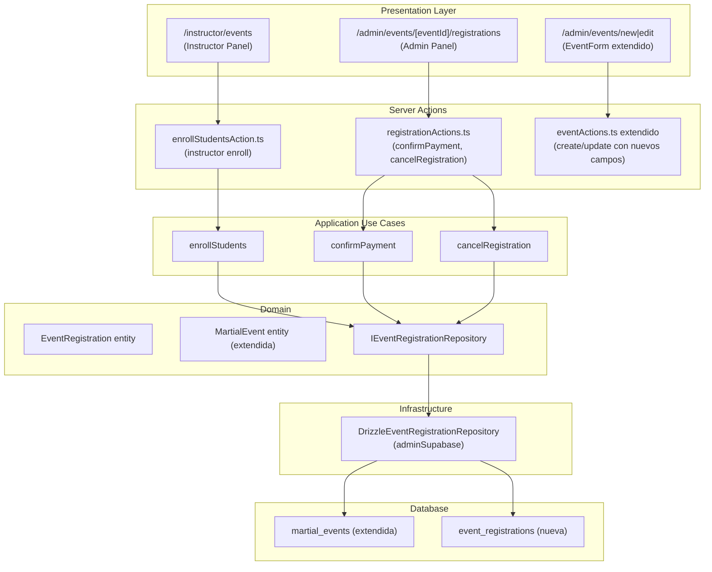

# Diseño Técnico: Sistema de Inscripción a Eventos

## Overview

Este documento describe el diseño técnico para extender el módulo de eventos marciales existente con capacidades de inscripción de participantes. Se añaden campos de descripción, precio (CLP), aforo mínimo/máximo a la tabla `martial_events`, y se crea una nueva tabla `event_registrations` con un flujo de confirmación diferenciado según si el evento es gratuito o de pago.

La implementación sigue la arquitectura DDD existente del proyecto:

- `domain/entities` → tipos e invariantes de negocio
- `domain/interfaces` → contratos de repositorio
- `application/use-cases` → lógica de aplicación pura
- `infrastructure/repositories` → implementación con `adminSupabase` (patrón `drizzleGradeExamRepository.ts`)
- `presentation/actions` → Server Actions de Next.js

El nuevo módulo se llama `event-registration` y convive con el módulo `practitioner-identity` existente (que mantiene las acciones de CRUD de eventos).

---

## Architecture



---

## Components and Interfaces

### Módulo `event-registration`

```
src/modules/event-registration/
├── domain/
│   ├── entities/
│   │   └── eventRegistration.ts
│   ├── interfaces/
│   │   └── eventRegistrationRepository.ts
│   └── errors.ts
├── application/
│   └── use-cases/
│       ├── enrollStudents.ts
│       ├── confirmPayment.ts
│       └── cancelRegistration.ts
├── infrastructure/
│   └── repositories/
│       └── drizzleEventRegistrationRepository.ts
└── presentation/
    └── actions/
        └── registrationActions.ts
```

### Páginas nuevas y modificadas

| Ruta                                                 | Tipo       | Descripción                             |
| ---------------------------------------------------- | ---------- | --------------------------------------- |
| `/admin/events/[eventId]/registrations`              | Nueva      | Panel de inscripciones para Admin       |
| `/instructor/events`                                 | Nueva      | Lista de eventos para Instructor        |
| `/instructor/events/[eventId]/enroll`                | Nueva      | Formulario de inscripción de alumnos    |
| `/admin/events/new` y `/admin/events/[eventId]/edit` | Modificada | `EventForm` extendido con nuevos campos |
| `/admin/events/[eventId]`                            | Modificada | Detalle con descripción, precio y aforo |

---

## Data Models

### Migración 030: Extensión de `martial_events` y nueva tabla `event_registrations`

```sql
-- Migration: 030_event_registration_system.sql

-- 1. Extend martial_events with new fields
ALTER TABLE martial_events
  ADD COLUMN IF NOT EXISTS description        TEXT          CHECK (char_length(description) <= 5000),
  ADD COLUMN IF NOT EXISTS registration_fee   NUMERIC(10,2) CHECK (registration_fee IS NULL OR registration_fee >= 0),
  ADD COLUMN IF NOT EXISTS min_participants   INTEGER       CHECK (min_participants IS NULL OR min_participants >= 1),
  ADD COLUMN IF NOT EXISTS max_participants   INTEGER       CHECK (max_participants IS NULL OR max_participants >= 1);

-- Constraint: max >= min when both are defined
ALTER TABLE martial_events
  ADD CONSTRAINT martial_events_participants_check
    CHECK (
      min_participants IS NULL
      OR max_participants IS NULL
      OR max_participants >= min_participants
    );

-- 2. Create event_registrations table
CREATE TABLE IF NOT EXISTS event_registrations (
  id              UUID        PRIMARY KEY DEFAULT gen_random_uuid(),
  event_id        UUID        NOT NULL REFERENCES martial_events(id) ON DELETE CASCADE,
  practitioner_id UUID        NOT NULL REFERENCES practitioners(id),
  instructor_id   UUID        NOT NULL REFERENCES practitioners(id),
  status          TEXT        NOT NULL DEFAULT 'pendiente_pago'
                              CHECK (status IN ('pendiente_pago', 'confirmada', 'cancelada')),
  registered_at   TIMESTAMPTZ NOT NULL DEFAULT now(),
  confirmed_at    TIMESTAMPTZ,
  confirmed_by    UUID,
  cancelled_at    TIMESTAMPTZ,
  cancelled_by    UUID,
  notes           TEXT,
  created_at      TIMESTAMPTZ NOT NULL DEFAULT now(),
  updated_at      TIMESTAMPTZ NOT NULL DEFAULT now(),

  -- A practitioner can only have one active registration per event
  CONSTRAINT event_registrations_unique_active
    UNIQUE (event_id, practitioner_id)
);

CREATE INDEX IF NOT EXISTS idx_event_registrations_event_id
  ON event_registrations(event_id);

CREATE INDEX IF NOT EXISTS idx_event_registrations_practitioner_id
  ON event_registrations(practitioner_id);

CREATE INDEX IF NOT EXISTS idx_event_registrations_instructor_id
  ON event_registrations(instructor_id);
```

### Entidad de dominio: `EventRegistration`

```typescript
// src/modules/event-registration/domain/entities/eventRegistration.ts

export type RegistrationStatus = "pendiente_pago" | "confirmada" | "cancelada";

export interface EventRegistration {
  id: string;
  eventId: string;
  practitionerId: string;
  instructorId: string;
  status: RegistrationStatus;
  registeredAt: string; // ISO timestamp
  confirmedAt: string | null;
  confirmedBy: string | null;
  cancelledAt: string | null;
  cancelledBy: string | null;
  notes: string | null;
  createdAt: string;
  updatedAt: string;
}
```

### Entidad de dominio: `MartialEvent` (extendida)

```typescript
// Extensión de los tipos existentes en eventActions.ts
export interface MartialEvent {
  id: string;
  name: string;
  event_type: EventType;
  event_date: string;
  location: string | null;
  description: string | null; // nuevo
  registration_fee: number | null; // nuevo (CLP)
  min_participants: number | null; // nuevo
  max_participants: number | null; // nuevo
  created_by: string;
  created_at: string;
}
```

### Funciones de dominio puras

```typescript
// src/modules/event-registration/domain/entities/eventRegistration.ts

/** Determina el status inicial según si el evento es gratuito o de pago */
export function determineInitialStatus(
  registrationFee: number | null,
): RegistrationStatus {
  return registrationFee === null || registrationFee === 0
    ? "confirmada"
    : "pendiente_pago";
}

/** Formatea el precio de inscripción en CLP */
export function formatRegistrationFee(fee: number | null): string {
  if (fee === null || fee === 0) return "Entrada libre";
  return new Intl.NumberFormat("es-CL", {
    style: "currency",
    currency: "CLP",
    minimumFractionDigits: 0,
  }).format(fee);
}

/** Verifica si un evento tiene aforo disponible */
export function hasCapacity(
  maxParticipants: number | null,
  confirmedCount: number,
): boolean {
  if (maxParticipants === null) return true;
  return confirmedCount < maxParticipants;
}
```

### Errores de dominio

```typescript
// src/modules/event-registration/domain/errors.ts

export class EventAtCapacityError extends Error {
  constructor() {
    super("El evento ha alcanzado el aforo máximo");
    this.name = "EventAtCapacityError";
  }
}

export class AlreadyRegisteredError extends Error {
  constructor(public readonly practitionerName: string) {
    super(`El alumno ${practitionerName} ya está inscrito en este evento`);
    this.name = "AlreadyRegisteredError";
  }
}

export class RegistrationAlreadyConfirmedError extends Error {
  constructor() {
    super("Esta inscripción ya está confirmada");
    this.name = "RegistrationAlreadyConfirmedError";
  }
}

export class RegistrationNotFoundError extends Error {
  constructor() {
    super("Inscripción no encontrada");
    this.name = "RegistrationNotFoundError";
  }
}
```

### Interfaz de repositorio

```typescript
// src/modules/event-registration/domain/interfaces/eventRegistrationRepository.ts

export interface RegistrationFilters {
  status?: RegistrationStatus;
}

export interface RegistrationWithDetails extends EventRegistration {
  practitionerName: string;
  instructorName: string;
}

export interface StatusCounts {
  pendiente_pago: number;
  confirmada: number;
  cancelada: number;
}

export interface IEventRegistrationRepository {
  findById(id: string): Promise<EventRegistration | null>;
  findByEvent(
    eventId: string,
    filters?: RegistrationFilters,
  ): Promise<RegistrationWithDetails[]>;
  findByPractitionerAndEvent(
    practitionerId: string,
    eventId: string,
  ): Promise<EventRegistration | null>;
  countConfirmedByEvent(eventId: string): Promise<number>;
  countByEventGroupedByStatus(eventId: string): Promise<StatusCounts>;
  save(registration: EventRegistration): Promise<void>;
  update(registration: EventRegistration): Promise<void>;
}
```

### Use Cases

```typescript
// enrollStudents.ts — inscribir alumnos (instructor)
export interface EnrollStudentsInput {
  instructorId: string;
  eventId: string;
  practitionerIds: string[];
}
// Retorna: { enrolled: string[]; skipped: { id: string; name: string }[] }

// confirmPayment.ts — confirmar pago (admin)
export interface ConfirmPaymentInput {
  adminId: string;
  registrationId: string;
}

// cancelRegistration.ts — cancelar inscripción (admin)
export interface CancelRegistrationInput {
  adminId: string;
  registrationId: string;
}
```

---

## Correctness Properties

_A property is a characteristic or behavior that should hold true across all valid executions of a system — essentially, a formal statement about what the system should do. Properties serve as the bridge between human-readable specifications and machine-verifiable correctness guarantees._

### Property 1: Description round-trip

_For any_ event with a non-null description (up to 5000 characters), saving the event and then fetching it should return the exact same description string unchanged.

**Validates: Requirements 1.1, 1.3**

---

### Property 2: Description length validation

_For any_ string longer than 5000 characters, attempting to create or update an event with that description should be rejected by the validation layer.

**Validates: Requirements 1.6**

---

### Property 3: Registration fee round-trip

_For any_ non-negative numeric fee value (including null for free events), saving an event with that fee and then fetching it should return the same value.

**Validates: Requirements 2.1, 2.4**

---

### Property 4: Fee validation rejects invalid values

_For any_ negative number or non-numeric string provided as registration fee, the validation schema should reject the input and not persist any change.

**Validates: Requirements 2.5, 2.6**

---

### Property 5: Fee display formatting

_For any_ event, the `formatRegistrationFee` function should return "Entrada libre" if and only if the fee is null or 0; otherwise it should return a string containing the numeric fee value formatted in CLP.

**Validates: Requirements 2.7**

---

### Property 6: Participant limits round-trip

_For any_ valid pair of (min_participants, max_participants) where max >= min and both >= 1, saving an event with those values and fetching it should return the same values.

**Validates: Requirements 3.1**

---

### Property 7: Participant limits validation

_For any_ pair where max_participants < min_participants, or any single value < 1, the validation schema should reject the input.

**Validates: Requirements 3.3, 3.4**

---

### Property 8: Capacity enforcement

_For any_ event with max_participants = N and exactly N confirmed registrations, attempting to enroll any additional student should fail with a capacity error, leaving the registration count unchanged.

**Validates: Requirements 3.5, 4.5**

---

### Property 9: Capacity display invariant

_For any_ event with max_participants defined, the `hasCapacity` function should return false if and only if confirmedCount >= maxParticipants.

**Validates: Requirements 3.6**

---

### Property 10: Future events filter

_For any_ list of events returned by the instructor events query, every event in the list should have an event_date strictly greater than today's date.

**Validates: Requirements 4.1**

---

### Property 11: Instructor student isolation

_For any_ instructor, the list of students available for enrollment should contain only practitioners whose instructor_id equals that instructor's id.

**Validates: Requirements 4.2**

---

### Property 12: Registration creation round-trip

_For any_ valid enrollment of a student in an event, after the operation completes, querying event_registrations for that (event_id, practitioner_id) pair should return a record with all required fields (status, registered_at, confirmed_at, confirmed_by) present.

**Validates: Requirements 4.3, 5.5**

---

### Property 13: No duplicate registrations

_For any_ student already registered in an event, attempting to register them again should not create a second record — the existing registration count for that (event_id, practitioner_id) pair should remain 1.

**Validates: Requirements 4.4**

---

### Property 14: Initial status based on event type

_For any_ event, `determineInitialStatus` should return 'confirmada' if and only if registration_fee is null or 0; otherwise it should return 'pendiente_pago'.

**Validates: Requirements 5.1, 5.2**

---

### Property 15: Payment confirmation transition

_For any_ registration with status 'pendiente_pago', after confirming payment, the status should be 'confirmada' and confirmed_at should be non-null.

**Validates: Requirements 5.3**

---

### Property 16: Double-confirm guard

_For any_ registration already in status 'confirmada', attempting to confirm payment again should throw RegistrationAlreadyConfirmedError and leave the status unchanged.

**Validates: Requirements 5.4**

---

### Property 17: Cancellation transition

_For any_ registration with status 'pendiente_pago' or 'confirmada', after cancellation, the status should be 'cancelada' and cancelled_at should be non-null.

**Validates: Requirements 5.6**

---

### Property 18: Status counts sum to total

_For any_ event, the sum of (pendiente_pago + confirmada + cancelada) returned by `countByEventGroupedByStatus` should equal the total number of registrations for that event.

**Validates: Requirements 6.3**

---

### Property 19: Error atomicity on confirmation failure

_For any_ registration, if the confirmPayment use case throws an error, the registration's status in the repository should remain unchanged from its pre-call value.

**Validates: Requirements 6.5**

---

## Error Handling

| Error                               | Código               | HTTP equiv. | Descripción                |
| ----------------------------------- | -------------------- | ----------- | -------------------------- |
| `EventAtCapacityError`              | `EVENT_AT_CAPACITY`  | 409         | Aforo máximo alcanzado     |
| `AlreadyRegisteredError`            | `ALREADY_REGISTERED` | 409         | Alumno ya inscrito         |
| `RegistrationAlreadyConfirmedError` | `ALREADY_CONFIRMED`  | 409         | Inscripción ya confirmada  |
| `RegistrationNotFoundError`         | `NOT_FOUND`          | 404         | Inscripción no encontrada  |
| `UnauthorizedError`                 | `UNAUTHORIZED`       | 401         | Sin permisos               |
| Zod `ValidationError`               | `VALIDATION_ERROR`   | 400         | Datos de entrada inválidos |
| Supabase error                      | `INTERNAL_ERROR`     | 500         | Error de base de datos     |

Todos los Server Actions retornan `ActionResult<T>`:

```typescript
type ActionResult<T = void> =
  | { success: true; data: T }
  | { success: false; error: string; code: string };
```

Los errores de dominio se capturan en la capa de actions y se mapean a mensajes en español para el usuario.

---

## Testing Strategy

### Enfoque dual: Unit tests + Property-based tests

**Unit tests** (Jest/Vitest) cubren:

- Funciones de dominio puras: `determineInitialStatus`, `formatRegistrationFee`, `hasCapacity`
- Casos de error específicos con inputs concretos
- Integración entre use cases y repositorio mockeado

**Property-based tests** (fast-check) cubren:

- Todas las propiedades listadas en la sección anterior
- Mínimo 100 iteraciones por propiedad
- Generadores de datos aleatorios para eventos, inscripciones y practicantes

### Configuración de property tests

Librería: **fast-check** (ya disponible en el ecosistema TypeScript/Node)

Cada test de propiedad debe incluir un comentario de trazabilidad:

```typescript
// Feature: event-registration-system, Property N: <texto de la propiedad>
```

Ejemplo de estructura:

```typescript
import fc from "fast-check";

// Feature: event-registration-system, Property 14: Initial status based on event type
it("determineInitialStatus returns confirmada iff fee is null or 0", () => {
  fc.assert(
    fc.property(
      fc.oneof(
        fc.constant(null),
        fc.constant(0),
        fc.float({ min: 0.01, max: 999999 }),
      ),
      (fee) => {
        const status = determineInitialStatus(fee);
        if (fee === null || fee === 0) {
          return status === "confirmada";
        } else {
          return status === "pendiente_pago";
        }
      },
    ),
    { numRuns: 100 },
  );
});
```

### Cobertura por capa

| Capa            | Tipo de test          | Qué se prueba                         |
| --------------- | --------------------- | ------------------------------------- |
| Domain entities | Unit + PBT            | Funciones puras, invariantes          |
| Use cases       | Unit (mock repo)      | Flujos de negocio, errores de dominio |
| Repository      | Integration           | Queries SQL contra Supabase test      |
| Server Actions  | Unit (mock use cases) | Validación Zod, mapeo de errores      |
| Pages           | E2E (Playwright)      | Flujos completos de UI                |

Cada propiedad correctness del diseño debe tener exactamente un test de propiedad correspondiente.
