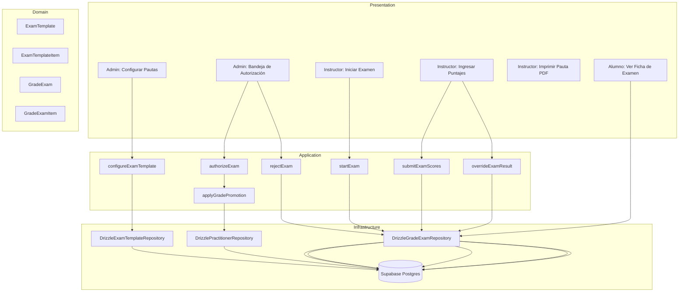
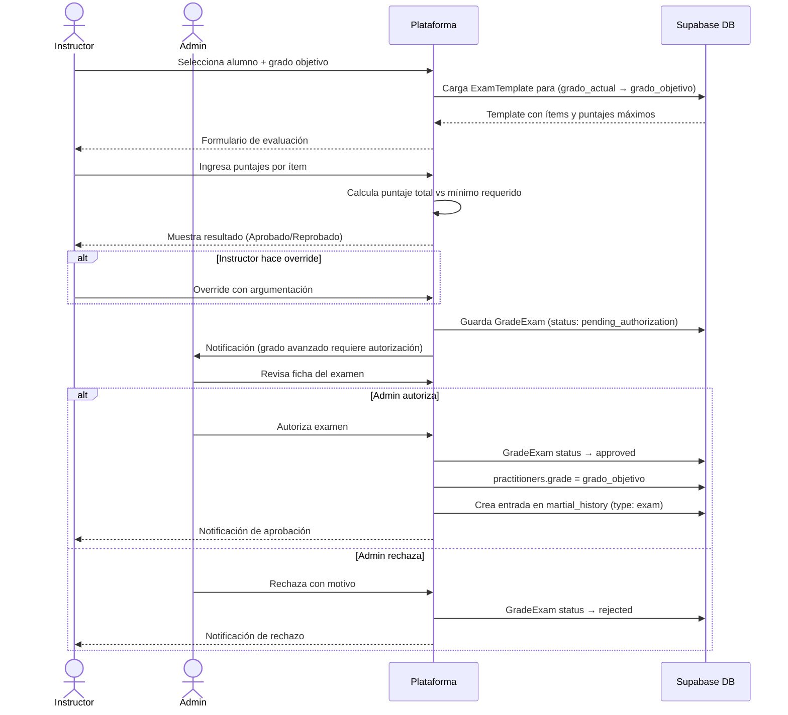
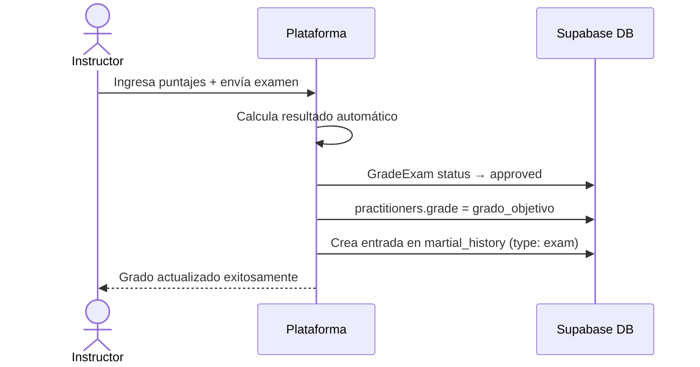

# Design Document: Grade Exam System (Sistema de Exámenes de Grado)

## Overview

El sistema de exámenes de grado permite a los instructores evaluar formalmente a sus alumnos para el cambio de cinturón (ej: blanco → amarillo), registrando la evaluación ítem por ítem según pautas configuradas por el administrador. El flujo incluye cálculo automático de aprobación, posibilidad de override por el instructor, y un paso de autorización admin para grados avanzados, culminando en la actualización automática del grado del practicante.

Este módulo se integra al stack existente (Next.js 15 App Router, Supabase/Postgres, Drizzle ORM, DDD) como un nuevo módulo `grade-exam` que convive con `practitioner-identity`.

## Architecture



## Sequence Diagrams

### Flujo completo: Examen con autorización admin



### Flujo: Examen sin autorización requerida



## Components and Interfaces

### Módulo: `src/modules/grade-exam/`

Sigue la misma arquitectura DDD del módulo `practitioner-identity`.

```
src/modules/grade-exam/
├── domain/
│   ├── entities/
│   │   ├── examTemplate.ts
│   │   └── gradeExam.ts
│   └── interfaces/
│       ├── examTemplateRepository.ts
│       └── gradeExamRepository.ts
├── application/
│   └── use-cases/
│       ├── configureExamTemplate.ts
│       ├── startExam.ts
│       ├── submitExamScores.ts
│       ├── overrideExamResult.ts
│       ├── authorizeExam.ts
│       ├── rejectExam.ts
│       └── applyGradePromotion.ts
├── infrastructure/
│   └── repositories/
│       ├── drizzleExamTemplateRepository.ts
│       └── drizzleGradeExamRepository.ts
└── presentation/
    └── actions/
        ├── adminExamActions.ts
        └── instructorExamActions.ts
```

### Páginas Next.js

```
src/app/(dashboard)/
├── admin/
│   ├── exam-templates/
│   │   ├── page.tsx                    # Lista de pautas configuradas
│   │   ├── new/page.tsx                # Crear nueva pauta
│   │   └── [templateId]/
│   │       ├── page.tsx                # Detalle/editar pauta
│   │       └── edit/page.tsx
│   └── grade-exams/
│       ├── page.tsx                    # Bandeja de exámenes pendientes de autorización
│       └── [examId]/
│           └── page.tsx                # Detalle del examen para autorizar/rechazar
└── instructor/
    └── grade-exams/
        ├── page.tsx                    # Lista de exámenes del instructor
        ├── new/page.tsx                # Iniciar nuevo examen
        └── [examId]/
            └── page.tsx                # Detalle / ingresar puntajes / imprimir
```

### Interfaces de Repositorio

```typescript
interface IExamTemplateRepository {
  findById(id: string): Promise<ExamTemplate | null>;
  findByGradeTransition(
    fromGrade: Grade,
    toGrade: Grade,
  ): Promise<ExamTemplate | null>;
  findAll(): Promise<ExamTemplate[]>;
  save(template: ExamTemplate): Promise<void>;
  update(template: ExamTemplate): Promise<void>;
}

interface IGradeExamRepository {
  findById(id: string): Promise<GradeExam | null>;
  findByPractitioner(practitionerId: string): Promise<GradeExam[]>;
  findByInstructor(
    instructorId: string,
    filters?: ExamFilters,
  ): Promise<GradeExam[]>;
  findPendingAuthorization(): Promise<GradeExam[]>;
  save(exam: GradeExam): Promise<void>;
  update(exam: GradeExam): Promise<void>;
}
```

## Data Models

### Entidad: `ExamTemplate`

Pauta de evaluación configurada por el admin para una transición de grado específica.

```typescript
interface ExamTemplate {
  id: string; // UUID
  fromGrade: Grade; // Grado de origen (ej: 'white')
  toGrade: Grade; // Grado objetivo (ej: 'yellow')
  discipline: Discipline; // Disciplina (ej: 'kombat_taekwondo')
  minimumPassScore: number; // Puntaje mínimo para aprobar (0-100, porcentaje)
  requiresAdminAuth: boolean; // Si requiere autorización del admin
  isActive: boolean;
  items: ExamTemplateItem[];
  createdBy: string; // auth.users UUID
  createdAt: string;
  updatedAt: string;
}

interface ExamTemplateItem {
  id: string;
  templateId: string;
  name: string; // Ej: "Patada frontal", "Formas (Poomsae)"
  description: string | null;
  maxScore: number; // Puntaje máximo del ítem
  order: number; // Orden de presentación
}
```

### Entidad: `GradeExam`

Registro de un examen realizado a un alumno.

```typescript
interface GradeExam {
  id: string; // UUID
  templateId: string; // Referencia a ExamTemplate
  practitionerId: string; // Alumno evaluado
  instructorId: string; // Instructor que evalúa (practitioners.id)
  fromGrade: Grade;
  toGrade: Grade;
  discipline: Discipline;
  examDate: string; // ISO date (YYYY-MM-DD)
  status: ExamStatus;
  // Puntajes
  items: GradeExamItem[];
  totalScore: number; // Calculado: suma de item scores
  maxPossibleScore: number; // Calculado: suma de item maxScores
  scorePercentage: number; // totalScore / maxPossibleScore * 100
  calculatedResult: "approved" | "failed"; // Resultado automático
  // Override del instructor
  instructorOverride: boolean;
  overrideResult: "approved" | "failed" | null;
  overrideJustification: string | null;
  // Resultado efectivo
  finalResult: "approved" | "failed"; // override ?? calculatedResult
  // Autorización admin
  authorizedBy: string | null; // auth.users UUID
  authorizedAt: string | null;
  rejectedBy: string | null;
  rejectionReason: string | null;
  // Metadata
  notes: string | null;
  createdAt: string;
  updatedAt: string;
}

type ExamStatus =
  | "draft" // En progreso, no enviado
  | "submitted" // Enviado por instructor, sin requerir auth
  | "pending_authorization" // Esperando visado del admin
  | "approved" // Aprobado (y grado actualizado)
  | "rejected"; // Rechazado por admin

interface GradeExamItem {
  id: string;
  examId: string;
  templateItemId: string;
  itemName: string; // Snapshot del nombre al momento del examen
  maxScore: number; // Snapshot del puntaje máximo
  score: number; // Puntaje asignado por el instructor (0..maxScore)
}
```

### Esquema SQL (migración 029)

```sql
-- exam_templates
CREATE TABLE exam_templates (
  id                  UUID PRIMARY KEY DEFAULT gen_random_uuid(),
  from_grade          TEXT NOT NULL CHECK (from_grade IN ('white','yellow','green','blue','red','black')),
  to_grade            TEXT NOT NULL CHECK (to_grade IN ('white','yellow','green','blue','red','black')),
  discipline          TEXT NOT NULL DEFAULT 'kombat_taekwondo',
  minimum_pass_score  NUMERIC(5,2) NOT NULL DEFAULT 60.0,  -- porcentaje
  requires_admin_auth BOOLEAN NOT NULL DEFAULT false,
  is_active           BOOLEAN NOT NULL DEFAULT true,
  created_by          UUID NOT NULL REFERENCES auth.users(id),
  created_at          TIMESTAMPTZ NOT NULL DEFAULT now(),
  updated_at          TIMESTAMPTZ NOT NULL DEFAULT now(),
  UNIQUE (from_grade, to_grade, discipline)
);

-- exam_template_items
CREATE TABLE exam_template_items (
  id          UUID PRIMARY KEY DEFAULT gen_random_uuid(),
  template_id UUID NOT NULL REFERENCES exam_templates(id) ON DELETE CASCADE,
  name        TEXT NOT NULL,
  description TEXT,
  max_score   NUMERIC(6,2) NOT NULL,
  "order"     SMALLINT NOT NULL DEFAULT 0,
  created_at  TIMESTAMPTZ NOT NULL DEFAULT now()
);

-- grade_exams
CREATE TABLE grade_exams (
  id                      UUID PRIMARY KEY DEFAULT gen_random_uuid(),
  template_id             UUID NOT NULL REFERENCES exam_templates(id),
  practitioner_id         UUID NOT NULL REFERENCES practitioners(id),
  instructor_id           UUID NOT NULL REFERENCES practitioners(id),
  from_grade              TEXT NOT NULL,
  to_grade                TEXT NOT NULL,
  discipline              TEXT NOT NULL,
  exam_date               DATE NOT NULL,
  status                  TEXT NOT NULL DEFAULT 'draft'
                          CHECK (status IN ('draft','submitted','pending_authorization','approved','rejected')),
  total_score             NUMERIC(8,2),
  max_possible_score      NUMERIC(8,2),
  score_percentage        NUMERIC(5,2),
  calculated_result       TEXT CHECK (calculated_result IN ('approved','failed')),
  instructor_override     BOOLEAN NOT NULL DEFAULT false,
  override_result         TEXT CHECK (override_result IN ('approved','failed')),
  override_justification  TEXT,
  final_result            TEXT CHECK (final_result IN ('approved','failed')),
  authorized_by           UUID REFERENCES auth.users(id),
  authorized_at           TIMESTAMPTZ,
  rejected_by             UUID REFERENCES auth.users(id),
  rejection_reason        TEXT,
  notes                   TEXT,
  created_at              TIMESTAMPTZ NOT NULL DEFAULT now(),
  updated_at              TIMESTAMPTZ NOT NULL DEFAULT now()
);

-- grade_exam_items
CREATE TABLE grade_exam_items (
  id               UUID PRIMARY KEY DEFAULT gen_random_uuid(),
  exam_id          UUID NOT NULL REFERENCES grade_exams(id) ON DELETE CASCADE,
  template_item_id UUID REFERENCES exam_template_items(id),
  item_name        TEXT NOT NULL,   -- snapshot
  max_score        NUMERIC(6,2) NOT NULL,
  score            NUMERIC(6,2) NOT NULL DEFAULT 0,
  created_at       TIMESTAMPTZ NOT NULL DEFAULT now()
);
```

## Error Handling

### Escenario 1: Pauta no configurada para la transición

**Condición**: El instructor intenta iniciar un examen para una transición (fromGrade → toGrade) sin pauta activa.
**Respuesta**: Error `ExamTemplateNotFound` — UI muestra mensaje "No existe una pauta configurada para esta transición de grado. Contacta al administrador."
**Recuperación**: Admin crea la pauta; instructor reintenta.

### Escenario 2: Override sin justificación

**Condición**: El instructor intenta hacer override del resultado sin ingresar justificación.
**Respuesta**: Validación Zod en Server Action rechaza el request con error de campo requerido.
**Recuperación**: Instructor completa el campo de justificación.

### Escenario 3: Alumno no pertenece al instructor

**Condición**: Un instructor intenta crear un examen para un alumno que no está bajo su cargo.
**Respuesta**: Error `UnauthorizedExamCreation` — HTTP 403 desde Server Action.
**Recuperación**: Verificar asignación del alumno en el panel de admin.

### Escenario 4: Examen ya aprobado (doble submit)

**Condición**: Se intenta modificar un examen con status `approved` o `rejected`.
**Respuesta**: Error `ExamAlreadyFinalized` — UI muestra "Este examen ya fue finalizado y no puede modificarse."
**Recuperación**: No aplica; el examen es inmutable una vez finalizado.

### Escenario 5: Puntaje fuera de rango

**Condición**: El instructor ingresa un puntaje mayor al máximo del ítem.
**Respuesta**: Validación Zod rechaza con error por ítem específico.
**Recuperación**: Instructor corrige el valor.

## Testing Strategy

### Unit Testing

- Lógica de cálculo de puntaje total y porcentaje (`calculateExamScore`)
- Determinación del `calculatedResult` según `minimumPassScore`
- Determinación del `finalResult` considerando override
- Validación de transición de estados del examen (`draft → submitted → approved/rejected`)
- `validateRoleForGrade` al aplicar promoción de grado

### Property-Based Testing

**Librería**: fast-check

- Para cualquier conjunto de ítems con scores en `[0, maxScore]`, el `scorePercentage` siempre está en `[0, 100]`
- Si `scorePercentage >= minimumPassScore`, `calculatedResult === 'approved'`
- Si `instructorOverride === true` y `overrideResult` está definido, `finalResult === overrideResult`
- Si `instructorOverride === false`, `finalResult === calculatedResult`

### Integration Testing

- Flujo completo: crear template → iniciar examen → ingresar puntajes → aprobar → verificar `practitioners.grade` actualizado
- Flujo con autorización: examen `pending_authorization` → admin autoriza → grado actualizado
- Flujo rechazo: examen `pending_authorization` → admin rechaza → grado sin cambios

## Correctness Properties

_A property is a characteristic or behavior that should hold true across all valid executions of a system — essentially, a formal statement about what the system should do. Properties serve as the bridge between human-readable specifications and machine-verifiable correctness guarantees._

### Property 1: scorePercentage siempre en rango [0, 100]

_For any_ GradeExam con GradeExamItems donde cada score está en [0, maxScore], el scorePercentage calculado debe estar en el rango [0, 100].

**Validates: Requirements 3.5**

### Property 2: calculatedResult determinado por scorePercentage vs minimumPassScore

_For any_ GradeExam y ExamTemplate, si scorePercentage >= minimumPassScore entonces calculatedResult = "approved", y si scorePercentage < minimumPassScore entonces calculatedResult = "failed".

**Validates: Requirements 3.6, 3.7**

### Property 3: finalResult determinado por override

_For any_ GradeExam, si instructorOverride = true y overrideResult está definido entonces finalResult = overrideResult; si instructorOverride = false entonces finalResult = calculatedResult.

**Validates: Requirements 4.3, 4.4**

### Property 4: totalScore y maxPossibleScore son sumas exactas

_For any_ GradeExam con N GradeExamItems, totalScore debe ser exactamente la suma de todos los GradeExamItem.score, y maxPossibleScore debe ser exactamente la suma de todos los GradeExamItem.maxScore.

**Validates: Requirements 3.3, 3.4**

### Property 5: Unicidad de ExamTemplate activa por transición

_For any_ combinación (fromGrade, toGrade, discipline), no puede existir más de una ExamTemplate con isActive = true. Intentar crear una segunda ExamTemplate activa para la misma combinación debe ser rechazado.

**Validates: Requirements 1.2, 1.6**

### Property 6: Inicialización correcta del GradeExam

_For any_ ExamTemplate con N ExamTemplateItems, el GradeExam creado a partir de ella debe tener exactamente N GradeExamItems con score = 0, status = "draft", y los campos instructorId, practitionerId y examDate registrados.

**Validates: Requirements 2.1, 2.4**

### Property 7: Validación de rango de scores por ítem

_For any_ GradeExamItem con maxScore M, cualquier score en [0, M] debe ser aceptado y cualquier score fuera de ese rango debe ser rechazado.

**Validates: Requirements 3.1, 3.2**

### Property 8: Transición de estado correcta al enviar examen

_For any_ GradeExam en estado "draft": si requiresAdminAuth = false y finalResult = "approved" → status = "approved"; si requiresAdminAuth = false y finalResult = "failed" → status = "submitted"; si requiresAdminAuth = true → status = "pending_authorization" independientemente del finalResult.

**Validates: Requirements 5.2, 5.3, 5.4**

### Property 9: Inmutabilidad de estados terminales

_For any_ GradeExam con status "approved" o "rejected", cualquier intento de modificación o de autorizar/rechazar debe ser rechazado con ExamAlreadyFinalized.

**Validates: Requirements 5.5, 6.4**

### Property 10: Grade Promotion actualiza grado y crea historial

_For any_ GradeExam que transiciona a status = "approved", el campo practitioners.grade del Practitioner debe ser igual a toGrade del examen, y debe existir exactamente una entrada en martial_history con type = "exam" referenciando ese GradeExam.

**Validates: Requirements 7.1, 7.2**

### Property 11: Filtrado correcto de exámenes pendientes de autorización

_For any_ conjunto de GradeExams en la base de datos, el listado de pendientes de autorización debe contener exactamente los GradeExams con status = "pending_authorization" y ningún otro.

**Validates: Requirements 6.1**

### Property 12: Aislamiento de datos por Instructor

_For any_ Instructor, el listado de GradeExams que le es presentado debe contener únicamente los GradeExams donde instructorId coincide con su identidad, sin incluir exámenes de otros instructores.

**Validates: Requirements 10.3**

### Property 13: Control de acceso basado en rol para operaciones de Admin

_For any_ usuario sin rol Admin, los intentos de ejecutar configureExamTemplate, authorizeExam o rejectExam deben ser rechazados con un error de autorización.

**Validates: Requirements 10.2**

### Property 14: Override requiere justificación no vacía

_For any_ intento de activar InstructorOverride, si overrideJustification es una cadena vacía o compuesta únicamente de espacios en blanco, la operación debe ser rechazada.

**Validates: Requirements 4.1, 4.2**

### Property 15: Rechazo de examen requiere motivo no vacío

_For any_ intento de rechazar un GradeExam, si rejectionReason es una cadena vacía o compuesta únicamente de espacios en blanco, la operación debe ser rechazada.

**Validates: Requirements 6.5, 6.6**

### Property 16: Acceso a ficha de examen restringido por rol

_For any_ GradeExam, un usuario que no sea el Practitioner evaluado, su Instructor asignado ni un Admin debe recibir un error de acceso denegado al intentar leer la ficha.

**Validates: Requirements 8.3**

## Performance Considerations

- Los exámenes se cargan con sus ítems en una sola query (JOIN) para evitar N+1.
- La bandeja de autorización del admin filtra por `status = 'pending_authorization'` con índice en esa columna.
- La impresión de pauta genera el PDF en el cliente (sin servidor) usando `window.print()` o una librería ligera como `react-to-print`.

## Security Considerations

- Los Server Actions de instructor verifican que `practitioner_id` pertenezca al `instructor_id` autenticado antes de crear o modificar un examen.
- Solo `admin_users` pueden ejecutar `authorizeExam`, `rejectExam` y `configureExamTemplate`.
- RLS en Supabase: instructores solo leen sus propios exámenes; alumnos solo leen sus propias fichas; admins leen todo.
- El campo `override_justification` es obligatorio cuando `instructor_override = true` (validado en Zod y en dominio).
- La actualización de `practitioners.grade` solo ocurre desde el use case `applyGradePromotion`, nunca directamente desde la UI.

## Dependencies

- `src/modules/practitioner-identity` — repositorio de practicantes para actualizar el grado
- `drizzle-orm` — repositorios de infraestructura
- `zod` — validación en Server Actions
- `@supabase/supabase-js` (adminSupabase) — operaciones privilegiadas
- `react-to-print` o `window.print()` — impresión de pauta offline (sin dependencia nueva si se usa CSS `@media print`)
