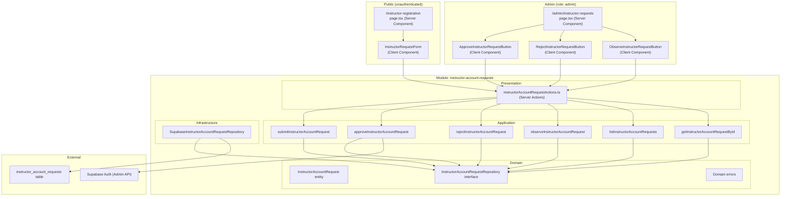
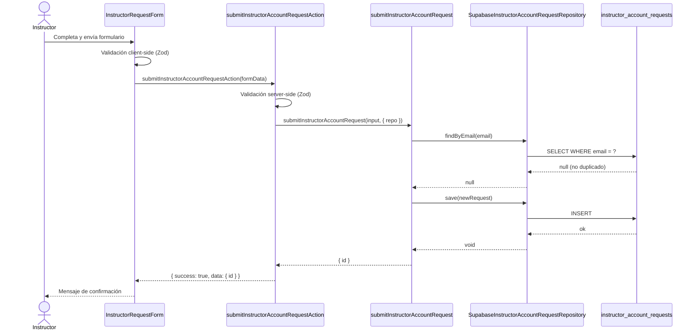
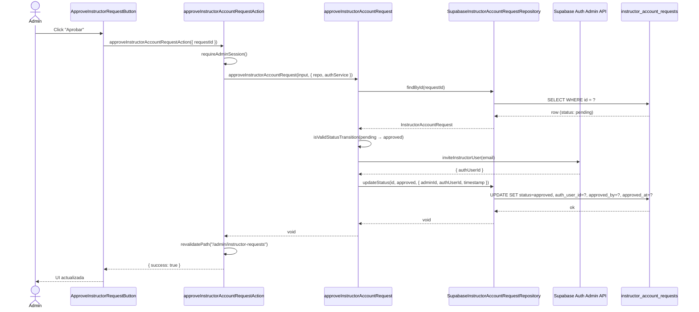
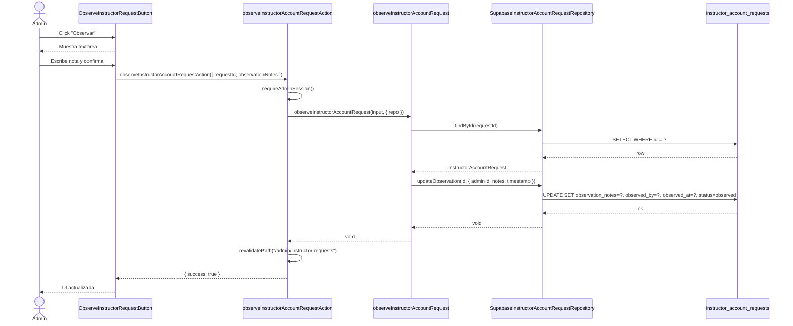

# Design Document: Instructor Account Requests

## Overview

Esta funcionalidad permite que un instructor solicite la creación de su cuenta en Kombat ID a través de un formulario público. Las solicitudes quedan en estado `pending` hasta que un administrador las aprueba, rechaza u observa (deja una nota). Al aprobar, se crea automáticamente un usuario en Supabase Auth con el rol `instructor` en `app_metadata` y se le envía un email de invitación para que establezca su contraseña.

El módulo sigue exactamente el mismo patrón arquitectónico que `referee-registration`: Clean Architecture + Screaming Architecture bajo `src/modules/instructor-account-requests/`, con una página pública en `/instructor-registration` y una página de administración en `/admin/instructor-requests`.

## Architecture



## Sequence Diagrams

### Flujo: Instructor envía solicitud



### Flujo: Admin aprueba solicitud



### Flujo: Admin observa solicitud (deja nota)



## Components and Interfaces

### Component 1: InstructorRequestForm (Client Component)

**Purpose**: Formulario público para que un instructor envíe su solicitud de cuenta.

**Interface**:

```typescript
// No recibe props — es un formulario autónomo
export function InstructorRequestForm(): JSX.Element;
```

**Responsibilities**:

- Validación client-side con Zod antes de enviar
- Llamar a `submitInstructorAccountRequestAction` vía `useTransition`
- Mostrar errores de campo y errores globales
- Mostrar estado de éxito tras envío correcto
- No requiere autenticación

---

### Component 2: InstructorRequestsTable (Server Component)

**Purpose**: Tabla de solicitudes para la vista de administración.

**Interface**:

```typescript
interface InstructorRequestsTableProps {
  requests: InstructorAccountRequestListItem[];
  totalCount: number;
  page: number;
  totalPages: number;
}

export function InstructorRequestsTable(
  props: InstructorRequestsTableProps,
): JSX.Element;
```

**Responsibilities**:

- Renderizar la lista de solicitudes con sus datos
- Incluir los botones de acción (Aprobar, Rechazar, Observar) por fila
- Mostrar badge de estado con colores semánticos

---

### Component 3: ApproveInstructorRequestButton (Client Component)

**Purpose**: Botón que llama a la acción de aprobación.

**Interface**:

```typescript
interface Props {
  requestId: string;
}
export function ApproveInstructorRequestButton({
  requestId,
}: Props): JSX.Element;
```

---

### Component 4: RejectInstructorRequestButton (Client Component)

**Purpose**: Botón que llama a la acción de rechazo.

**Interface**:

```typescript
interface Props {
  requestId: string;
}
export function RejectInstructorRequestButton({
  requestId,
}: Props): JSX.Element;
```

---

### Component 5: ObserveInstructorRequestButton (Client Component)

**Purpose**: Botón que despliega un textarea inline para dejar una nota/observación.

**Interface**:

```typescript
interface Props {
  requestId: string;
}
export function ObserveInstructorRequestButton({
  requestId,
}: Props): JSX.Element;
```

**Responsibilities**:

- Alternar entre botón y formulario inline
- Enviar nota a `observeInstructorAccountRequestAction`
- Deshabilitar el botón de confirmar si la nota está vacía

## Data Models

### Entidad de dominio: InstructorAccountRequest

```typescript
// src/modules/instructor-account-requests/domain/entities/instructorAccountRequest.ts

export type InstructorAccountRequestStatus =
  | "pending"
  | "approved"
  | "rejected"
  | "observed";

export interface InstructorAccountRequest {
  id: string; // UUID
  email: string; // Email del instructor solicitante
  fullName: string; // Nombre completo
  phone: string | null; // Teléfono de contacto (opcional)
  academyName: string | null; // Academia o club de origen (opcional)
  message: string | null; // Mensaje o motivación (opcional)
  status: InstructorAccountRequestStatus;
  authUserId: string | null; // Vinculado al aprobar
  approvedAt: string | null; // ISO timestamp
  approvedBy: string | null; // UUID del admin que aprobó
  rejectedAt: string | null; // ISO timestamp
  rejectedBy: string | null; // UUID del admin que rechazó
  observationNotes: string | null; // Nota del admin al observar
  observedAt: string | null; // ISO timestamp
  observedBy: string | null; // UUID del admin que observó
  createdAt: string; // ISO timestamp
  updatedAt: string; // ISO timestamp
}
```

**Validation Rules**:

- `email`: formato válido, máximo 254 caracteres, único en la tabla
- `fullName`: mínimo 2 caracteres, máximo 200 caracteres
- `phone`: máximo 30 caracteres (opcional)
- `academyName`: máximo 200 caracteres (opcional)
- `message`: máximo 1000 caracteres (opcional)
- `status`: solo puede transicionar desde `pending` → `approved`, `pending` → `rejected`, `pending` → `observed`

### Tabla de base de datos: instructor_account_requests

```sql
CREATE TABLE instructor_account_requests (
  id                UUID PRIMARY KEY DEFAULT gen_random_uuid(),
  email             TEXT NOT NULL UNIQUE,
  full_name         TEXT NOT NULL,
  phone             TEXT,
  academy_name      TEXT,
  message           TEXT,
  status            TEXT NOT NULL DEFAULT 'pending'
                    CHECK (status IN ('pending', 'approved', 'rejected', 'observed')),
  auth_user_id      UUID REFERENCES auth.users(id),
  approved_at       TIMESTAMPTZ,
  approved_by       UUID,
  rejected_at       TIMESTAMPTZ,
  rejected_by       UUID,
  observation_notes TEXT,
  observed_at       TIMESTAMPTZ,
  observed_by       UUID,
  created_at        TIMESTAMPTZ NOT NULL DEFAULT now(),
  updated_at        TIMESTAMPTZ NOT NULL DEFAULT now()
);

-- Índice para búsqueda por email
CREATE INDEX idx_instructor_account_requests_email
  ON instructor_account_requests(email);

-- Índice para filtrar por estado (listado admin)
CREATE INDEX idx_instructor_account_requests_status
  ON instructor_account_requests(status);
```

### DTO de lista para la vista admin

```typescript
// src/modules/instructor-account-requests/presentation/components/instructorRequestListItem.ts

export interface InstructorAccountRequestListItem {
  id: string;
  email: string;
  fullName: string;
  phone: string | null;
  academyName: string | null;
  message: string | null;
  status: InstructorAccountRequestStatus;
  observationNotes: string | null;
  createdAt: string; // ISO string — serializable para Client Components
}
```

## Repository Interface

```typescript
// src/modules/instructor-account-requests/domain/interfaces/instructorAccountRequestRepository.ts

export interface InstructorAccountRequestFilter {
  status?: InstructorAccountRequestStatus;
  page?: number;
  pageSize?: number;
}

export interface InstructorAccountRequestRepository {
  findById(id: string): Promise<InstructorAccountRequest | null>;
  findByEmail(email: string): Promise<InstructorAccountRequest | null>;
  list(filter: InstructorAccountRequestFilter): Promise<{
    items: InstructorAccountRequest[];
    total: number;
  }>;
  save(request: InstructorAccountRequest): Promise<void>;
  updateStatus(
    id: string,
    status: InstructorAccountRequestStatus,
    meta: {
      adminId: string;
      authUserId?: string;
      timestamp: string;
    },
  ): Promise<void>;
  updateObservation(
    id: string,
    meta: {
      adminId: string;
      notes: string;
      timestamp: string;
    },
  ): Promise<void>;
}
```

## Auth Service Interface

```typescript
// Definida en el use case approveInstructorAccountRequest (DIP)

export interface InstructorAuthService {
  /**
   * Crea un usuario en Supabase Auth con role 'instructor' en app_metadata
   * y envía un email de invitación para establecer contraseña.
   * Si el usuario ya existe, asigna el rol si falta y retorna el id existente.
   */
  inviteInstructorUser(email: string): Promise<{ authUserId: string }>;
}
```

## Use Cases

| Use Case                          | Descripción                                                           | Auth requerida |
| --------------------------------- | --------------------------------------------------------------------- | -------------- |
| `submitInstructorAccountRequest`  | Crea una solicitud nueva con status `pending`                         | No (pública)   |
| `approveInstructorAccountRequest` | Aprueba la solicitud, crea usuario Auth con rol `instructor`          | Admin          |
| `rejectInstructorAccountRequest`  | Rechaza la solicitud                                                  | Admin          |
| `observeInstructorAccountRequest` | Deja una nota/observación en la solicitud, cambia status a `observed` | Admin          |
| `listInstructorAccountRequests`   | Lista solicitudes con filtro por status y paginación                  | Admin          |
| `getInstructorAccountRequestById` | Obtiene una solicitud por id                                          | Admin          |

## Routing

| Ruta                         | Tipo      | Acceso | Descripción                       |
| ---------------------------- | --------- | ------ | --------------------------------- |
| `/instructor-registration`   | Pública   | Todos  | Formulario de solicitud de cuenta |
| `/admin/instructor-requests` | Protegida | Admin  | Lista y gestión de solicitudes    |

### Cambios en middleware.ts

Agregar `/instructor-registration` a `PUBLIC_ROUTES`:

```typescript
const PUBLIC_ROUTES = [
  ...AUTH_ROUTES,
  "/auth/callback",
  "/verify",
  "/academies",
  "/events",
  "/design",
  "/referee-registration",
  "/instructor-registration", // ← nuevo
  "/referees",
  "/",
];
```

### Cambios en el dashboard de admin

Agregar enlace de navegación a la página de solicitudes de instructores en `DashboardNav.tsx` (solo visible para el rol `admin`).

## Error Handling

### Error Scenario 1: Email duplicado

**Condition**: El email ya existe en `instructor_account_requests`
**Response**: `{ success: false, error: "Ya existe una solicitud con este email", code: "CONFLICT" }`
**Recovery**: El formulario muestra el error en el campo email; el usuario puede corregirlo

### Error Scenario 2: Transición de estado inválida

**Condition**: Se intenta aprobar/rechazar una solicitud que no está en `pending`
**Response**: `{ success: false, error: "...", code: "INVALID_STATUS_TRANSITION" }`
**Recovery**: La UI muestra un mensaje de error; la fila puede recargarse

### Error Scenario 3: Fallo al crear usuario Auth

**Condition**: La llamada a Supabase Auth Admin API falla durante la aprobación
**Response**: `{ success: false, error: "Error al crear la cuenta del instructor", code: "AUTH_USER_CREATION_ERROR" }`
**Recovery**: La solicitud permanece en `pending` (invariante preservado); el admin puede reintentar

### Error Scenario 4: Solicitud no encontrada

**Condition**: El `requestId` no existe en la tabla
**Response**: `{ success: false, error: "Solicitud no encontrada", code: "NOT_FOUND" }`
**Recovery**: La UI muestra el error; la lista puede recargarse

### Error Scenario 5: Sin autorización

**Condition**: Un usuario no-admin intenta acceder a las acciones de admin
**Response**: `{ success: false, error: "No autorizado", code: "FORBIDDEN" }` o redirect a `/dashboard`
**Recovery**: Redirect automático por middleware o respuesta de error estructurada

## Correctness Properties

_Una propiedad es una característica o comportamiento que debe mantenerse verdadero en todas las ejecuciones válidas del sistema — esencialmente, una declaración formal sobre lo que el sistema debe hacer. Las propiedades sirven como puente entre las especificaciones legibles por humanos y las garantías de corrección verificables por máquinas._

### Property 1: Creación de solicitud produce entidad con estado pending

_Para cualquier_ combinación válida de datos de entrada (email con formato correcto, fullName entre 2 y 200 caracteres, campos opcionales presentes o ausentes), el Submit_Use_Case SHALL crear una Instructor_Account_Request con `status === "pending"` y retornar un `id` de tipo UUID no vacío.

**Validates: Requirements 1.2, 1.11, 9.4**

---

### Property 2: Inputs inválidos son rechazados por el validador

_Para cualquier_ input donde al menos un campo obligatorio viola sus restricciones (email con formato inválido o > 254 chars, fullName < 2 o > 200 chars, phone presente y > 30 chars, academyName presente y > 200 chars, message presente y > 1000 chars), el Request_Validator SHALL rechazar la solicitud y retornar un error de validación sin crear ninguna entidad.

**Validates: Requirements 1.5, 1.6, 1.7, 1.8, 1.9, 1.10**

---

### Property 3: Unicidad de email — duplicados producen CONFLICT

_Para cualquier_ email que ya existe en la tabla `instructor_account_requests`, intentar crear una nueva solicitud con ese mismo email SHALL retornar un Action_Result con `success: false` y `code: "CONFLICT"`, sin insertar ningún registro adicional.

**Validates: Requirements 2.1, 2.2**

---

### Property 4: Paginación nunca excede el límite configurado

_Para cualquier_ número N de solicitudes en la base de datos y cualquier número de página válido, el List_Use_Case SHALL retornar como máximo 25 items por página, y el campo `total` SHALL reflejar el número real de registros que coinciden con el filtro aplicado.

**Validates: Requirements 3.2, 3.6**

---

### Property 5: Filtrado por estado retorna solo items del estado solicitado

_Para cualquier_ filtro de estado (`pending`, `approved`, `rejected`, `observed`) aplicado al List_Use_Case, todos los items retornados SHALL tener exactamente ese estado, y ningún item con un estado diferente SHALL aparecer en los resultados.

**Validates: Requirements 3.6**

---

### Property 6: Botones de acción presentes solo para solicitudes pending

_Para cualquier_ Instructor_Account_Request con estado `pending`, el componente de tabla SHALL renderizar los tres botones de acción (Aprobar, Rechazar, Observar). _Para cualquier_ solicitud con estado distinto de `pending`, ninguno de esos botones SHALL estar presente en el renderizado.

**Validates: Requirements 3.5**

---

### Property 7: Transiciones de estado — función pura y exhaustiva

_Para cualquier_ par `(estadoActual, estadoDestino)` donde ambos son valores válidos de `InstructorAccountRequestStatus`, la función `isValidStatusTransition` SHALL retornar `true` únicamente para los pares `(pending, approved)`, `(pending, rejected)` y `(pending, observed)`, y SHALL retornar `false` para todos los demás pares. Llamar la función múltiples veces con los mismos argumentos SHALL producir siempre el mismo resultado (pureza).

**Validates: Requirements 7.1, 7.2, 7.3**

---

### Property 8: Consistencia de aprobación — authUserId no-nulo si éxito

_Para cualquier_ solicitud en estado `pending` y cualquier respuesta exitosa del Auth_Service, si el Approve_Use_Case completa sin error, la Instructor_Account_Request actualizada SHALL tener `status === "approved"`, `authUserId` no-nulo, `approvedBy` igual al UUID del admin que ejecutó la acción, y `approvedAt` con un timestamp ISO válido.

**Validates: Requirements 4.7**

---

### Property 9: Invariante de fallo Auth — estado permanece pending

_Para cualquier_ solicitud en estado `pending`, si el Auth_Service lanza un error durante la creación del usuario, el Approve_Use_Case SHALL retornar un Action_Result con `code: "AUTH_USER_CREATION_ERROR"` y la Instructor_Account_Request SHALL permanecer con `status === "pending"` sin ninguna modificación en la base de datos.

**Validates: Requirements 4.8**

---

### Property 10: Consistencia de observación — estado y notas correctas

_Para cualquier_ solicitud existente y cualquier string no vacío de `observationNotes`, si el Observe_Use_Case completa sin error, la Instructor_Account_Request actualizada SHALL tener `status === "observed"`, `observationNotes` igual al string proporcionado, `observedBy` igual al UUID del admin, y `observedAt` con un timestamp ISO válido.

**Validates: Requirements 6.6**

---

### Property 11: Round-trip de serialización de entidad

_Para cualquier_ Instructor_Account_Request válida (con todos los campos opcionales en cualquier combinación de presentes/nulos), serializar la entidad a fila de base de datos con `toRow()` y luego deserializar la fila con `toEntity()` SHALL producir una entidad con todos los campos equivalentes a la entidad original.

**Validates: Requirements 8.1, 8.2, 8.3**

---

### Property 12: Action_Result siempre tipado — nunca undefined

_Para cualquier_ input (válido, inválido, con errores de dominio, con errores inesperados), toda Server Action del módulo SHALL retornar un valor del tipo `{ success: true; data: T } | { success: false; error: string; code: string }`, nunca `undefined`, nunca `null`, y nunca un objeto que no cumpla esa forma. El campo `error` en resultados fallidos SHALL ser un string no vacío y el campo `code` SHALL ser uno de los códigos definidos en el dominio.

**Validates: Requirements 9.1, 9.2, 9.4**

---

### Property 13: Autorización — FORBIDDEN sin sesión o rol admin válido

_Para cualquier_ Admin_Action invocada sin sesión activa válida, o con sesión de un usuario cuyo rol no es `admin`, la acción SHALL retornar un Action_Result con `success: false` y `code: "FORBIDDEN"` sin ejecutar ninguna operación de lectura ni escritura en la base de datos ni en Supabase Auth.

**Validates: Requirements 4.1, 10.1, 10.2, 10.3**

---

### Property 14: Respuestas sin datos sensibles

_Para cualquier_ ejecución de una Admin_Action (exitosa o fallida), el Action_Result retornado al cliente SHALL no contener campos como `authUserId` en contextos de error, tokens de autenticación, stack traces, mensajes de error de SQL, ni ningún detalle de infraestructura interna.

**Validates: Requirements 10.6**

---

## Testing Strategy

### Unit Testing Approach

Probar las funciones de dominio puras:

- `isValidStatusTransition`: todas las combinaciones de estado válidas e inválidas
- Validación de los schemas Zod de cada use case

### Property-Based Testing Approach

**Property Test Library**: `fast-check`

Propiedades clave a verificar:

1. **Unicidad de email**: para cualquier email, no pueden existir dos solicitudes con el mismo email
2. **Transición de estado válida**: solo `pending → approved`, `pending → rejected`, `pending → observed` son válidas; todas las demás deben fallar
3. **Consistencia aprobación–cuenta Auth**: si la aprobación tiene éxito, `authUserId` siempre es no-nulo; si falla la creación Auth, el status permanece `pending`
4. **ActionResult siempre tipado**: toda Server Action retorna `{ success: true, data: T } | { success: false, error: string, code: string }` — nunca `undefined`
5. **Round-trip de serialización**: `toEntity(toRow(entity))` produce una entidad idéntica a la original

### Integration Testing Approach

- Probar el flujo completo submit → approve usando un Supabase de test
- Verificar que el usuario Auth se crea con `app_metadata.role === "instructor"`
- Verificar que `revalidatePath` se llama tras cada mutación exitosa

## Security Considerations

- **Formulario público**: no requiere autenticación, pero el rate limiting debe aplicarse a nivel de infraestructura (Supabase / edge)
- **Acciones de admin**: cada Server Action verifica la sesión y el rol `admin` antes de ejecutar cualquier lógica
- **Creación de usuario Auth**: se realiza exclusivamente con `adminSupabase` (service role key), nunca expuesta al cliente
- **Datos sensibles**: el email del instructor no se expone en logs; los errores internos se loguean server-side y se retorna un mensaje genérico al cliente
- **Validación doble**: Zod valida tanto en el cliente (UX) como en el servidor (seguridad)
- **`import "server-only"`**: en el repositorio y en cualquier módulo que use `adminSupabase`

## Performance Considerations

- La página de admin usa paginación server-side (25 registros por página) para evitar cargar toda la tabla
- Los índices en `email` y `status` garantizan consultas eficientes
- La página pública es un Server Component estático con un único Client Component para el formulario — mínimo JS enviado al browser

## Dependencies

| Dependencia                            | Uso                                             |
| -------------------------------------- | ----------------------------------------------- |
| `@supabase/supabase-js` (ya instalado) | Acceso a DB y Auth Admin API                    |
| `zod` (ya instalado)                   | Validación de inputs en use cases y formularios |
| `next/cache` (`revalidatePath`)        | Invalidación de caché tras mutaciones           |
| `crypto` (`randomUUID`)                | Generación de UUIDs para nuevas solicitudes     |
| `server-only` (ya instalado)           | Marcar módulos server-only                      |

No se requieren dependencias nuevas.
