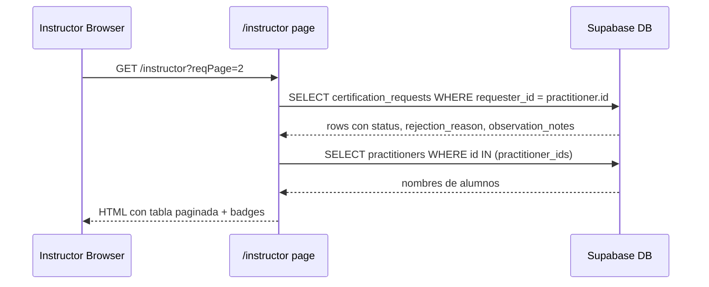
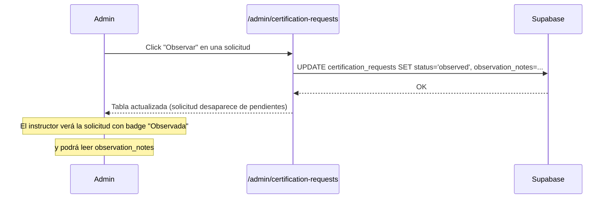

# Design Document: Instructor Certification Requests

## Overview

Esta feature agrega una sección "Mis solicitudes" al panel del instructor (`/instructor`) que lista todas las solicitudes de certificación enviadas por ese instructor, con badges visuales por estado y visualización del motivo cuando aplique. También incluye la migración SQL necesaria para agregar el estado `observed` y el campo `observation_notes` a la tabla `certification_requests`.

El instructor puede ver el historial completo de sus solicitudes (pendiente, aprobada, rechazada, observada) con paginación, sin necesidad de navegar a una página separada.

## Architecture

```mermaid
graph TD
    A[/instructor page.tsx] --> B[InstructorPage Server Component]
    B --> C[adminSupabase query: certification_requests]
    C --> D[JOIN practitioners para nombre del alumno]
    B --> E[CertificationRequestsSection - nueva sección en página]
    E --> F[StatusBadge component]
    E --> G[ReasonPanel - motivo colapsable]

    H[Admin Panel] --> I[observeCertificationRequestAction - nueva action]
    I --> J[certification_requests UPDATE status=observed]

    K[028_add_observed_status.sql] --> L[ALTER TABLE: nuevo CHECK constraint]
    K --> M[ADD COLUMN observation_notes TEXT]
```



## Components and Interfaces

### Sección nueva en InstructorPage

La sección "Mis solicitudes" se agrega al final de `src/app/(dashboard)/instructor/page.tsx` como una cuarta sección (después de Mis alumnos, Mis academias, Solicitar certificación).

**Query adicional en el Server Component:**

```typescript
// Parámetro de paginación separado para no colisionar con el de alumnos
const reqPage = Math.max(1, parseInt(sp.reqPage ?? "1", 10));
const reqOffset = (reqPage - 1) * REQ_PAGE_SIZE;

const { data: requestRows, count: reqCount } = await adminSupabase
  .from("certification_requests")
  .select("*, practitioners!practitioner_id(full_name, rut)", {
    count: "exact",
  })
  .eq("requester_id", practitioner.id)
  .order("created_at", { ascending: false })
  .range(reqOffset, reqOffset + REQ_PAGE_SIZE - 1);
```

### StatusBadge

Componente inline (no archivo separado, definido en la misma página o como helper):

```typescript
interface StatusBadgeProps {
  status: "pending" | "approved" | "rejected" | "observed";
}

// Estilos por estado:
// pending  → bg-yellow-900/50 text-yellow-400 border-yellow-800   → "Pendiente"
// approved → bg-emerald-900/50 text-emerald-400 border-emerald-800 → "Aprobada"
// rejected → bg-red-900/50 text-red-400 border-red-800            → "Rechazada"
// observed → bg-blue-900/50 text-blue-400 border-blue-800         → "Observada"
```

### Data Model: CertificationRequest (vista instructor)

```typescript
interface CertificationRequestRow {
  id: string;
  practitioner_id: string;
  cert_type: string;
  notes: string | null;
  status: "pending" | "approved" | "rejected" | "observed";
  rejection_reason: string | null; // campo existente
  observation_notes: string | null; // campo nuevo (migración)
  created_at: string;
  // join:
  practitioners: { full_name: string; rut: string } | null;
}
```

## Data Models

### Migración SQL: 028_add_observed_status.sql

```sql
-- Ampliar el CHECK constraint para incluir 'observed'
ALTER TABLE certification_requests
  DROP CONSTRAINT IF EXISTS certification_requests_status_check;

ALTER TABLE certification_requests
  ADD CONSTRAINT certification_requests_status_check
  CHECK (status IN ('pending', 'approved', 'rejected', 'observed'));

-- Nuevo campo para notas de observación del admin
ALTER TABLE certification_requests
  ADD COLUMN IF NOT EXISTS observation_notes TEXT;
```

### Nueva action: observeCertificationRequestAction

```typescript
// En instructorActions.ts (o adminActions.ts si existe)
const ObserveCertificationRequestInputSchema = z.object({
  requestId: z.string().uuid(),
  observationNotes: z.string().min(1),
});

export async function observeCertificationRequestAction(
  rawInput: unknown,
): Promise<ActionResult>;
// Preconditions: usuario es admin, request existe y está en pending
// Postconditions: status = "observed", observation_notes = input.observationNotes
```

## Sequence Diagrams



## Error Handling

### Sin solicitudes

- Mostrar estado vacío: "Aún no has enviado solicitudes de certificación."

### Error de DB al cargar solicitudes

- La sección muestra un mensaje de error genérico; no bloquea el resto del panel.

### Estado desconocido en DB

- El badge muestra el valor raw con estilo neutro (fallback).

## Testing Strategy

### Unit Testing Approach

- Testear la función helper `getStatusLabel(status)` y `getStatusStyle(status)` con los 4 estados válidos y un estado desconocido.
- Testear que `buildUrl` con `reqPage` no sobreescribe el parámetro `page` de alumnos.

### Property-Based Testing Approach

- **Property Test Library**: fast-check
- Propiedad: para cualquier `status ∈ {"pending","approved","rejected","observed"}`, `getStatusStyle(status)` retorna un string no vacío.
- Propiedad: para cualquier número de página `n ≥ 1`, `buildUrl({page: "1"}, {reqPage: String(n)})` contiene `reqPage=n` y `page=1`.

### Integration Testing Approach

- Verificar que la query con `.eq("requester_id", practitioner.id)` filtra correctamente y no expone solicitudes de otros instructores.

## Performance Considerations

- `REQ_PAGE_SIZE = 10` para mantener la página liviana.
- El join `practitioners!practitioner_id(full_name, rut)` evita una segunda query para enriquecer nombres.
- El índice existente `idx_certification_requests_requester` cubre la query principal.

## Security Considerations

- La query siempre filtra por `requester_id = practitioner.id` (el practitioner del usuario autenticado), nunca expone solicitudes de otros instructores.
- `requireUser()` ya garantiza autenticación; el guard de rol instructor ya existe en la página.
- La nueva action `observeCertificationRequestAction` requiere `requireAdmin()` igual que las acciones existentes de aprobar/rechazar.

## Dependencies

- Supabase `adminSupabase` (ya disponible)
- `requireUser()` de `@/lib/supabase/server` (ya disponible)
- `formatDateShort` de `@/lib/format-date` (ya usado en admin page)
- Tailwind CSS (ya configurado con tema oscuro)
- Migración `028_add_observed_status.sql` (nueva)
