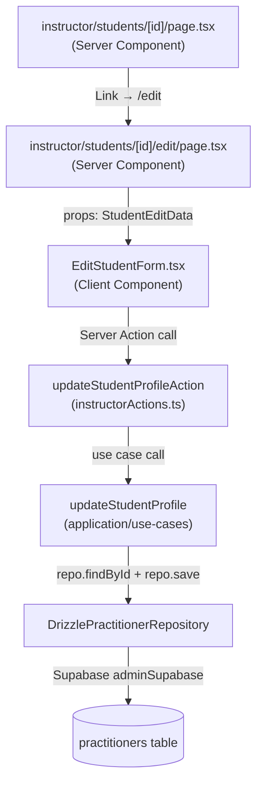
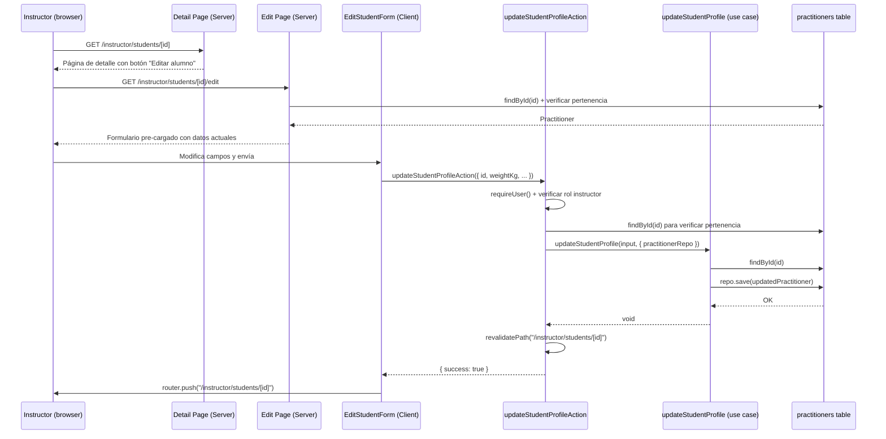
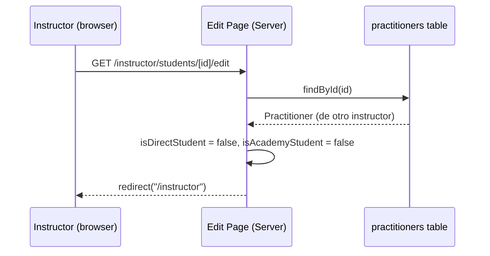

# Design Document: Instructor Edit Student

## Overview

Esta funcionalidad permite a un instructor editar los datos no sensibles de un alumno que le pertenece (directo o de su academia). El instructor puede actualizar peso, estatura, teléfono, email de contacto y dirección, pero no puede modificar datos de identidad como RUT, nombre, fecha de nacimiento, género, grado ni rol — esos campos son exclusivos del administrador.

La edición se expone a través de una sub-ruta dedicada `instructor/students/[id]/edit/page.tsx`, siguiendo el mismo patrón que usa el admin en rutas como `admin/practitioners/[publicId]/grade/` y `admin/events/[eventId]/edit/`. Un botón "Editar alumno" en la página de detalle existente navega a esta sub-ruta.

## Decisión de UX: Sub-ruta vs Modal Inline

Se elige **sub-ruta** (`/instructor/students/[id]/edit`) por las siguientes razones:

- Es el patrón establecido en el proyecto: el admin usa sub-rutas para todas las operaciones de edición (`/grade`, `/edit`, `/certifications/new`).
- Permite que la página de edición sea un Server Component que pre-carga los datos actuales del alumno sin estado adicional en el cliente.
- Mantiene URLs navegables y permite el botón "atrás" del navegador.
- Evita complejidad de estado en la página de detalle (que ya es un Server Component sin `"use client"`).

## Architecture



## Sequence Diagrams

### Flujo de edición exitosa



### Flujo de acceso denegado



## Components and Interfaces

### Component 1: `updateStudentProfile` (Use Case)

**Ubicación:** `src/modules/practitioner-identity/application/use-cases/updateStudentProfile.ts`

**Purpose:** Actualiza los campos editables por el instructor en el perfil de un alumno activo.

**Interface:**

```typescript
export const UpdateStudentProfileInputSchema = z.object({
  publicId: z.string().uuid(),
  weightKg: z.number().positive().nullable().optional(),
  heightCm: z.number().int().min(50).max(250).nullable().optional(),
  contactPhone: z.string().max(30).nullable().optional(),
  contactEmail: z.string().email().nullable().optional(),
  addressStreet: z.string().max(200).nullable().optional(),
  addressCity: z.string().max(100).nullable().optional(),
  addressRegion: z.string().max(100).nullable().optional(),
});

export type UpdateStudentProfileInput = z.infer<
  typeof UpdateStudentProfileInputSchema
>;

export async function updateStudentProfile(
  input: UpdateStudentProfileInput,
  deps: { practitionerRepo: PractitionerRepository },
): Promise<void>;
```

**Responsibilities:**

- Validar el input con Zod.
- Verificar que el practicante existe (`PractitionerNotFoundError` si no).
- Verificar que el practicante está activo (`PractitionerInactiveError` si no).
- Aplicar solo los campos presentes en el input (patch parcial: `undefined` = no cambiar, `null` = limpiar).
- Persistir el practicante actualizado con `updatedAt` renovado.
- No tocar campos de identidad (rut, fullName, birthDate, gender, grade, dan, role).

---

### Component 2: `updateStudentProfileAction` (Server Action)

**Ubicación:** `src/modules/practitioner-identity/presentation/actions/instructorActions.ts` (nuevo export)

**Purpose:** Punto de entrada seguro desde el cliente. Autentica al instructor, verifica que el alumno le pertenece, y delega al use case.

**Interface:**

```typescript
export async function updateStudentProfileAction(
  rawInput: unknown,
): Promise<ActionResult>;
```

**Responsibilities:**

- Autenticar al usuario con `createClient().auth.getUser()`.
- Verificar que el usuario tiene un perfil de practicante activo con rol instructor/profesor/maestro.
- Validar el input con Zod (`UpdateStudentProfileActionSchema`).
- Verificar que el alumno objetivo pertenece al instructor (alumno directo o de su academia) — misma lógica que la página de detalle.
- Instanciar `DrizzlePractitionerRepository` y llamar a `updateStudentProfile`.
- Llamar a `revalidatePath` para la página de detalle y la de edición.
- Retornar `ActionResult` tipado.

---

### Component 3: `EditStudentForm.tsx` (Client Component)

**Ubicación:** `src/app/(dashboard)/instructor/students/[id]/edit/EditStudentForm.tsx`

**Purpose:** Formulario interactivo con los campos editables del alumno, pre-cargado con los valores actuales.

**Interface:**

```typescript
interface StudentEditData {
  publicId: string;
  weightKg: number | null;
  heightCm: number | null;
  contactPhone: string | null;
  contactEmail: string | null;
  addressStreet: string | null;
  addressCity: string | null;
  addressRegion: string | null;
}

interface Props {
  student: StudentEditData;
  backHref: string;
}

export function EditStudentForm({ student, backHref }: Props): JSX.Element;
```

**Responsibilities:**

- Renderizar campos de formulario pre-cargados con los valores actuales.
- Gestionar estado local con `useState` para cada campo.
- Llamar a `updateStudentProfileAction` dentro de `useTransition` al enviar.
- Mostrar estado de carga (`isPending`) y errores inline.
- Redirigir a la página de detalle con `router.push(backHref)` tras éxito.
- No recibir ni exponer datos sensibles (rut, authUserId, qrToken, etc.).

---

### Component 4: `instructor/students/[id]/edit/page.tsx` (Server Component)

**Ubicación:** `src/app/(dashboard)/instructor/students/[id]/edit/page.tsx`

**Purpose:** Carga los datos del alumno, verifica pertenencia al instructor, y renderiza el formulario de edición.

**Interface:**

```typescript
export default async function EditStudentPage({
  params,
}: {
  params: Promise<{ id: string }>;
}): Promise<JSX.Element>;
```

**Responsibilities:**

- Verificar sesión y rol de instructor (redirect a `/dashboard` si no).
- Cargar el practicante por `id` (notFound si no existe).
- Verificar pertenencia (redirect a `/instructor` si el alumno no pertenece al instructor).
- Pasar solo `StudentEditData` (campos editables + publicId) al Client Component — sin datos sensibles.

---

### Component 5: Botón "Editar alumno" en `instructor/students/[id]/page.tsx`

**Modificación:** Agregar un `Link` en la página de detalle existente que navega a la sub-ruta de edición.

```typescript
<Link
  href={`/instructor/students/${id}/edit`}
  className="inline-flex items-center gap-1.5 text-xs font-medium text-primary-400 hover:text-primary-300 transition-colors"
>
  Editar alumno
</Link>
```

## Data Models

### `UpdateStudentProfileInput`

```typescript
interface UpdateStudentProfileInput {
  publicId: string; // UUID del practicante — requerido
  weightKg?: number | null; // kg, positivo; null = limpiar
  heightCm?: number | null; // cm, 50–250; null = limpiar
  contactPhone?: string | null; // máx 30 chars; null = limpiar
  contactEmail?: string | null; // email válido; null = limpiar
  addressStreet?: string | null; // máx 200 chars; null = limpiar
  addressCity?: string | null; // máx 100 chars; null = limpiar
  addressRegion?: string | null; // máx 100 chars; null = limpiar
}
```

**Validation Rules:**

- `publicId`: UUID v4 válido, requerido.
- `weightKg`: número positivo (> 0) si se provee; acepta `null` para limpiar.
- `heightCm`: entero entre 50 y 250 si se provee; acepta `null` para limpiar.
- `contactPhone`: string de máximo 30 caracteres si se provee; acepta `null`.
- `contactEmail`: email válido según RFC si se provee; acepta `null`.
- `addressStreet`, `addressCity`, `addressRegion`: strings con límites de longitud; aceptan `null`.
- Campos ausentes (`undefined`) no modifican el valor existente (patch semántico).

### `StudentEditData` (DTO para el Client Component)

```typescript
interface StudentEditData {
  publicId: string;
  weightKg: number | null;
  heightCm: number | null;
  contactPhone: string | null;
  contactEmail: string | null;
  addressStreet: string | null;
  addressCity: string | null;
  addressRegion: string | null;
}
```

**Nota de seguridad:** Este DTO excluye explícitamente `rut`, `authUserId`, `qrToken`, `grade`, `dan`, `role`, `deactivatedAt`, `deactivationReason` y cualquier otro campo sensible. Solo se pasan al Client Component los campos que el instructor puede editar.

## Error Handling

### Error Scenario 1: Alumno no encontrado

**Condition:** `publicId` no corresponde a ningún practicante en la base de datos.
**Response:** Use case lanza `PractitionerNotFoundError`. Server Action retorna `{ success: false, error: "Alumno no encontrado", code: "NOT_FOUND" }`.
**Recovery:** El formulario muestra el mensaje de error. La página de edición también llama a `notFound()` si el practicante no existe al cargar.

### Error Scenario 2: Alumno inactivo

**Condition:** El practicante existe pero `isActive === false`.
**Response:** Use case lanza `PractitionerInactiveError`. Server Action retorna `{ success: false, error: "El alumno está inactivo", code: "FORBIDDEN" }`.
**Recovery:** El formulario muestra el mensaje de error inline.

### Error Scenario 3: Instructor no autorizado (alumno de otro instructor)

**Condition:** El alumno no es alumno directo ni de academia del instructor autenticado.
**Response (Server Action):** Retorna `{ success: false, error: "No tienes permiso para editar este alumno", code: "FORBIDDEN" }`.
**Response (Edit Page):** `redirect("/instructor")` antes de renderizar el formulario.
**Recovery:** El instructor es redirigido a su panel.

### Error Scenario 4: Input inválido

**Condition:** Los datos enviados no pasan la validación Zod (ej. email malformado, altura fuera de rango).
**Response:** Server Action retorna `{ success: false, error: "<mensaje Zod>", code: "VALIDATION_ERROR" }`.
**Recovery:** El formulario muestra el error inline sin perder los valores ingresados.

### Error Scenario 5: Error de base de datos

**Condition:** Fallo inesperado al persistir en Supabase.
**Response:** Server Action captura la excepción, la loguea server-side, y retorna `{ success: false, error: "Error interno del servidor", code: "INTERNAL_ERROR" }`.
**Recovery:** El formulario muestra el mensaje genérico. No se expone el detalle del error al cliente.

## Testing Strategy

### Unit Testing Approach

El use case `updateStudentProfile` es la pieza con mayor lógica y debe tener cobertura unitaria:

- Caso feliz: actualiza solo los campos provistos, no toca los demás.
- Patch parcial: campos `undefined` no modifican el valor existente.
- Limpiar campos: campos `null` se persisten como `null`.
- `PractitionerNotFoundError` cuando el repo retorna `null`.
- `PractitionerInactiveError` cuando `isActive === false`.
- `updatedAt` se renueva en cada llamada.

### Property-Based Testing Approach

**Property Test Library:** `fast-check`

Propiedades a verificar en `updateStudentProfile`:

- **Idempotencia de campos no provistos:** Para cualquier practicante y cualquier subconjunto de campos editables, los campos no incluidos en el input permanecen iguales al valor original.
- **Campos de identidad inmutables:** Para cualquier input válido, `rut`, `fullName`, `birthDate`, `gender`, `grade`, `dan`, `role` del practicante guardado son idénticos a los del practicante original.
- **Patch semántico:** Si se provee un campo con valor `null`, el practicante guardado tiene ese campo como `null`. Si se provee con un valor, el practicante guardado tiene ese valor.

### Integration Testing Approach

- Verificar que `updateStudentProfileAction` rechaza llamadas sin sesión activa.
- Verificar que la acción rechaza instructores que intentan editar alumnos de otros instructores.
- Verificar que la página de edición redirige correctamente cuando el alumno no pertenece al instructor.

## Security Considerations

- **Autorización doble:** La verificación de pertenencia del alumno se realiza tanto en la Server Page (para no renderizar el formulario) como en la Server Action (para no ejecutar la mutación). Nunca se confía en el cliente para esta verificación.
- **DTO mínimo al cliente:** `EditStudentForm` recibe solo `StudentEditData` — sin `rut`, `authUserId`, `qrToken`, ni campos de auditoría. Esto sigue el principio ISP y evita exponer datos sensibles al browser.
- **Campos de identidad bloqueados en el use case:** El use case `updateStudentProfile` solo toca los 7 campos editables. Los campos de identidad (`rut`, `fullName`, `birthDate`, `gender`, `grade`, `dan`, `role`) se copian del practicante original sin modificación, independientemente de lo que llegue en el input.
- **Validación Zod en la Server Action:** Todo input externo se valida con `safeParse` antes de ejecutar cualquier lógica.
- **Sin exposición de errores internos:** Los errores de base de datos se loguean server-side y se retorna solo un mensaje genérico al cliente.

## Dependencies

- `zod` — validación de input (ya instalado).
- `next/cache` → `revalidatePath` — invalidación de caché tras mutación.
- `next/navigation` → `redirect`, `notFound` — navegación server-side.
- `@/lib/supabase/server` → `createClient` — autenticación del usuario.
- `@/lib/supabase/admin` → `adminSupabase` — consultas privilegiadas para verificar pertenencia.
- `DrizzlePractitionerRepository` — acceso a datos del practicante.
- Errores de dominio existentes: `PractitionerNotFoundError`, `PractitionerInactiveError`, `UnauthorizedError`.
- No se requieren nuevas dependencias externas.

## Correctness Properties

_Una propiedad es una característica o comportamiento que debe mantenerse verdadero en todas las ejecuciones válidas del sistema — esencialmente, una declaración formal sobre lo que el sistema debe hacer. Las propiedades sirven como puente entre las especificaciones legibles por humanos y las garantías de corrección verificables por máquinas._

### Property 1: Verificación de pertenencia del alumno en la página de edición

_Para cualquier_ par (instructor, alumno), la EditStudentPage solo debe renderizar el formulario de edición si y solo si el alumno pertenece al instructor (como alumno directo o de su academia); en cualquier otro caso debe redirigir a `/instructor`.

**Validates: Requirement 1.4**

### Property 2: Patch semántico — campos no provistos permanecen inalterados

_Para cualquier_ practicante activo y cualquier subconjunto de campos editables (weightKg, heightCm, contactPhone, contactEmail, addressStreet, addressCity, addressRegion), los campos NO incluidos en el input del use case `updateStudentProfile` deben tener exactamente el mismo valor en el practicante guardado que en el practicante original.

**Validates: Requirements 2.1, 2.2, 2.3**

### Property 3: Inmutabilidad de campos de identidad

_Para cualquier_ input válido de `updateStudentProfile`, los campos rut, fullName, birthDate, gender, grade, dan y role del practicante guardado deben ser idénticos a los del practicante original, independientemente del contenido del input.

**Validates: Requirement 2.4**

### Property 4: Autorización en la Server Action — solo alumnos propios

_Para cualquier_ instructor autenticado y cualquier alumno, la `updateStudentProfileAction` solo debe ejecutar la mutación si el alumno pertenece al instructor; para cualquier alumno que no pertenezca al instructor, debe retornar `{ success: false, code: "FORBIDDEN" }`.

**Validates: Requirements 3.5, 3.6**

### Property 5: ActionResult siempre tipado

_Para cualquier_ input (válido, inválido, o malformado), la `updateStudentProfileAction` debe retornar siempre un objeto con la forma `{ success: boolean }` — nunca `undefined`, nunca lanzar una excepción no manejada al cliente.

**Validates: Requirement 3.10**

### Property 6: Validación rechaza valores fuera de rango

_Para cualquier_ valor de `weightKg` no positivo, `heightCm` fuera del rango [50, 250], o `contactEmail` con formato inválido, el schema `UpdateStudentProfileInput` debe retornar un error de validación y nunca persistir el valor inválido.

**Validates: Requirements 5.2, 5.3, 5.4**

### Property 7: Pre-carga del formulario con datos actuales

_Para cualquier_ `StudentEditData` válido, el EditStudentForm debe inicializar cada campo del formulario con el valor correspondiente del prop `student`, de modo que el estado inicial del formulario sea igual a los datos actuales del alumno.

**Validates: Requirement 4.1**
