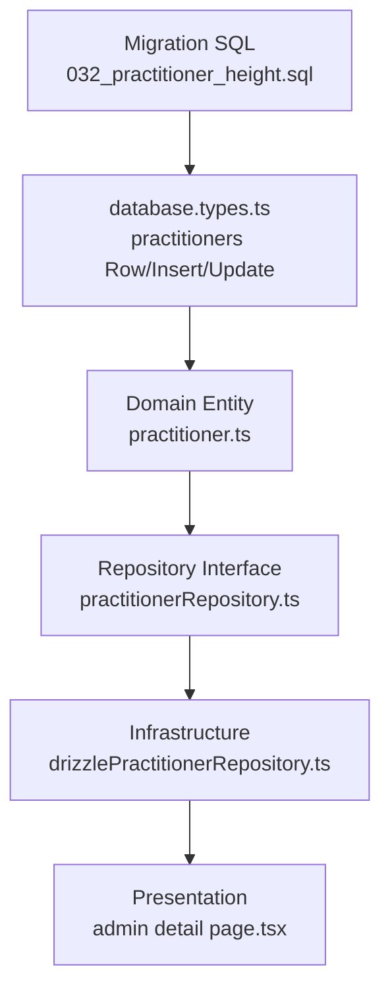

# Documento de Diseño: practitioner-height

## Descripción general

Esta funcionalidad agrega el atributo `height_cm` (estatura en centímetros) a la tabla `practitioners` en la base de datos, lo expone en la entidad de dominio `Practitioner`, y lo muestra en la ficha de detalle del alumno en el panel de administración. El cambio sigue el mismo patrón ya establecido para `weight_kg` en todas las capas de la arquitectura (migración SQL → tipo DB → entidad de dominio → repositorio → página de detalle).

## Arquitectura

El cambio atraviesa todas las capas de Clean Architecture del módulo `practitioner-identity`, siguiendo el flujo de dependencias de afuera hacia adentro para escritura y de adentro hacia afuera para lectura.



## Componentes e interfaces

### 1. Migración de base de datos

**Archivo:** `src/lib/db/migrations/032_practitioner_height.sql`

**Propósito:** Agregar la columna `height_cm` a la tabla `practitioners` en Supabase/PostgreSQL.

```sql
ALTER TABLE practitioners
  ADD COLUMN IF NOT EXISTS height_cm SMALLINT CHECK (height_cm BETWEEN 50 AND 250);
```

**Decisiones de diseño:**

- Tipo `SMALLINT`: suficiente para valores entre 50 y 250 cm, ahorra espacio frente a `INTEGER`.
- Restricción `CHECK (height_cm BETWEEN 50 AND 250)`: previene valores absurdos a nivel de base de datos.
- `IF NOT EXISTS`: idempotente, seguro de re-ejecutar.
- Columna nullable: la estatura es un dato opcional, igual que `weight_kg`.

---

### 2. Tipos de base de datos

**Archivo:** `src/types/database.types.ts`

**Propósito:** Reflejar la nueva columna en los tipos TypeScript generados de Supabase.

```typescript
// En Database["public"]["Tables"]["practitioners"]
Row: {
  // ... campos existentes ...
  height_cm: number | null;   // NUEVO
  weight_kg: number | null;
}

Insert: {
  // ... campos existentes ...
  height_cm?: number | null;  // NUEVO
  weight_kg?: number | null;
}

Update: {
  // ... campos existentes ...
  height_cm?: number | null;  // NUEVO
  weight_kg?: number | null;
}
```

---

### 3. Entidad de dominio

**Archivo:** `src/modules/practitioner-identity/domain/entities/practitioner.ts`

**Propósito:** Agregar `heightCm` a la interfaz `Practitioner` (camelCase, convención del dominio).

```typescript
export interface Practitioner {
  // ... campos existentes ...
  weightKg: number | null;
  heightCm: number | null; // NUEVO — estatura en centímetros
  // ...
}
```

**Regla de validación de dominio:**

- `heightCm` debe ser `null` o un entero entre 50 y 250 (inclusive).
- Esta restricción se valida en el esquema Zod del repositorio y en los use cases que acepten el campo.

---

### 4. Interfaz del repositorio

**Archivo:** `src/modules/practitioner-identity/domain/interfaces/practitionerRepository.ts`

No requiere cambios en la interfaz. El método `save(practitioner: Practitioner)` ya acepta la entidad completa; al agregar `heightCm` a la entidad, el repositorio lo persiste automáticamente.

---

### 5. Repositorio de infraestructura

**Archivo:** `src/modules/practitioner-identity/infrastructure/repositories/drizzlePractitionerRepository.ts`

**Propósito:** Mapear `height_cm` (snake_case DB) ↔ `heightCm` (camelCase dominio).

**Cambios en `PractitionerRowSchema`:**

```typescript
const PractitionerRowSchema = z
  .object({
    // ... campos existentes ...
    weight_kg: z.number().nullable(),
    height_cm: z.number().int().min(50).max(250).nullable().optional(), // NUEVO
  })
  .passthrough();
```

**Cambios en `toEntity()`:**

```typescript
private toEntity(row: PractitionerRow): Practitioner {
  return {
    // ... campos existentes ...
    weightKg: row.weight_kg,
    heightCm: row.height_cm ?? null,  // NUEVO
    // ...
  };
}
```

**Cambios en `toRow()`:**

```typescript
private toRow(practitioner: Practitioner): PractitionerInsert {
  return {
    // ... campos existentes ...
    weight_kg: practitioner.weightKg,
    height_cm: practitioner.heightCm,  // NUEVO
    // ...
  };
}
```

---

### 6. Use case: registerPractitioner

**Archivo:** `src/modules/practitioner-identity/application/use-cases/registerPractitioner.ts`

**Propósito:** Permitir registrar la estatura al crear un practicante (campo opcional).

```typescript
export const RegisterPractitionerInputSchema = z.object({
  // ... campos existentes ...
  weightKg: z.number().positive().optional(),
  heightCm: z.number().int().min(50).max(250).optional(), // NUEVO
});

// En la construcción del objeto Practitioner:
const practitioner: Practitioner = {
  // ...
  weightKg: validated.weightKg ?? null,
  heightCm: validated.heightCm ?? null, // NUEVO
};
```

---

### 7. Página de detalle del practicante (presentación)

**Archivo:** `src/app/(dashboard)/admin/practitioners/[publicId]/page.tsx`

**Propósito:** Mostrar la estatura en la sección "Datos personales" de la ficha del alumno, junto al peso, siguiendo el mismo patrón visual del campo `weightKg`.

**Cambio en la sección de datos personales:**

```tsx
{
  practitioner.weightKg && (
    <Field label="Peso" value={`${practitioner.weightKg} kg`} />
  );
}
{
  practitioner.heightCm && (
    <Field label="Estatura" value={`${practitioner.heightCm} cm`} /> // NUEVO
  );
}
```

**Decisión de diseño:** Se muestra condicionalmente (solo si tiene valor), igual que el peso, para no mostrar campos vacíos en fichas antiguas que no tengan el dato.

---

## Modelos de datos

### Practitioner (entidad de dominio — estado final)

```typescript
interface Practitioner {
  id: string;
  authUserId: string | null;
  rut: string;
  fullName: string;
  birthDate: string;
  gender: Gender;
  grade: Grade;
  dan: number | null;
  startDate: string;
  isActive: boolean;
  contactPhone: string | null;
  contactEmail: string | null;
  photoPath: string | null;
  qrToken: string;
  weightKg: number | null;
  heightCm: number | null; // NUEVO
  deactivatedAt: string | null;
  deactivationReason: string | null;
  updatedAt: string;
  createdAt: string;
  role?: PractitionerRole;
  ageCategory?: AgeCategory;
  addressStreet: string | null;
  addressCity: string | null;
  addressRegion: string | null;
  instructorId: string | null;
}
```

**Reglas de validación:**

- `heightCm` es nullable (dato opcional).
- Si se provee, debe ser un entero entre 50 y 250 (inclusive).
- No afecta ninguna lógica de negocio existente (grado, rol, categoría de edad, ranking).

---

## Manejo de errores

### Escenario 1: Valor fuera de rango

**Condición:** Se intenta guardar `heightCm` con un valor < 50 o > 250.  
**Respuesta:** El esquema Zod en el use case rechaza el input con un error de validación antes de llegar al repositorio. La restricción `CHECK` en la base de datos actúa como segunda línea de defensa.  
**Recuperación:** El Server Action retorna `{ success: false, error: "Invalid input", code: "VALIDATION_ERROR" }`.

### Escenario 2: Columna ausente en filas antiguas

**Condición:** Filas creadas antes de la migración no tienen el campo `height_cm`.  
**Respuesta:** El esquema Zod usa `.optional()` y el `toEntity()` usa `?? null`, por lo que el campo se mapea a `null` sin error.  
**Recuperación:** La UI muestra el campo condicionalmente, así que no aparece para fichas sin dato.

---

## Estrategia de testing

### Testing unitario

- Verificar que `toEntity()` mapea `height_cm: null` → `heightCm: null`.
- Verificar que `toEntity()` mapea `height_cm: 175` → `heightCm: 175`.
- Verificar que `toRow()` mapea `heightCm: 175` → `height_cm: 175`.
- Verificar que `PractitionerRowSchema` rechaza valores fuera del rango [50, 250].
- Verificar que `RegisterPractitionerInputSchema` acepta `heightCm` opcional y rechaza valores inválidos.

### Testing de propiedad (property-based)

**Librería:** fast-check

**Propiedad 1 — Round-trip de mapeo:**  
Para cualquier entero `n` en [50, 250], `toEntity(toRow({ ...practitioner, heightCm: n })).heightCm === n`.

**Propiedad 2 — Valores nulos son preservados:**  
`toEntity(toRow({ ...practitioner, heightCm: null })).heightCm === null`.

### Testing de integración

- Verificar que la migración SQL se aplica sin errores en un entorno de test.
- Verificar que `save()` persiste `heightCm` y `findById()` lo recupera correctamente.

---

## Consideraciones de seguridad

- `heightCm` es un dato personal de salud (dato biométrico). Se aplican las mismas políticas RLS existentes para la tabla `practitioners`: solo el propio practicante y los administradores pueden leer/escribir el dato.
- No se expone en respuestas públicas (el endpoint de verificación QR no incluye datos físicos).
- La validación Zod en el use case previene inyección de valores maliciosos antes de llegar a la base de datos.

---

## Dependencias

No se requieren nuevas dependencias externas. El cambio reutiliza:

- Supabase/PostgreSQL (ya configurado)
- Zod (ya instalado)
- Patrón de mapeo snake_case ↔ camelCase ya establecido en `drizzlePractitionerRepository.ts`

---

## Correctness Properties

_Una propiedad es una característica o comportamiento que debe mantenerse verdadero en todas las ejecuciones válidas del sistema — esencialmente, una declaración formal sobre lo que el sistema debe hacer. Las propiedades sirven como puente entre las especificaciones legibles por humanos y las garantías de corrección verificables por máquinas._

### Property 1: Validación de rango — rechazo de valores fuera de [50, 250]

_Para cualquier_ valor entero `n` fuera del rango [50, 250] (es decir, `n < 50` o `n > 250`), el esquema Zod de `PractitionerRowSchema`, el `RegisterPractitionerInputSchema` del use case y cualquier otra capa de validación SHALL rechazar ese valor con un error de validación, sin persistir el dato en la base de datos.

**Validates: Requirements 3.2, 4.6, 5.2, 5.3, 7.3**

---

### Property 2: Round-trip de mapeo — preservación del valor de estatura

_Para cualquier_ entero válido `n` en el rango [50, 250] y para el valor especial `null`, la composición `toEntity(toRow({ ...practitioner, heightCm: n })).heightCm` SHALL producir un valor igual a `n`. Es decir, el mapeo camelCase → snake_case → camelCase es una identidad sobre el campo `heightCm`.

**Validates: Requirements 4.2, 4.3, 4.4, 4.5, 5.5, 8.1**

---

### Property 3: Formato de visualización — presencia del valor en la UI

_Para cualquier_ valor entero `n` en el rango [50, 250], cuando la `DetailPage` recibe un `Practitioner` con `heightCm = n`, el HTML renderizado SHALL contener la cadena `"${n} cm"` en la sección de datos personales.

**Validates: Requirements 6.1**
