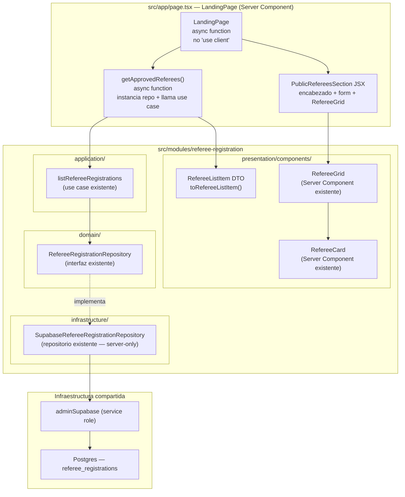
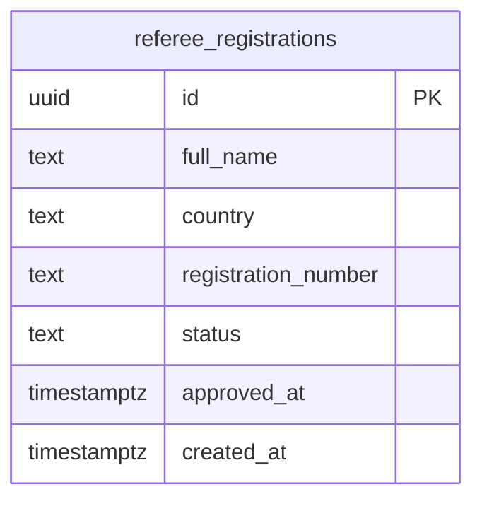
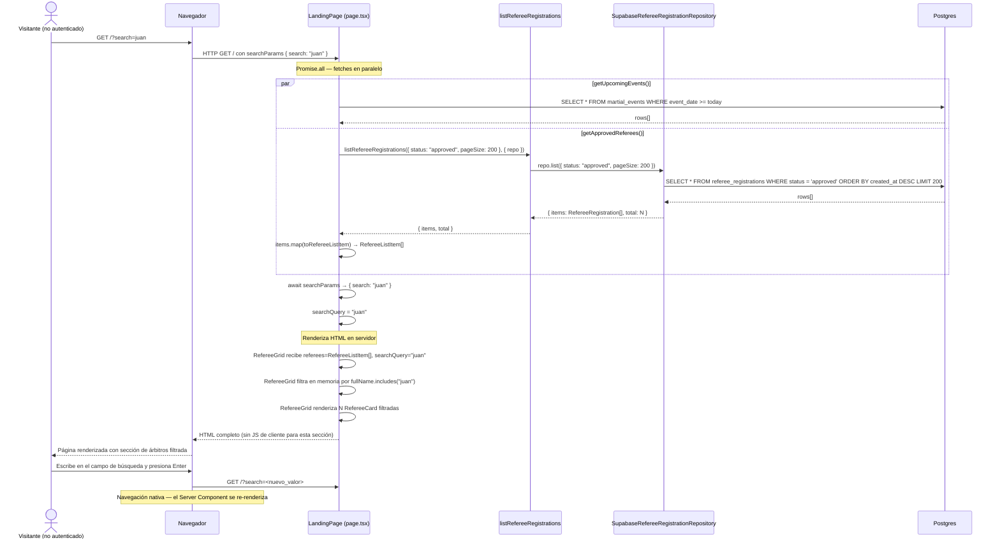

# Documento de Diseño: Sección Pública de Árbitros (`public-referee-section`)

## Descripción general

El feature `public-referee-section` agrega una nueva sección a la landing page (`src/app/page.tsx`) que muestra todos los árbitros con estado `approved` en un grid visual de tarjetas, accesible sin autenticación. La sección incluye un campo de búsqueda por nombre implementado con un formulario nativo `<form method="GET">` y el query param `?search=`, sin necesidad de `"use client"`.

El feature reutiliza íntegramente los componentes y la lógica ya existentes en el bounded context `src/modules/referee-registration/`: el DTO `RefereeListItem`, la función `toRefereeListItem`, el componente `RefereeCard`, el componente `RefereeGrid`, el caso de uso `listRefereeRegistrations` y el repositorio `SupabaseRefereeRegistrationRepository`. **El único archivo modificado es `src/app/page.tsx`.**

---

## Arquitectura del sistema



---

## Estructura de archivos

Solo se modifica el archivo marcado con `← MODIFICADO`. Todo lo demás ya existe y no se toca.

```
src/
├── app/
│   └── page.tsx                                              ← MODIFICADO
│
└── modules/
    └── referee-registration/
        ├── domain/                                           (sin cambios)
        ├── application/                                      (sin cambios)
        ├── infrastructure/                                   (sin cambios)
        └── presentation/
            └── components/
                ├── refereeListItem.ts                        (sin cambios)
                ├── RefereeCard.tsx                           (sin cambios)
                └── RefereeGrid.tsx                           (sin cambios)
```

---

## Componentes e interfaces

### `page.tsx` — LandingPage

**Tipo:** Server Component (async, sin `"use client"`)

**Cambios respecto al estado actual:**

1. Agregar prop `searchParams: Promise<{ search?: string }>` a la función de página.
2. Agregar la función `getApprovedReferees()` junto a `getUpcomingEvents()`.
3. Cambiar el fetch de datos a `Promise.all([getUpcomingEvents(), getApprovedReferees()])`.
4. Leer `search` desde `searchParams` y pasarlo al bloque JSX de la sección.
5. Insertar el bloque JSX `PublicRefereesSection` después de la sección "Próximas actividades" y antes del CTA final.

**Firma actualizada de la función de página:**

```typescript
export default async function LandingPage({
  searchParams,
}: {
  searchParams: Promise<{ search?: string }>;
}) {
  const [upcoming, approvedReferees] = await Promise.all([
    getUpcomingEvents(),
    getApprovedReferees(),
  ]);
  const { search } = await searchParams;
  const searchQuery = search?.trim() || undefined;
  // ...
}
```

---

### `getApprovedReferees()` — Función de obtención de datos

**Tipo:** Función `async` declarada en `page.tsx`, sin `"use client"`, sin hooks.

**Responsabilidades:**

- Instanciar `SupabaseRefereeRegistrationRepository` (composition root local).
- Invocar `listRefereeRegistrations` con el filtro `{ status: "approved", pageSize: 200 }`.
- Serializar cada `RefereeRegistration` a `RefereeListItem` usando `toRefereeListItem`.
- Retornar `RefereeListItem[]`.

**Implementación:**

```typescript
async function getApprovedReferees(): Promise<RefereeListItem[]> {
  const repo = new SupabaseRefereeRegistrationRepository();
  const { items } = await listRefereeRegistrations(
    { status: "approved", pageSize: 200 },
    { repo },
  );
  return items.map(toRefereeListItem);
}
```

**Decisión de diseño — `pageSize: 200`:** El número de árbitros aprobados en el sistema es acotado. Un límite de 200 es suficiente para el caso de uso actual. Si el directorio crece significativamente, se puede agregar paginación en una iteración futura sin cambiar la interfaz pública de la sección.

**Decisión de diseño — filtrado en cliente vs. servidor:** La búsqueda por nombre se implementa como filtro en memoria dentro de `RefereeGrid` (ya existente), no como una consulta adicional a la base de datos. Esto evita un segundo round-trip y es apropiado dado el volumen acotado de árbitros. El array completo de aprobados se carga una vez; `RefereeGrid` filtra localmente.

---

### `PublicRefereesSection` — Bloque JSX en `page.tsx`

**Tipo:** JSX inline dentro de `LandingPage` (Server Component). No es un componente separado — sigue el mismo patrón que las secciones "Próximas actividades" y "Funcionalidades" de la landing page actual.

**Estructura JSX exacta:**

```tsx
{
  /* ── ÁRBITROS OFICIALES ───────────────────────────────────────────── */
}
<section className="border-t border-neutral-800 bg-neutral-900/20">
  <div className="max-w-7xl mx-auto px-6 py-20 sm:py-24">
    {/* Encabezado */}
    <div className="flex items-end justify-between mb-10 gap-4 flex-wrap">
      <div className="space-y-2">
        <span className="inline-flex items-center gap-2 bg-neutral-800 border border-neutral-700 text-neutral-400 text-xs font-medium px-3 py-1.5 rounded-full">
          Directorio
        </span>
        <h2 className="text-3xl font-bold tracking-tight">
          Árbitros Oficiales
        </h2>
        <p className="text-sm text-neutral-400">
          Árbitros certificados de Kombat Taekwondo Chile
        </p>
      </div>
      {/* Contador total — invariante: siempre muestra el total, no el filtrado */}
      <span className="text-sm text-neutral-500 shrink-0">
        {approvedReferees.length}{" "}
        {approvedReferees.length === 1 ? "árbitro" : "árbitros"}
      </span>
    </div>

    {/* Campo de búsqueda — form nativo GET, sin "use client" */}
    <form method="GET" className="mb-8">
      <div className="relative max-w-sm">
        <span
          aria-hidden="true"
          className="absolute left-3 top-1/2 -translate-y-1/2 text-neutral-500 text-sm"
        >
          🔍
        </span>
        <input
          type="search"
          name="search"
          defaultValue={searchQuery ?? ""}
          placeholder="Buscar por nombre..."
          className="w-full rounded-xl border border-neutral-700 bg-neutral-800/60 pl-9 pr-4 py-2.5 text-sm text-neutral-200 placeholder:text-neutral-500 focus:border-primary-600 focus:outline-none focus:ring-1 focus:ring-primary-600"
        />
      </div>
    </form>

    {/* Grid de tarjetas */}
    <RefereeGrid referees={approvedReferees} searchQuery={searchQuery} />
  </div>
</section>;
```

**Decisión de diseño — `<form method="GET">` nativo:** El campo de búsqueda no requiere `"use client"` ni `useState`. Al enviar el formulario, el navegador navega a `/?search=<valor>`, Next.js re-renderiza el Server Component con el nuevo `searchParams`, y `RefereeGrid` filtra el array en memoria. Esto mantiene toda la página como Server Component puro, sin JavaScript adicional en el cliente.

**Decisión de diseño — `defaultValue` vs. `value`:** Se usa `defaultValue` (no `value`) para que el input sea un campo no controlado. En un Server Component no hay estado React, por lo que `value` no aplica. `defaultValue` pre-puebla el campo con el valor del query param actual.

---

### `RefereeGrid` — Componente existente (sin modificaciones)

**Props recibidas desde `LandingPage`:**

| Prop          | Tipo                  | Descripción                                                    |
| ------------- | --------------------- | -------------------------------------------------------------- |
| `referees`    | `RefereeListItem[]`   | Array completo de árbitros aprobados                           |
| `searchQuery` | `string \| undefined` | Valor del query param `search`, o `undefined` si ausente/vacío |

**Comportamiento de filtrado (ya implementado):**

- Si `searchQuery` es `undefined` o `""`: muestra todos los árbitros.
- Si `searchQuery` tiene valor: filtra por `fullName.toLowerCase().includes(searchQuery.toLowerCase())`.
- Si el array filtrado está vacío: muestra el estado vacío con el mensaje `"No hay árbitros registrados"`.

**Layout del grid (ya implementado):**

| Breakpoint          | Columnas | Clase Tailwind   |
| ------------------- | -------- | ---------------- |
| Mobile (< 640 px)   | 1        | `grid-cols-1`    |
| Tablet (≥ 640 px)   | 2        | `sm:grid-cols-2` |
| Desktop (≥ 1024 px) | 3        | `lg:grid-cols-3` |
| Wide (≥ 1280 px)    | 4        | `xl:grid-cols-4` |

---

### `RefereeCard` — Componente existente (sin modificaciones)

Renderiza la tarjeta visual de un árbitro individual. Recibe un `RefereeListItem` y muestra:

- Avatar con iniciales (gradiente `from-primary-600 to-primary-800`).
- Nombre completo (`text-neutral-50 font-semibold text-lg`).
- País con ícono 🌎.
- Número de registro en fuente monoespaciada.
- Fecha de afiliación formateada con `formatDateLong()`.
- Badge `"Árbitro Oficial"` con color `primary`.

---

## Modelo de datos

No se modifica el esquema de base de datos. Se reutiliza la tabla `referee_registrations` existente.



**Campos utilizados por este feature:**

| Campo DB              | Campo entidad        | Campo DTO            | Uso en UI                                          |
| --------------------- | -------------------- | -------------------- | -------------------------------------------------- |
| `full_name`           | `fullName`           | `fullName`           | Nombre en la tarjeta y filtro de búsqueda          |
| `country`             | `country`            | `country`            | País en la tarjeta                                 |
| `registration_number` | `registrationNumber` | `registrationNumber` | Número oficial                                     |
| `approved_at`         | `approvedAt`         | `approvedAt`         | Fecha de afiliación                                |
| `status`              | `status`             | —                    | Filtro: solo `"approved"` (no se expone en el DTO) |

**Campos excluidos del DTO (seguridad):** `email`, `authUserId`, `certificatePath`, `approvedBy`, `rejectedAt`, `rejectedBy`.

---

## Flujo de secuencia



---

## Diseño visual

### Posición en la página

```
┌─────────────────────────────────────────────────────────────┐
│  HERO                                                       │
├─────────────────────────────────────────────────────────────┤
│  STATS                                                      │
├─────────────────────────────────────────────────────────────┤
│  CÓMO FUNCIONA                                              │
├─────────────────────────────────────────────────────────────┤
│  FUNCIONALIDADES                                            │
├─────────────────────────────────────────────────────────────┤
│  VERIFICACIÓN                                               │
├─────────────────────────────────────────────────────────────┤
│  PRÓXIMAS ACTIVIDADES  (condicional — solo si hay eventos)  │
├─────────────────────────────────────────────────────────────┤
│  ► ÁRBITROS OFICIALES  ← NUEVA SECCIÓN                      │
├─────────────────────────────────────────────────────────────┤
│  CTA FINAL                                                  │
├─────────────────────────────────────────────────────────────┤
│  FOOTER                                                     │
└─────────────────────────────────────────────────────────────┘
```

### Paleta de colores

Sigue el dark theme del proyecto (`neutral-*`, `primary-*`):

| Elemento              | Clase Tailwind                                              |
| --------------------- | ----------------------------------------------------------- |
| Contenedor de sección | `border-t border-neutral-800 bg-neutral-900/20`             |
| Contenedor interior   | `max-w-7xl mx-auto px-6 py-20 sm:py-24`                     |
| Etiqueta "Directorio" | `bg-neutral-800 border border-neutral-700 text-neutral-400` |
| Título `h2`           | `text-3xl font-bold tracking-tight`                         |
| Descripción           | `text-sm text-neutral-400`                                  |
| Contador              | `text-sm text-neutral-500`                                  |
| Input de búsqueda     | `border-neutral-700 bg-neutral-800/60 text-neutral-200`     |
| Input focus           | `focus:border-primary-600 focus:ring-primary-600`           |
| Tarjeta base          | `bg-neutral-900 border border-neutral-800`                  |
| Tarjeta hover         | `hover:border-primary-500/50 hover:bg-neutral-800/60`       |

### Wireframe de la sección

```
┌──────────────────────────────────────────────────────────────────┐
│  [Directorio]                                    42 árbitros     │
│  Árbitros Oficiales                                              │
│  Árbitros certificados de Kombat Taekwondo Chile                 │
│                                                                  │
│  [🔍 Buscar por nombre...                    ]                   │
│                                                                  │
│  ┌──────────────┐  ┌──────────────┐  ┌──────────────┐  ┌──────┐ │
│  │ ┌──┐ Juan P. │  │ ┌──┐ María G.│  │ ┌──┐ Carlos R│  │ ...  │ │
│  │ │JP│ 🌎 Chile│  │ │MG│ 🌎 Chile│  │ │CR│ 🌎 Chile│  │      │ │
│  │ └──┘ REG-001 │  │ └──┘ REG-002 │  │ └──┘ REG-003 │  │      │ │
│  │ 📅 5 ene 2025│  │ 📅 8 feb 2025│  │ 📅 1 mar 2025│  │      │ │
│  │ [●Árb.Ofic.] │  │ [●Árb.Ofic.] │  │ [●Árb.Ofic.] │  │      │ │
│  └──────────────┘  └──────────────┘  └──────────────┘  └──────┘ │
└──────────────────────────────────────────────────────────────────┘
```

---

## Seguridad

- **Sin autenticación requerida:** `getApprovedReferees` no llama a ningún guard de sesión. La consulta usa `adminSupabase` (service role) para leer datos públicos, siguiendo el mismo patrón que `getUpcomingEvents`.
- **DTO sin campos sensibles:** `toRefereeListItem` excluye estructuralmente `email`, `authUserId`, `certificatePath`, `approvedBy`, `rejectedAt`, `rejectedBy`. El DTO solo contiene `id`, `fullName`, `country`, `registrationNumber`, `approvedAt`.
- **`SupabaseRefereeRegistrationRepository` es `server-only`:** El repositorio tiene `import "server-only"` — no puede importarse en Client Components. Como `page.tsx` es un Server Component, la importación es válida.
- **Sin exposición de credenciales al cliente:** Toda la lógica de acceso a datos ocurre en el servidor. El cliente recibe solo HTML renderizado.
- **Validación del query param `search`:** El valor de `search` se usa únicamente como argumento de `String.prototype.includes()` dentro de `RefereeGrid`. No se concatena en queries SQL ni se usa en operaciones de sistema de archivos.

---

## Consideraciones de rendimiento

- **Fetches en paralelo:** `Promise.all([getUpcomingEvents(), getApprovedReferees()])` evita un waterfall secuencial. Ambas consultas se ejecutan simultáneamente.
- **Sin JavaScript de cliente:** La sección completa es HTML estático generado en el servidor. El campo de búsqueda usa navegación nativa del navegador — cero KB de JS adicional.
- **Filtrado en memoria:** Con un máximo de 200 árbitros, el filtro `Array.prototype.filter` en `RefereeGrid` es O(N) con N ≤ 200 — negligible.
- **Sin re-renders de cliente:** Cada búsqueda es una nueva solicitud GET al servidor. El Server Component se re-renderiza con los nuevos `searchParams`. No hay hidratación ni estado de cliente que gestionar.

---

## Propiedades de corrección

_Una propiedad es una característica o comportamiento que debe mantenerse verdadero en todas las ejecuciones válidas del sistema — esencialmente, una declaración formal sobre lo que el sistema debe hacer. Las propiedades sirven como puente entre las especificaciones legibles por humanos y las garantías de corrección verificables por máquinas._

### Propiedad 1: Serialización del DTO excluye campos sensibles

_Para cualquier_ `RefereeRegistration` válida con `status === "approved"`, la conversión a `RefereeListItem` mediante `toRefereeListItem` debe producir un objeto que contenga exactamente los campos `{id, fullName, country, registrationNumber, approvedAt}` y que no contenga ninguno de los campos sensibles `{email, authUserId, certificatePath, approvedBy, rejectedAt, rejectedBy}`.

**Valida: Requisitos 2.2, 2.3**

---

### Propiedad 2: Solo árbitros aprobados en el resultado

_Para cualquier_ conjunto de `RefereeRegistration` con estados mixtos (`pending`, `approved`, `rejected`), el array `RefereeListItem[]` producido por `getApprovedReferees` debe contener únicamente registros cuyo `status` original era `"approved"`. Ningún registro con `status === "pending"` o `status === "rejected"` debe aparecer en el resultado.

**Valida: Requisitos 2.1, 2.2, 2.3**

---

### Propiedad 3: Invariante del contador respecto al filtro de búsqueda

_Para cualquier_ array `RefereeListItem[]` de longitud N y cualquier valor del query param `search` (incluyendo valores que producen cero coincidencias), el contador numérico mostrado en el encabezado de `PublicRefereesSection` debe ser igual a N — el total de árbitros aprobados — independientemente del número de coincidencias que produzca el filtro de búsqueda activo.

**Valida: Requisitos 3.4, 3.5**

---

### Propiedad 4: Correspondencia 1:1 entre array y tarjetas renderizadas

_Para cualquier_ array `RefereeListItem[]` de longitud N pasado a `RefereeGrid` sin `searchQuery` activo (o con `searchQuery === undefined`), el componente debe renderizar exactamente N instancias de `RefereeCard`, una por cada elemento del array, sin duplicados ni omisiones.

**Valida: Requisito 5.2**

---

## Estrategia de testing

### Enfoque dual

La estrategia combina tests de propiedades (para invariantes universales) con tests de ejemplo (para comportamientos específicos y casos de borde).

### Tests de propiedades (property-based)

**Librería:** `fast-check` (ya instalada en el proyecto)

**Configuración:** Mínimo 100 iteraciones por propiedad. Cada test referencia la propiedad del documento de diseño con el tag:
`Feature: public-referee-section, Property {N}: {texto}`

**Propiedad 1 — Serialización del DTO:**

```typescript
// Feature: public-referee-section, Property 1: DTO serialization excludes sensitive fields
fc.assert(
  fc.property(arbitraryApprovedRefereeRegistration(), (registration) => {
    const dto = toRefereeListItem(registration);
    // Contiene exactamente los campos esperados
    expect(Object.keys(dto)).toEqual(
      expect.arrayContaining([
        "id",
        "fullName",
        "country",
        "registrationNumber",
        "approvedAt",
      ]),
    );
    // No contiene campos sensibles
    expect(dto).not.toHaveProperty("email");
    expect(dto).not.toHaveProperty("authUserId");
    expect(dto).not.toHaveProperty("certificatePath");
    expect(dto).not.toHaveProperty("approvedBy");
    expect(dto).not.toHaveProperty("rejectedAt");
    expect(dto).not.toHaveProperty("rejectedBy");
  }),
  { numRuns: 100 },
);
```

**Propiedad 2 — Solo árbitros aprobados:**

```typescript
// Feature: public-referee-section, Property 2: only approved referees in output
fc.assert(
  fc.property(
    fc.array(arbitraryRefereeRegistrationWithAnyStatus()),
    (registrations) => {
      const approved = registrations.filter((r) => r.status === "approved");
      const result = approved.map(toRefereeListItem);
      // Todos los resultados provienen de registros aprobados
      expect(result).toHaveLength(approved.length);
      // Ningún registro no-aprobado aparece
      const nonApproved = registrations.filter((r) => r.status !== "approved");
      nonApproved.forEach((r) => {
        expect(result.find((dto) => dto.id === r.id)).toBeUndefined();
      });
    },
  ),
  { numRuns: 100 },
);
```

**Propiedad 3 — Invariante del contador:**

```typescript
// Feature: public-referee-section, Property 3: counter invariant under search
fc.assert(
  fc.property(
    fc.array(arbitraryRefereeListItem(), { minLength: 0, maxLength: 50 }),
    fc.string(),
    (referees, searchQuery) => {
      // El contador siempre debe ser referees.length, no el número de coincidencias
      const counterValue = referees.length;
      const filtered = searchQuery
        ? referees.filter((r) =>
            r.fullName.toLowerCase().includes(searchQuery.toLowerCase()),
          )
        : referees;
      // El contador no debe cambiar con el filtro
      expect(counterValue).toBe(referees.length);
      expect(counterValue).not.toBe(filtered.length); // solo si filtered.length !== referees.length
    },
  ),
  { numRuns: 100 },
);
```

**Propiedad 4 — Correspondencia 1:1:**

```typescript
// Feature: public-referee-section, Property 4: 1:1 card correspondence
fc.assert(fc.property(
  fc.array(arbitraryRefereeListItem(), { minLength: 1, maxLength: 50 }),
  (referees) => {
    const { getAllByRole } = render(<RefereeGrid referees={referees} />);
    const cards = getAllByRole("article");
    expect(cards).toHaveLength(referees.length);
  }
), { numRuns: 100 });
```

### Tests de ejemplo (unit tests)

- Renderizar `RefereeGrid` con array vacío → muestra `"No hay árbitros registrados"`.
- Renderizar `RefereeGrid` con `searchQuery` que no coincide con ningún árbitro → muestra estado vacío.
- Renderizar la sección con `searchQuery="juan"` → el input tiene `defaultValue="juan"`.
- Verificar que el formulario tiene `method="GET"` y el input tiene `name="search"`.
- Verificar que el `h2` contiene `"Árbitros Oficiales"`.
- Verificar que la etiqueta contiene `"Directorio"`.
- Verificar que el grid aplica las clases `grid-cols-1 sm:grid-cols-2 lg:grid-cols-3 xl:grid-cols-4`.

### Tests de integración

- `getApprovedReferees()` con repositorio mockeado que retorna mezcla de estados → solo retorna los `approved`.
- `getApprovedReferees()` invoca `listRefereeRegistrations` con `{ status: "approved" }`.
- `LandingPage` renderiza con `searchParams = { search: "juan" }` → `RefereeGrid` recibe `searchQuery="juan"`.
- `LandingPage` renderiza con `searchParams = {}` → `RefereeGrid` recibe `searchQuery=undefined`.

### Tests de humo (smoke)

- La página `/` responde sin sesión activa (sin redirect a `/login`).
- `page.tsx` no contiene la directiva `"use client"`.
- `getApprovedReferees` no importa hooks de React.
- `Promise.all` está presente en el cuerpo de `LandingPage`.
