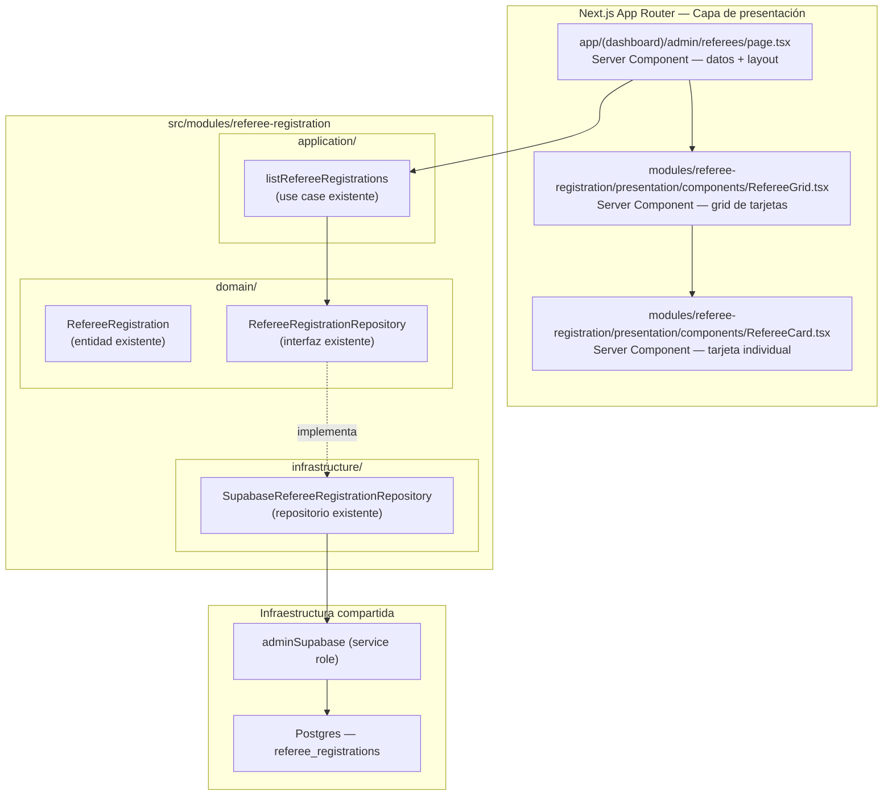
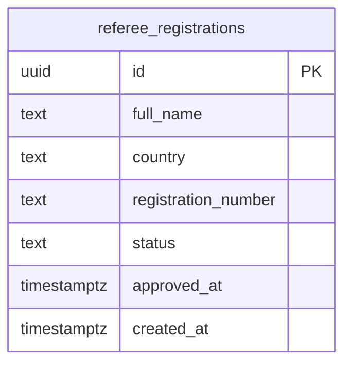
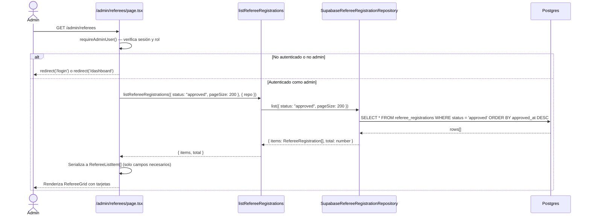

# Documento de Diseño: Listado Público de Árbitros (`referee-list`)

## Descripción general

El feature `referee-list` agrega una página pública dentro del dashboard que muestra todos los árbitros con estado `approved` registrados en el sistema. La página presenta una experiencia visual atractiva con tarjetas tipo card, mostrando el nombre del árbitro y su fecha de afiliación (campo `approved_at`). La página es de solo lectura, no requiere acciones de mutación, y es accesible para cualquier usuario autenticado con rol admin.

El feature reutiliza íntegramente el bounded context `src/modules/referee-registration/` existente: la entidad `RefereeRegistration`, la interfaz `RefereeRegistrationRepository`, el caso de uso `listRefereeRegistrations`, y el repositorio `SupabaseRefereeRegistrationRepository`. No se crea ningún módulo nuevo ni se modifica la base de datos.

---

## Arquitectura del sistema



---

## Estructura de carpetas

Solo se agregan los archivos marcados con `← NUEVO`. Todo lo demás ya existe.

```
src/
├── app/
│   └── (dashboard)/
│       └── admin/
│           └── referees/
│               └── page.tsx                  ← NUEVO (Server Component)
│
└── modules/
    └── referee-registration/
        ├── domain/                            (sin cambios)
        ├── application/                       (sin cambios)
        ├── infrastructure/                    (sin cambios)
        └── presentation/
            └── components/
                ├── RefereeGrid.tsx            ← NUEVO (Server Component)
                └── RefereeCard.tsx            ← NUEVO (Server Component)
```

> **Nota de navegación:** Se agrega un enlace `"Lista de árbitros"` en `DashboardNav.tsx` bajo la sección admin, apuntando a `/admin/referees`.

---

## Componentes e interfaces

### `page.tsx` — Página principal

**Tipo:** Server Component (async, sin `"use client"`)

**Ruta:** `/admin/referees`

**Responsabilidades:**

- Verificar sesión y rol admin (guard `requireAdminUser`).
- Instanciar `SupabaseRefereeRegistrationRepository` (composition root).
- Llamar a `listRefereeRegistrations` filtrando por `status: "approved"` sin paginación (o con `pageSize` alto para mostrar todos).
- Serializar los datos a DTOs planos antes de pasarlos a componentes hijos.
- Componer el layout: encabezado, contador, `<RefereeGrid>`.

**Props:** `searchParams: Promise<{ search?: string }>` — búsqueda opcional por nombre.

**DTO serializable pasado a componentes:**

```typescript
interface RefereeListItem {
  id: string;
  fullName: string;
  country: string;
  registrationNumber: string;
  approvedAt: string; // ISO timestamp — se formatea en el componente
}
```

---

### `RefereeGrid.tsx` — Grid de tarjetas

**Tipo:** Server Component

**Responsabilidades:**

- Recibir el array de `RefereeListItem[]` y renderizar el grid responsivo.
- Mostrar estado vacío cuando no hay árbitros aprobados.
- Renderizar una `<RefereeCard>` por cada árbitro.

**Props:**

```typescript
interface RefereeGridProps {
  referees: RefereeListItem[];
  searchQuery?: string;
}
```

**Layout del grid:**

- Mobile: 1 columna
- Tablet (sm): 2 columnas
- Desktop (lg): 3 columnas
- Wide (xl): 4 columnas

---

### `RefereeCard.tsx` — Tarjeta individual

**Tipo:** Server Component

**Responsabilidades:**

- Renderizar la tarjeta visual de un árbitro con nombre, país, número de registro y fecha de afiliación.
- Aplicar el diseño visual atractivo con el sistema de diseño del proyecto (dark theme, `card-base`, colores `neutral-*`, `primary-*`).

**Props:**

```typescript
interface RefereeCardProps {
  referee: RefereeListItem;
}
```

**Elementos visuales de la tarjeta:**

- Avatar generado con iniciales del nombre (círculo con gradiente).
- Nombre completo en texto prominente (`text-neutral-50`, `font-semibold`).
- País con ícono de bandera/globo.
- Número de registro oficial con estilo monoespaciado.
- Fecha de afiliación formateada con `formatDateLong()` (ej: "5 de enero de 2025").
- Badge `"Árbitro Oficial"` con color `primary`.
- Borde sutil con efecto hover (`hover:border-primary-500/50`).

---

## Modelo de datos

No se modifica el esquema de base de datos. Se reutiliza la tabla `referee_registrations` existente.



**Campos utilizados por este feature:**

| Campo DB              | Campo entidad        | Uso en UI                 |
| --------------------- | -------------------- | ------------------------- |
| `full_name`           | `fullName`           | Nombre en la tarjeta      |
| `country`             | `country`            | País en la tarjeta        |
| `registration_number` | `registrationNumber` | Número oficial            |
| `approved_at`         | `approvedAt`         | Fecha de afiliación       |
| `status`              | `status`             | Filtro: solo `"approved"` |

---

## Flujo de secuencia



---

## Diseño visual (UX/UI)

### Paleta de colores aplicada

El diseño sigue el dark theme del proyecto (`neutral-*`, `primary-*`):

| Elemento         | Clase Tailwind                                                 |
| ---------------- | -------------------------------------------------------------- |
| Fondo de página  | `bg-neutral-950` (heredado del layout)                         |
| Tarjeta base     | `bg-neutral-900 border border-neutral-800`                     |
| Tarjeta hover    | `hover:border-primary-500/50 hover:bg-neutral-800/60`          |
| Nombre árbitro   | `text-neutral-50 font-semibold text-lg`                        |
| País / metadata  | `text-neutral-400 text-sm`                                     |
| Número registro  | `text-neutral-300 font-mono text-xs`                           |
| Fecha afiliación | `text-neutral-400 text-xs`                                     |
| Badge oficial    | `bg-primary-900/50 text-primary-400 border border-primary-800` |
| Avatar (fondo)   | Gradiente `from-primary-600 to-primary-800`                    |
| Avatar (texto)   | `text-white font-bold`                                         |

### Encabezado de página

```
┌─────────────────────────────────────────────────────────┐
│  Árbitros Oficiales                    [N árbitros]      │
│  Registro oficial de árbitros de Kombat Taekwondo Chile  │
│                                                          │
│  [🔍 Buscar por nombre...]                               │
└─────────────────────────────────────────────────────────┘
```

### Tarjeta individual

```
┌──────────────────────────────────────┐
│  ┌────┐  Juan Pérez González         │
│  │ JP │  🌎 Chile                    │
│  └────┘  Nº REG-2024-001             │
│                                      │
│  📅 Afiliado el 5 de enero de 2025   │
│                                      │
│  [● Árbitro Oficial]                 │
└──────────────────────────────────────┘
```

### Estado vacío

Cuando no hay árbitros aprobados:

```
┌──────────────────────────────────────────────────────────┐
│                                                          │
│              🏅  No hay árbitros registrados             │
│         Aún no se han aprobado registros de árbitros.    │
│                                                          │
└──────────────────────────────────────────────────────────┘
```

---

## Seguridad

- La página está protegida por `requireAdminUser()` — mismo guard que el resto del panel admin.
- No se exponen campos sensibles (`email`, `authUserId`, `certificatePath`, `approvedBy`) al cliente.
- El DTO `RefereeListItem` solo incluye los campos necesarios para la UI.
- `SupabaseRefereeRegistrationRepository` está marcado con `import "server-only"` — no puede importarse en Client Components.
- No hay Server Actions en este feature (solo lectura).

---

## Consideraciones de rendimiento

- La consulta filtra por `status = 'approved'` directamente en la base de datos — no se cargan registros pendientes o rechazados.
- Se usa `pageSize: 200` como límite razonable. Si el número de árbitros crece significativamente, se puede agregar paginación en una iteración futura.
- Los componentes `RefereeGrid` y `RefereeCard` son Server Components — no generan JavaScript en el cliente.
- La búsqueda por nombre se implementa como filtro en el servidor (query param `?search=`), no en el cliente.

---

## Estrategia de testing

### Tests unitarios

- Verificar que `RefereeListItem` solo contiene los campos permitidos (no `email`, no `authUserId`).
- Verificar que `formatDateLong(approvedAt)` produce el formato correcto para fechas válidas.

### Tests de propiedades (property-based)

**Librería:** `fast-check` (ya instalada en el proyecto)

- **Propiedad 1 — Solo árbitros aprobados:** Para cualquier conjunto de registros con estados mixtos (`pending`, `approved`, `rejected`), la página solo debe mostrar los que tienen `status === "approved"`.
- **Propiedad 2 — Serialización segura del DTO:** Para cualquier `RefereeRegistration` válida con `status === "approved"`, la serialización a `RefereeListItem` nunca debe incluir los campos `email`, `authUserId`, `certificatePath`, `approvedBy`, `rejectedAt`, `rejectedBy`.
- **Propiedad 3 — Formato de fecha:** Para cualquier ISO timestamp válido en `approvedAt`, `formatDateLong(approvedAt)` debe retornar un string no vacío con el formato `"D de [mes] de YYYY"`.

### Tests de integración

- Acceso a `/admin/referees` con usuario admin → renderiza la página correctamente.
- Acceso a `/admin/referees` sin sesión → redirige a `/login`.
- Acceso a `/admin/referees` con usuario no-admin → redirige a `/dashboard`.

---

## Dependencias

- `@supabase/supabase-js` — cliente admin (ya instalado).
- `@supabase/ssr` — cliente server para sesiones (ya instalado).
- `zod` — validación en el repositorio (ya instalado).
- `next` — App Router, Server Components (ya instalado).
- `src/lib/format-date.ts` — `formatDateLong()` para formatear `approved_at`.
- `src/modules/referee-registration/` — bounded context completo (ya existe).

No se requieren dependencias nuevas.

---

## Propiedades de corrección

### Propiedad 1: Solo árbitros aprobados en el listado

_Para cualquier_ conjunto de registros en la base de datos con estados mixtos (`pending`, `approved`, `rejected`), el array `RefereeListItem[]` producido por la Page debe contener únicamente registros cuyo `status` original era `"approved"`. Ningún registro con `status === "pending"` o `status === "rejected"` debe aparecer en el resultado.

**Valida: Requisitos 2.1, 2.2**

---

### Propiedad 2: Serialización segura del DTO

_Para cualquier_ `RefereeRegistration` válida con `status === "approved"`, la conversión a `RefereeListItem` debe excluir estructuralmente los campos sensibles: `email`, `authUserId`, `certificatePath`, `approvedBy`, `rejectedAt`, `rejectedBy`. El DTO resultante debe contener únicamente `id`, `fullName`, `country`, `registrationNumber` y `approvedAt`.

**Valida: Requisitos 2.2, 2.3**

---

### Propiedad 3: Formato de fecha de afiliación

_Para cualquier_ ISO timestamp válido en `approvedAt`, la función `formatDateLong(approvedAt)` debe retornar un string no vacío con el patrón `"D de [mes] de YYYY"` donde `[mes]` es uno de los 12 meses en español.

**Valida: Requisito 6.1**

---

### Propiedad 4: Autorización obligatoria

_Para cualquier_ solicitud HTTP a `/admin/referees`, si el usuario no está autenticado o no tiene rol admin, el sistema debe redirigir sin renderizar ningún dato de árbitros. Esta propiedad debe mantenerse independientemente del estado de la base de datos.

**Valida: Requisitos 1.1, 1.2, 1.3**

---

### Propiedad 5: Invariante de conteo

_Para cualquier_ estado de la base de datos, el contador mostrado en el encabezado de la página debe ser igual al número de tarjetas renderizadas en el grid.

**Valida: Requisito 3.2**

---

### Propiedad 6: Correspondencia 1:1 entre array y tarjetas renderizadas

_Para cualquier_ array `RefereeListItem[]` de longitud N pasado a `RefereeGrid`, el componente debe renderizar exactamente N instancias de `RefereeCard`, una por cada elemento del array.

**Valida: Requisito 4.1**

---

### Propiedad 7: Filtrado de búsqueda es subconjunto correcto

_Para cualquier_ query de búsqueda no vacío y cualquier array de `RefereeListItem[]`, todos los elementos mostrados por `RefereeGrid` deben tener un `fullName` que contiene el query (case-insensitive), y ningún elemento cuyo `fullName` no contenga el query debe aparecer en el resultado.

**Valida: Requisito 4.4**
