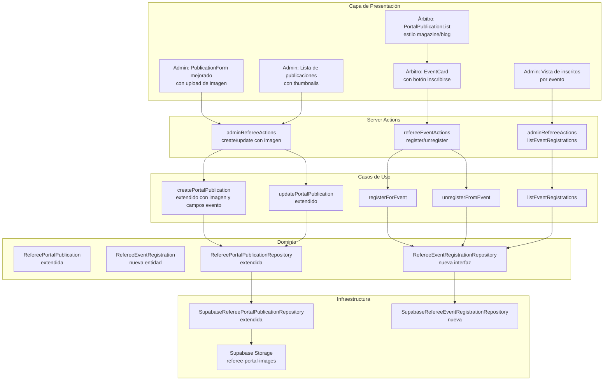
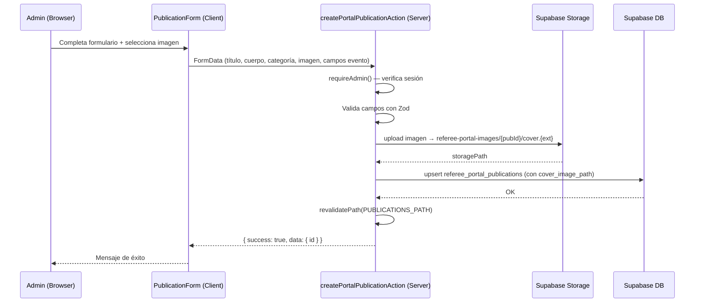
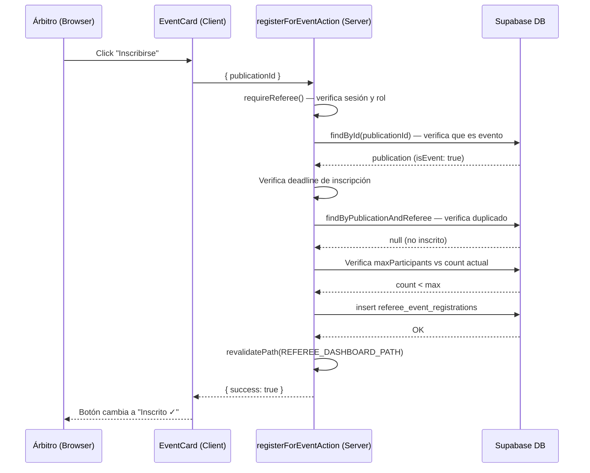
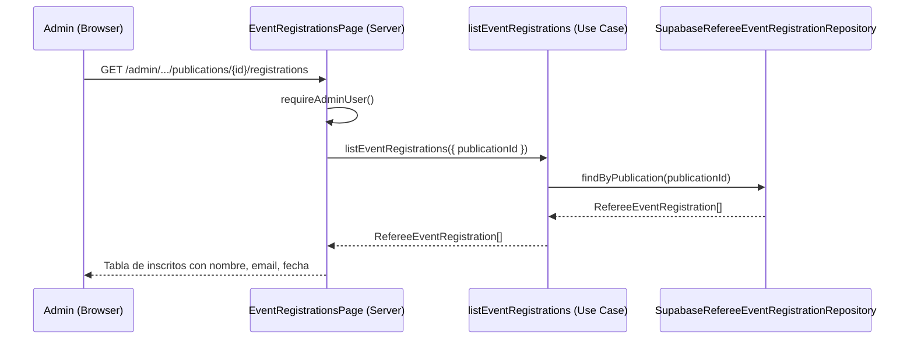

# Documento de Diseño: Portal de Árbitros — Publicaciones Mejoradas

## Descripción General

Este documento describe el diseño técnico para mejorar el módulo de publicaciones del portal de árbitros de Kombat Taekwondo Chile. La mejora abarca tres pilares: soporte de imágenes de portada en publicaciones, rediseño visual de la experiencia UX tanto para administradores como para árbitros, e inscripción de árbitros a eventos publicados con categoría `championship`.

El sistema se construye sobre la infraestructura existente de Next.js App Router, Supabase (base de datos y Storage) y Clean Architecture con screaming architecture. La entidad `RefereePortalPublication` y su repositorio se extienden sin reemplazarse, y se añade una nueva entidad `RefereeEventRegistration` para gestionar las inscripciones a eventos.

---

## Arquitectura General



---

## Diagrama de Secuencia — Flujos Principales

### Flujo 1: Admin crea publicación con imagen



### Flujo 2: Árbitro se inscribe a un evento



### Flujo 3: Admin ve inscritos a un evento



---

## Componentes e Interfaces

### Componente 1: Entidad de Dominio — `RefereePortalPublication` (extendida)

**Propósito**: Representa una publicación del portal, ahora con soporte de imagen de portada y campos opcionales para eventos.

**Interfaz extendida**:

```typescript
export type PublicationCategory = "news" | "regulation" | "championship";

export interface RefereePortalPublication {
  id: string;
  title: string;
  body: string;
  category: PublicationCategory;
  publishedAt: string; // ISO timestamp
  createdBy: string; // UUID del admin
  createdAt: string;
  updatedAt: string;
  // Nuevos campos
  coverImagePath: string | null; // Ruta en Supabase Storage (referee-portal-images)
  isEvent: boolean; // true solo para category === "championship"
  eventDate: string | null; // ISO date string (YYYY-MM-DD)
  eventLocation: string | null; // Texto libre, ej: "Gimnasio Nacional, Santiago"
  maxParticipants: number | null; // null = sin límite
  registrationDeadline: string | null; // ISO date string
}
```

**Reglas de dominio**:

- `isEvent` solo puede ser `true` cuando `category === "championship"`
- Si `isEvent === false`, los campos `eventDate`, `eventLocation`, `maxParticipants` y `registrationDeadline` deben ser `null`
- `coverImagePath` es independiente de la categoría (cualquier publicación puede tener imagen)

---

### Componente 2: Entidad de Dominio — `RefereeEventRegistration` (nueva)

**Propósito**: Representa la inscripción de un árbitro a un evento publicado.

**Interfaz**:

```typescript
export interface RefereeEventRegistration {
  id: string; // UUID
  publicationId: string; // UUID → referee_portal_publications.id
  refereeUserId: string; // UUID → auth.users.id (rol referee)
  registeredAt: string; // ISO timestamp
  createdAt: string;
}
```

---

### Componente 3: Interfaz de Repositorio — `RefereePortalPublicationRepository` (extendida)

```typescript
export interface RefereePortalPublicationRepository {
  findById(id: string): Promise<RefereePortalPublication | null>;
  list(): Promise<RefereePortalPublication[]>;
  listEvents(): Promise<RefereePortalPublication[]>; // solo isEvent === true
  save(publication: RefereePortalPublication): Promise<void>;
  delete(id: string): Promise<void>;
}
```

---

### Componente 4: Interfaz de Repositorio — `RefereeEventRegistrationRepository` (nueva)

```typescript
export interface RefereeEventRegistrationWithRefereeInfo extends RefereeEventRegistration {
  refereeName: string;
  refereeEmail: string;
}

export interface RefereeEventRegistrationRepository {
  findById(id: string): Promise<RefereeEventRegistration | null>;
  findByPublicationAndReferee(
    publicationId: string,
    refereeUserId: string,
  ): Promise<RefereeEventRegistration | null>;
  findByPublication(
    publicationId: string,
  ): Promise<RefereeEventRegistrationWithRefereeInfo[]>;
  countByPublication(publicationId: string): Promise<number>;
  save(registration: RefereeEventRegistration): Promise<void>;
  delete(id: string): Promise<void>;
}
```

---

### Componente 5: `PublicationForm` mejorado (Client Component)

**Propósito**: Formulario de creación/edición de publicaciones con soporte de imagen y campos de evento.

**Responsabilidades**:

- Previsualización de imagen antes de subir (usando `URL.createObjectURL`)
- Mostrar/ocultar campos de evento según categoría seleccionada (`championship`) y toggle `isEvent`
- Validación client-side con Zod antes de enviar
- Envío como `FormData` para incluir el archivo de imagen

**Campos del formulario**:

- `title` — texto, requerido, máx 300 caracteres
- `category` — select: news / regulation / championship
- `body` — textarea, requerido
- `coverImage` — input file, opcional, acepta image/jpeg, image/png, image/webp, máx 5 MB
- `isEvent` — checkbox, visible solo cuando `category === "championship"`
- `eventDate` — date input, visible cuando `isEvent === true`
- `eventLocation` — texto, visible cuando `isEvent === true`
- `maxParticipants` — número entero positivo, opcional, visible cuando `isEvent === true`
- `registrationDeadline` — date input, visible cuando `isEvent === true`

---

### Componente 6: `PortalPublicationList` mejorado (Server Component)

**Propósito**: Lista de publicaciones estilo magazine/blog para el dashboard del árbitro.

**Responsabilidades**:

- Renderizar publicaciones con imagen de portada prominente cuando existe
- Distinguir visualmente publicaciones de tipo evento (banner especial, fecha, lugar)
- Mostrar estado de inscripción del árbitro en eventos (inscrito / no inscrito)
- Delegar el botón de inscripción a un Client Component (`EventRegistrationButton`)

**Props**:

```typescript
interface Props {
  publications: RefereePortalPublication[];
  eventRegistrations: RefereeEventRegistration[]; // inscripciones del árbitro actual
  refereeUserId: string;
}
```

---

### Componente 7: `EventRegistrationButton` (Client Component)

**Propósito**: Botón de inscripción/desinscripción a eventos para árbitros.

**Responsabilidades**:

- Mostrar estado actual (inscrito / no inscrito)
- Llamar a `registerForEventAction` o `unregisterFromEventAction`
- Manejar estado de carga con `useTransition`
- Deshabilitar cuando el deadline ha pasado o el evento está lleno

**Props**:

```typescript
interface Props {
  publicationId: string;
  isRegistered: boolean;
  isDeadlinePassed: boolean;
  isFull: boolean;
}
```

---

### Componente 8: `PublicationCard` (Server Component — árbitro)

**Propósito**: Tarjeta individual de publicación estilo blog/magazine.

**Variantes visuales**:

- **Noticia** (`news`): Imagen de portada + título + extracto del cuerpo + fecha. Badge azul.
- **Reglamento** (`regulation`): Sin imagen prominente, ícono de documento, badge ámbar.
- **Evento** (`championship` + `isEvent: true`): Imagen de portada + banner "EVENTO" en verde esmeralda + fecha del evento + lugar + cupos disponibles + botón de inscripción.
- **Campeonato sin evento** (`championship` + `isEvent: false`): Similar a noticia, badge verde esmeralda.

---

### Componente 9: `AdminPublicationCard` (Server Component — admin)

**Propósito**: Tarjeta de publicación en la lista de administración con thumbnail y acciones.

**Responsabilidades**:

- Mostrar thumbnail de imagen de portada (si existe)
- Mostrar badge de categoría con color
- Mostrar indicador "Evento" con contador de inscritos (si `isEvent === true`)
- Botones de editar y eliminar

---

## Modelos de Datos

### Tabla: `referee_portal_publications` (extendida)

```sql
ALTER TABLE referee_portal_publications
  ADD COLUMN cover_image_path    TEXT,
  ADD COLUMN is_event            BOOLEAN     NOT NULL DEFAULT false,
  ADD COLUMN event_date          DATE,
  ADD COLUMN event_location      TEXT        CHECK (char_length(event_location) <= 500),
  ADD COLUMN max_participants    INTEGER     CHECK (max_participants > 0),
  ADD COLUMN registration_deadline DATE;

-- Constraint: campos de evento solo válidos cuando is_event = true
ALTER TABLE referee_portal_publications
  ADD CONSTRAINT chk_event_fields_require_is_event
    CHECK (
      is_event = true
      OR (
        event_date IS NULL
        AND event_location IS NULL
        AND max_participants IS NULL
        AND registration_deadline IS NULL
      )
    );

-- Constraint: is_event solo válido para categoría championship
ALTER TABLE referee_portal_publications
  ADD CONSTRAINT chk_is_event_requires_championship
    CHECK (
      is_event = false
      OR category = 'championship'
    );
```

### Tabla: `referee_event_registrations` (nueva)

```sql
CREATE TABLE referee_event_registrations (
  id               UUID        PRIMARY KEY DEFAULT gen_random_uuid(),
  publication_id   UUID        NOT NULL
                   REFERENCES referee_portal_publications(id) ON DELETE CASCADE,
  referee_user_id  UUID        NOT NULL,
  registered_at    TIMESTAMPTZ NOT NULL DEFAULT now(),
  created_at       TIMESTAMPTZ NOT NULL DEFAULT now(),

  CONSTRAINT uq_referee_event_registration
    UNIQUE (publication_id, referee_user_id)
);

CREATE INDEX idx_referee_event_registrations_publication
  ON referee_event_registrations(publication_id);

CREATE INDEX idx_referee_event_registrations_referee
  ON referee_event_registrations(referee_user_id);
```

### Bucket de Supabase Storage: `referee-portal-images`

```
referee-portal-images/
└── {publicationId}/
    └── cover.{jpg|png|webp}
```

**Convención de ruta**: `{publicationId}/cover.{ext}`

**Políticas RLS**:

- `INSERT`: solo usuarios con rol admin (`admin_users`)
- `UPDATE`: solo usuarios con rol admin
- `DELETE`: solo usuarios con rol admin
- `SELECT`: usuarios autenticados con rol `referee` o `admin`

**Configuración del bucket**:

- `public: false` (acceso mediante signed URLs o URLs públicas según política)
- `allowedMimeTypes`: `["image/jpeg", "image/png", "image/webp"]`
- `fileSizeLimit`: 5 MB (5242880 bytes)

**Nota de implementación**: Para simplificar la carga en el dashboard del árbitro sin generar signed URLs por cada imagen, el bucket puede configurarse como `public: true` con políticas de escritura restringidas a admins. Esto es aceptable porque las imágenes de publicaciones son contenido no sensible destinado a árbitros autenticados. La decisión final se toma en la fase de implementación según los requisitos de seguridad del proyecto.

---

## Manejo de Errores

### Escenario 1: Error al subir imagen en creación/edición

**Condición**: Falla el upload a Supabase Storage durante `createPortalPublicationAction` o `updatePortalPublicationAction`.

**Respuesta**: La acción retorna `{ success: false, error: "Error al subir la imagen. Por favor intenta nuevamente.", code: "STORAGE_ERROR" }`.

**Recuperación**: No se persiste la publicación si la imagen falla. El formulario muestra el error y permite reintentar.

---

### Escenario 2: Árbitro intenta inscribirse a evento lleno

**Condición**: `countByPublication(publicationId) >= publication.maxParticipants` en `registerForEvent`.

**Respuesta**: Se lanza `EventAtCapacityError`. La acción retorna `{ success: false, error: "El evento ha alcanzado el cupo máximo.", code: "AT_CAPACITY" }`.

**Recuperación**: El botón de inscripción se deshabilita en el cliente cuando `isFull === true`.

---

### Escenario 3: Árbitro intenta inscribirse después del deadline

**Condición**: `publication.registrationDeadline` es una fecha pasada al momento de llamar `registerForEvent`.

**Respuesta**: Se lanza `RegistrationDeadlinePassedError`. La acción retorna `{ success: false, error: "El plazo de inscripción ha cerrado.", code: "DEADLINE_PASSED" }`.

**Recuperación**: El botón se deshabilita en el cliente cuando `isDeadlinePassed === true`.

---

### Escenario 4: Árbitro intenta inscribirse dos veces

**Condición**: Ya existe un registro en `referee_event_registrations` para el par `(publicationId, refereeUserId)`.

**Respuesta**: Se lanza `AlreadyRegisteredForEventError`. La acción retorna `{ success: false, error: "Ya estás inscrito en este evento.", code: "ALREADY_REGISTERED" }`.

**Recuperación**: El estado del botón se actualiza optimistamente en el cliente.

---

### Escenario 5: Eliminación de publicación con imagen

**Condición**: Se elimina una publicación que tiene `coverImagePath` no nulo.

**Respuesta**: El caso de uso `deletePortalPublication` debe eliminar primero el archivo de Storage y luego el registro de la base de datos. Si falla la eliminación del archivo, se registra el error en el servidor pero se procede con la eliminación del registro (el archivo huérfano puede limpiarse manualmente).

---

## Estrategia de Testing

### Testing Unitario

**Casos de uso nuevos** (`registerForEvent`, `unregisterFromEvent`, `listEventRegistrations`):

- Verificar que `registerForEvent` lanza `AlreadyRegisteredForEventError` si ya existe inscripción
- Verificar que `registerForEvent` lanza `EventAtCapacityError` si `count >= maxParticipants`
- Verificar que `registerForEvent` lanza `RegistrationDeadlinePassedError` si deadline pasó
- Verificar que `registerForEvent` permite inscripción cuando `maxParticipants === null`
- Verificar que `unregisterFromEvent` lanza `RegistrationNotFoundError` si no existe inscripción

**Entidad `RefereePortalPublication` extendida**:

- Verificar que `isEvent === true` solo es válido con `category === "championship"`
- Verificar que campos de evento son `null` cuando `isEvent === false`

### Testing Basado en Propiedades

**Librería**: `fast-check` (ya instalada en el proyecto)

**Propiedad 1 — Idempotencia de inscripción**:

> Para cualquier árbitro y cualquier evento con cupo disponible y deadline futuro, inscribirse dos veces consecutivas debe resultar en exactamente una inscripción en la base de datos.

**Propiedad 2 — Consistencia de campos de evento**:

> Para cualquier publicación guardada, si `isEvent === false` entonces `eventDate`, `eventLocation`, `maxParticipants` y `registrationDeadline` son siempre `null`.

**Propiedad 3 — Invariante de categoría para eventos**:

> Para cualquier publicación con `isEvent === true`, la categoría es siempre `"championship"`.

**Propiedad 4 — Conteo de inscritos**:

> El número de registros en `referee_event_registrations` para un evento nunca supera `maxParticipants` cuando este no es `null`.

### Testing de Integración

- Flujo completo de creación de publicación con imagen: upload a Storage + persistencia en DB
- Flujo completo de inscripción a evento: verificación de sesión + validaciones + persistencia
- Flujo de eliminación de publicación: limpieza de imagen en Storage + eliminación en DB

---

## Consideraciones de Rendimiento

- **Carga de imágenes**: Las imágenes de portada se sirven directamente desde Supabase Storage. Se recomienda usar el parámetro `transform` de Supabase Storage para redimensionar imágenes al tamaño de thumbnail en la lista de admin (ej: `?width=120&height=80&resize=cover`).
- **Consulta de inscripciones**: En el dashboard del árbitro, se obtienen las inscripciones del árbitro actual en paralelo con las publicaciones usando `Promise.all()` para evitar waterfalls.
- **Paginación**: La lista de publicaciones no requiere paginación en esta fase (volumen esperado bajo), pero el repositorio debe estar preparado para añadirla.

---

## Consideraciones de Seguridad

- **Upload de imágenes**: Solo admins pueden subir imágenes. El upload se realiza server-side en el Server Action usando `adminSupabase`, nunca desde el cliente directamente.
- **Validación de tipo MIME**: Se valida el tipo MIME del archivo tanto en el cliente (para UX) como en el servidor (para seguridad). El bucket de Storage también restringe los tipos permitidos.
- **Autorización en inscripciones**: `registerForEventAction` y `unregisterFromEventAction` verifican que el usuario autenticado tiene rol `referee` antes de ejecutar. Un árbitro solo puede gestionar sus propias inscripciones.
- **Ownership en desinscripción**: Al desinscribirse, se verifica que la inscripción pertenece al árbitro autenticado antes de eliminarla.
- **Datos expuestos**: La lista de inscritos (admin) expone nombre y email de árbitros. Esta información solo es accesible para admins verificados.

---

## Dependencias

- **Supabase Storage** — bucket `referee-portal-images` (nuevo, a crear con script de setup)
- **Supabase DB** — migración SQL para extender `referee_portal_publications` y crear `referee_event_registrations`
- **`@supabase/supabase-js`** — ya instalado (`^2.101.1`)
- **`zod`** — ya instalado (`^4.3.6`)
- **`fast-check`** — ya instalado (`^4.6.0`) para property-based tests
- **No se requieren nuevas dependencias externas**

---

## Estructura de Archivos Nuevos y Modificados

```
src/
├── modules/referee-registration/
│   ├── domain/
│   │   ├── entities/
│   │   │   ├── refereePortalPublication.ts          ← MODIFICAR (nuevos campos)
│   │   │   └── refereeEventRegistration.ts          ← NUEVO
│   │   ├── interfaces/
│   │   │   ├── refereePortalPublicationRepository.ts ← MODIFICAR (listEvents)
│   │   │   └── refereeEventRegistrationRepository.ts ← NUEVO
│   │   └── errors/
│   │       └── index.ts                             ← MODIFICAR (nuevos errores)
│   ├── application/use-cases/
│   │   ├── createPortalPublication.ts               ← MODIFICAR (nuevos campos)
│   │   ├── updatePortalPublication.ts               ← MODIFICAR (nuevos campos)
│   │   ├── deletePortalPublication.ts               ← MODIFICAR (limpieza Storage)
│   │   ├── registerForEvent.ts                      ← NUEVO
│   │   ├── unregisterFromEvent.ts                   ← NUEVO
│   │   └── listEventRegistrations.ts                ← NUEVO
│   ├── infrastructure/repositories/
│   │   ├── supabaseRefereePortalPublicationRepository.ts ← MODIFICAR
│   │   └── supabaseRefereeEventRegistrationRepository.ts ← NUEVO
│   └── presentation/
│       ├── actions/
│       │   ├── adminRefereeActions.ts               ← MODIFICAR (imagen, eventos)
│       │   └── refereeEventActions.ts               ← NUEVO
│       └── components/
│           ├── PublicationForm.tsx                  ← MODIFICAR (imagen, campos evento)
│           ├── PortalPublicationList.tsx             ← MODIFICAR (nuevo diseño)
│           ├── PublicationCard.tsx                  ← NUEVO (árbitro)
│           ├── EventCard.tsx                        ← NUEVO (árbitro, variante evento)
│           ├── EventRegistrationButton.tsx          ← NUEVO (Client Component)
│           ├── AdminPublicationCard.tsx             ← NUEVO (admin)
│           └── ImageUploadField.tsx                 ← NUEVO (Client Component)
├── app/
│   ├── referee/dashboard/
│   │   └── page.tsx                                 ← MODIFICAR (pasar inscripciones)
│   └── (dashboard)/admin/referee-registrations/publications/
│       ├── page.tsx                                 ← MODIFICAR (thumbnails)
│       └── [publicationId]/
│           ├── edit/page.tsx                        ← MODIFICAR (nuevos campos)
│           └── registrations/
│               └── page.tsx                         ← NUEVO (lista de inscritos)
└── lib/db/migrations/
    └── 034_referee_portal_publications_enhanced.sql ← NUEVO
```

---

## Propiedades de Corrección

_Una propiedad es una característica o comportamiento que debe mantenerse verdadero en todas las ejecuciones válidas del sistema — esencialmente, una declaración formal sobre lo que el sistema debe hacer. Las propiedades sirven como puente entre las especificaciones legibles por humanos y las garantías de corrección verificables por máquinas._

Las siguientes propiedades deben mantenerse en todo momento:

### Propiedad 1: Consistencia de campos de evento

_Para cualquier_ publicación guardada en el sistema, si `isEvent = false` entonces `eventDate`, `eventLocation`, `maxParticipants` y `registrationDeadline` son siempre `null`.

**Valida: Requisitos 8.1, 8.2**

---

### Propiedad 2: Invariante de categoría para eventos

_Para cualquier_ publicación con `isEvent = true`, la categoría es siempre `"championship"`.

**Valida: Requisitos 8.1**

---

### Propiedad 3: Unicidad de inscripción (idempotencia)

_Para cualquier_ árbitro y cualquier evento con cupo disponible y deadline futuro, intentar inscribirse dos veces consecutivas debe resultar en exactamente una inscripción en la base de datos — la segunda llamada retorna `ALREADY_REGISTERED`.

**Valida: Requisitos 4.4, 8.3**

---

### Propiedad 4: Respeto de cupo máximo

_Para cualquier_ evento con `maxParticipants` no nulo, el número de registros en `referee_event_registrations` para ese evento nunca supera `maxParticipants`.

**Valida: Requisitos 4.5, 8.4**

---

### Propiedad 5: Autorización de inscripción y ownership

_Para cualquier_ acción de inscripción o desinscripción, el usuario autenticado tiene rol `"referee"` y la inscripción pertenece exclusivamente al usuario autenticado — ningún árbitro puede gestionar las inscripciones de otro.

**Valida: Requisitos 7.3, 7.4**

---

### Propiedad 6: Integridad referencial de inscripciones

_Para cualquier_ `RefereeEventRegistration` existente, existe una `RefereePortalPublication` con el mismo `id` y con `isEvent = true`.

**Valida: Requisitos 8.5, 8.6**

---

### Propiedad 7: Validación de tipo MIME en servidor

_Para cualquier_ archivo enviado al Server Action de creación o edición de publicaciones, si el tipo MIME no es `image/jpeg`, `image/png` o `image/webp`, el sistema rechaza el archivo y no realiza el upload al Storage, independientemente de la validación del cliente.

**Valida: Requisitos 1.5, 7.6**

---

### Propiedad 8: Atomicidad de creación con imagen

_Para cualquier_ intento de creación de publicación con imagen donde el upload al Storage falla, no se persiste ningún registro en la base de datos — el sistema retorna `STORAGE_ERROR` y el estado de la base de datos permanece sin cambios.

**Valida: Requisitos 1.6**
