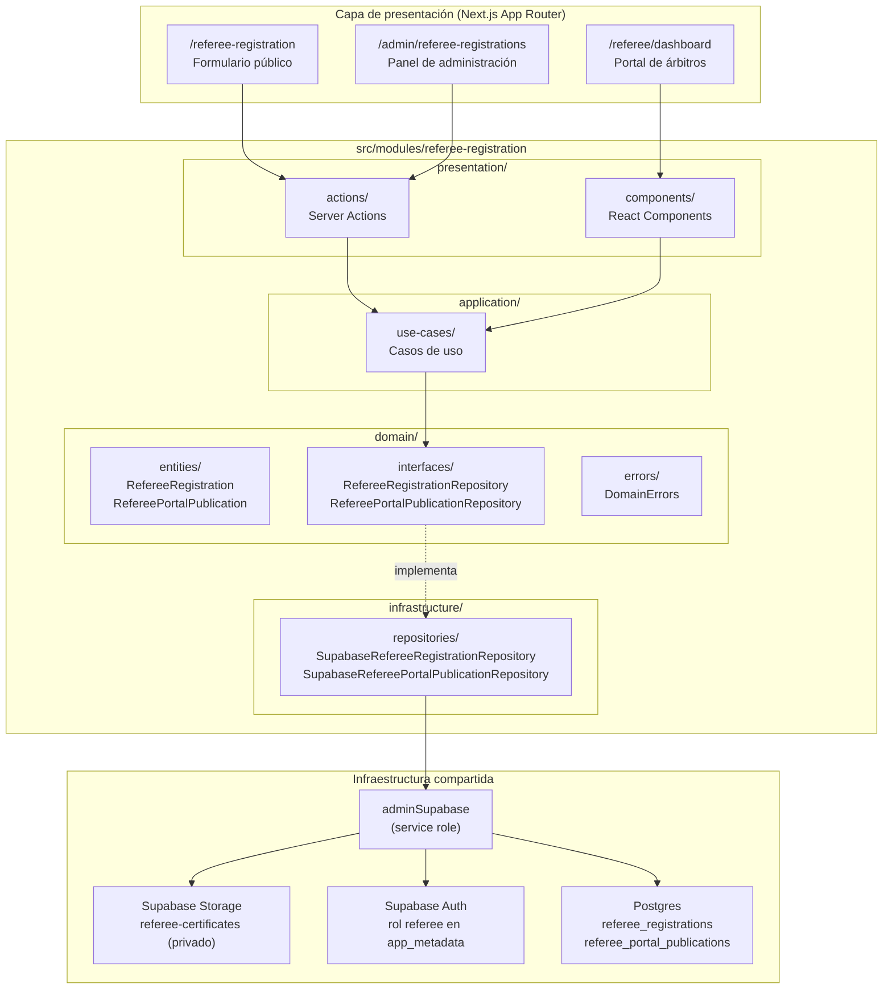
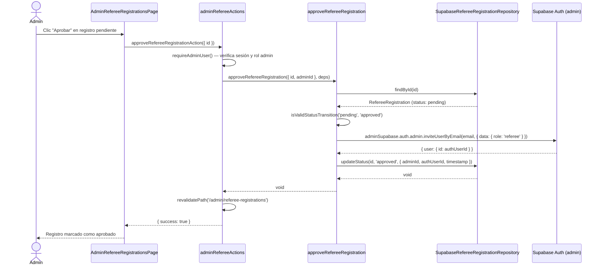
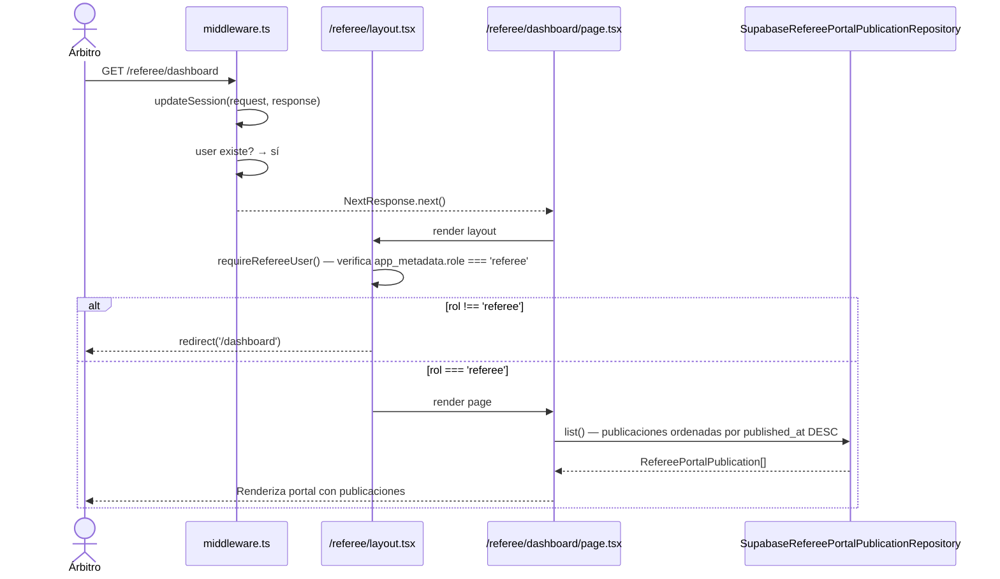
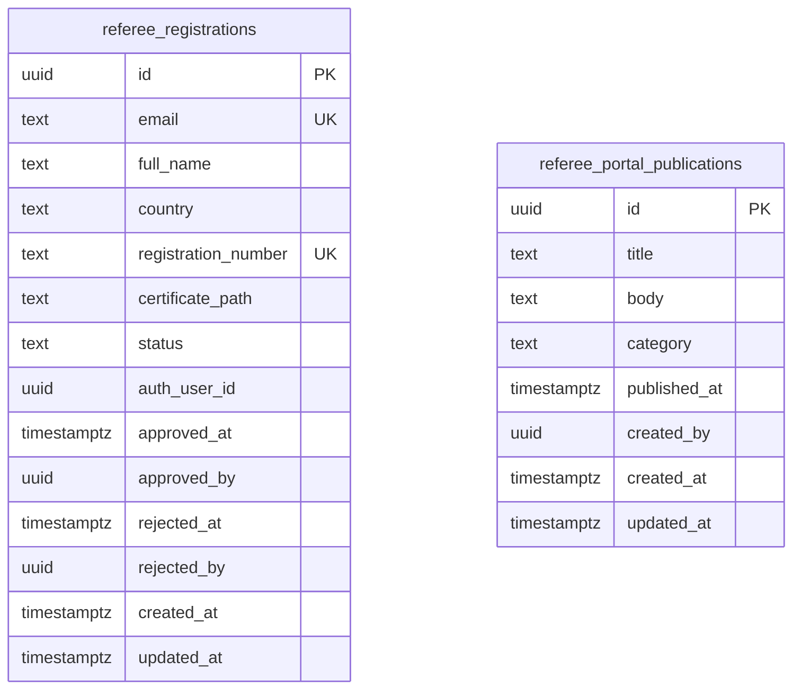
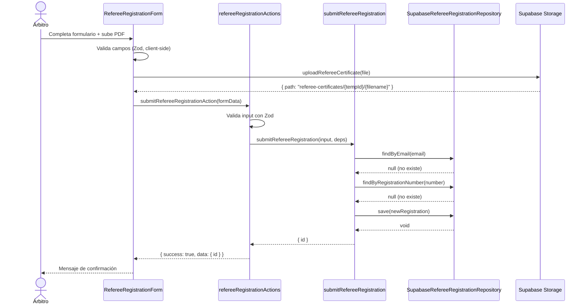

# Documento de Diseño: Registro de Árbitros Oficiales

## Descripción general

El módulo `referee-registration` incorpora un registro de árbitros oficiales al ecosistema de Kombat Taekwondo Chile. Implementa dos flujos principales: el auto-registro público del árbitro (formulario en `/referee-registration`) y la gestión administrativa (listado, aprobación, rechazo, edición en `/admin/referee-registrations`). Al aprobar un registro, el sistema crea automáticamente una cuenta en Supabase Auth con rol `referee` y envía un enlace de configuración de contraseña. Los árbitros aprobados acceden a un portal privado (`/referee/dashboard`) donde consumen publicaciones creadas exclusivamente por el administrador.

El módulo sigue la arquitectura Clean/Screaming Architecture del proyecto: bounded context en `src/modules/referee-registration/` con capas `domain/`, `application/`, `infrastructure/` y `presentation/`. Usa Next.js App Router, Supabase Auth + Storage + Postgres, y TypeScript estricto.

---

## Arquitectura del sistema



---

## Estructura de carpetas del módulo

```
src/
├── app/
│   ├── referee-registration/
│   │   └── page.tsx                          # Formulario público de registro (Server Component)
│   ├── referee/
│   │   ├── layout.tsx                        # Layout con guard de rol referee
│   │   └── dashboard/
│   │       └── page.tsx                      # Portal privado de árbitros (Server Component)
│   └── (dashboard)/
│       └── admin/
│           └── referee-registrations/
│               ├── page.tsx                  # Listado de registros (Server Component)
│               ├── [id]/
│               │   └── page.tsx              # Detalle / edición de un registro
│               └── publications/
│                   ├── page.tsx              # Listado de publicaciones
│                   └── new/
│                       └── page.tsx          # Crear publicación
│
└── modules/
    └── referee-registration/
        ├── domain/
        │   ├── entities/
        │   │   ├── refereeRegistration.ts    # Entidad RefereeRegistration + tipos
        │   │   └── refereePortalPublication.ts # Entidad RefereePortalPublication + tipos
        │   ├── interfaces/
        │   │   ├── refereeRegistrationRepository.ts
        │   │   └── refereePortalPublicationRepository.ts
        │   └── errors/
        │       └── index.ts                  # DomainErrors del módulo
        ├── application/
        │   └── use-cases/
        │       ├── submitRefereeRegistration.ts
        │       ├── approveRefereeRegistration.ts
        │       ├── rejectRefereeRegistration.ts
        │       ├── updateRefereeRegistration.ts
        │       ├── listRefereeRegistrations.ts
        │       ├── getRefereeRegistrationById.ts
        │       ├── createPortalPublication.ts
        │       ├── updatePortalPublication.ts
        │       ├── deletePortalPublication.ts
        │       └── listPortalPublications.ts
        ├── infrastructure/
        │   └── repositories/
        │       ├── supabaseRefereeRegistrationRepository.ts
        │       └── supabaseRefereePortalPublicationRepository.ts
        └── presentation/
            ├── actions/
            │   ├── refereeRegistrationActions.ts  # Server Actions públicas
            │   └── adminRefereeActions.ts          # Server Actions de administración
            └── components/
                ├── RefereeRegistrationForm.tsx     # Formulario público ("use client")
                ├── RefereeRegistrationTable.tsx    # Tabla de registros ("use client")
                ├── ApproveRegistrationButton.tsx   # Botón aprobar ("use client")
                ├── RejectRegistrationButton.tsx    # Botón rechazar ("use client")
                ├── EditRegistrationForm.tsx        # Formulario de edición ("use client")
                ├── PortalPublicationList.tsx       # Lista de publicaciones (Server Component)
                └── PublicationForm.tsx             # Formulario de publicación ("use client")
```

---

## Modelo de datos

### Tabla `referee_registrations`


**Restricciones:**

- `email`: `UNIQUE NOT NULL`
- `registration_number`: `UNIQUE NOT NULL`
- `status`: enum `('pending', 'approved', 'rejected')`, default `'pending'`
- `category`: enum `('news', 'regulation', 'championship')`
- `auth_user_id`: nullable, se rellena al aprobar
- `approved_by` / `rejected_by`: UUID del admin que realizó la acción

---

## Entidades del dominio

### `RefereeRegistration`

```typescript
// src/modules/referee-registration/domain/entities/refereeRegistration.ts

export type RefereeRegistrationStatus = "pending" | "approved" | "rejected";

export interface RefereeRegistration {
  id: string; // UUID
  email: string;
  fullName: string;
  country: string;
  registrationNumber: string;
  certificatePath: string; // ruta en Supabase Storage
  status: RefereeRegistrationStatus;
  authUserId: string | null; // vinculado al aprobar
  approvedAt: string | null; // ISO timestamp
  approvedBy: string | null; // UUID del admin
  rejectedAt: string | null;
  rejectedBy: string | null;
  createdAt: string;
  updatedAt: string;
}

/** Verifica si una transición de estado es válida */
export function isValidStatusTransition(
  current: RefereeRegistrationStatus,
  next: RefereeRegistrationStatus,
): boolean {
  if (current === "pending" && (next === "approved" || next === "rejected")) {
    return true;
  }
  return false;
}
```

### `RefereePortalPublication`

```typescript
// src/modules/referee-registration/domain/entities/refereePortalPublication.ts

export type PublicationCategory = "news" | "regulation" | "championship";

export interface RefereePortalPublication {
  id: string;
  title: string;
  body: string;
  category: PublicationCategory;
  publishedAt: string; // ISO timestamp
  createdBy: string; // UUID del admin
  createdAt: string;
  updatedAt: string;
}
```

---

## Interfaces de repositorio

### `RefereeRegistrationRepository`

```typescript
// src/modules/referee-registration/domain/interfaces/refereeRegistrationRepository.ts

import type {
  RefereeRegistration,
  RefereeRegistrationStatus,
} from "../entities/refereeRegistration";

export interface RefereeRegistrationFilter {
  status?: RefereeRegistrationStatus;
  page?: number;
  pageSize?: number;
}

export interface RefereeRegistrationRepository {
  findById(id: string): Promise<RefereeRegistration | null>;
  findByEmail(email: string): Promise<RefereeRegistration | null>;
  findByRegistrationNumber(number: string): Promise<RefereeRegistration | null>;
  list(
    filter: RefereeRegistrationFilter,
  ): Promise<{ items: RefereeRegistration[]; total: number }>;
  save(registration: RefereeRegistration): Promise<void>;
  updateStatus(
    id: string,
    status: RefereeRegistrationStatus,
    meta: { adminId: string; authUserId?: string; timestamp: string },
  ): Promise<void>;
}
```

### `RefereePortalPublicationRepository`

```typescript
// src/modules/referee-registration/domain/interfaces/refereePortalPublicationRepository.ts

import type { RefereePortalPublication } from "../entities/refereePortalPublication";

export interface RefereePortalPublicationRepository {
  findById(id: string): Promise<RefereePortalPublication | null>;
  list(): Promise<RefereePortalPublication[]>;
  save(publication: RefereePortalPublication): Promise<void>;
  delete(id: string): Promise<void>;
}
```

---

## Errores de dominio

```typescript
// src/modules/referee-registration/domain/errors/index.ts

import { DomainError } from "@/lib/errors";

export class RefereeRegistrationNotFoundError extends DomainError {
  constructor(id: string) {
    super(`Referee registration not found: ${id}`);
  }
}

export class DuplicateRefereeEmailError extends DomainError {
  constructor(email: string) {
    super(`A referee registration with email ${email} already exists`);
  }
}

export class DuplicateRegistrationNumberError extends DomainError {
  constructor(number: string) {
    super(`A referee registration with number ${number} already exists`);
  }
}

export class InvalidStatusTransitionError extends DomainError {
  constructor(current: string, next: string) {
    super(
      `Cannot transition referee registration from '${current}' to '${next}'`,
    );
  }
}

export class PortalPublicationNotFoundError extends DomainError {
  constructor(id: string) {
    super(`Portal publication not found: ${id}`);
  }
}

export class AuthUserCreationError extends DomainError {
  constructor(email: string, reason: string) {
    super(`Failed to create auth user for ${email}: ${reason}`);
  }
}
```

---

## Casos de uso principales

### `submitRefereeRegistration`

```typescript
// Precondiciones:
//   - email no existe en referee_registrations
//   - registrationNumber no existe en referee_registrations
//   - certificatePath es una ruta válida en Supabase Storage
// Postcondiciones:
//   - Se crea un registro con status = 'pending'
//   - Retorna el id del nuevo registro

export async function submitRefereeRegistration(
  input: SubmitRefereeRegistrationInput,
  deps: { repo: RefereeRegistrationRepository },
): Promise<{ id: string }>;
```

### `approveRefereeRegistration`

```typescript
// Precondiciones:
//   - El registro existe y su status es 'pending'
//   - adminId es un usuario administrador válido
// Postcondiciones:
//   - Se crea un usuario en Supabase Auth con app_metadata.role = 'referee'
//   - Se envía email de invitación para configurar contraseña
//   - El registro queda con status = 'approved', auth_user_id vinculado
// Invariante de error:
//   - Si la creación del usuario Auth falla, el status del registro NO cambia

export async function approveRefereeRegistration(
  input: ApproveRefereeRegistrationInput,
  deps: {
    repo: RefereeRegistrationRepository;
    authService: RefereeAuthService;
  },
): Promise<void>;
```

### `rejectRefereeRegistration`

```typescript
// Precondiciones:
//   - El registro existe y su status es 'pending'
// Postcondiciones:
//   - El registro queda con status = 'rejected'

export async function rejectRefereeRegistration(
  input: RejectRefereeRegistrationInput,
  deps: { repo: RefereeRegistrationRepository },
): Promise<void>;
```

---

## Flujos de secuencia

### Flujo de registro público


### Flujo de aprobación administrativa



### Flujo de acceso al portal de árbitros



---

## Componentes e interfaces

### Formulario público — `RefereeRegistrationForm`

**Tipo:** Client Component (`"use client"`)

**Responsabilidades:**

- Renderizar el formulario con campos: email, nombre completo, país, número de registro, certificado PDF.
- Validar campos en el cliente antes de enviar (Zod).
- Gestionar la subida del PDF a Supabase Storage desde el cliente (usando `createClient()`).
- Llamar a `submitRefereeRegistrationAction` con los datos validados.
- Mostrar estados de carga, éxito y error.

**Props:** ninguna (formulario autónomo)

**Interfaz de la acción:**

```typescript
submitRefereeRegistrationAction(input: {
  email: string;
  fullName: string;
  country: string;
  registrationNumber: string;
  certificatePath: string;  // ruta ya subida a Storage
}): Promise<ActionResult<{ id: string }>>
```

---

### Tabla de registros — `RefereeRegistrationTable`

**Tipo:** Client Component (`"use client"`)

**Responsabilidades:**

- Renderizar la tabla de registros con columnas: nombre, email, país, número de registro, estado, fecha.
- Mostrar botones de acción (Aprobar, Rechazar, Ver PDF, Editar) según el estado del registro.
- Gestionar el estado de carga de cada acción individualmente.

**Props:**

```typescript
interface RefereeRegistrationTableProps {
  registrations: RefereeRegistrationRow[]; // DTO serializable
  currentPage: number;
  totalPages: number;
}
```

---

### Botones de acción — `ApproveRegistrationButton` / `RejectRegistrationButton`

**Tipo:** Client Component (`"use client"`)

**Responsabilidades:**

- Invocar la Server Action correspondiente con `useTransition`.
- Mostrar estado de carga y manejar errores.

---

### Lista de publicaciones — `PortalPublicationList`

**Tipo:** Server Component

**Responsabilidades:**

- Obtener publicaciones del repositorio directamente (colocación de datos).
- Renderizar cada publicación con título, categoría, cuerpo y fecha.

---

## Infraestructura: repositorios

### `SupabaseRefereeRegistrationRepository`

Implementa `RefereeRegistrationRepository` usando `adminSupabase`. Mapea filas de `referee_registrations` a entidades `RefereeRegistration` y viceversa. Marcado con `import "server-only"`.

**Métodos clave:**

- `findById`, `findByEmail`, `findByRegistrationNumber`: consultas con `.maybeSingle()`.
- `list`: consulta con filtro de status, paginación con `.range()` y conteo con `{ count: "exact" }`.
- `save`: upsert con `.upsert()`.
- `updateStatus`: update selectivo de columnas de estado.

### `SupabaseRefereePortalPublicationRepository`

Implementa `RefereePortalPublicationRepository` usando `adminSupabase`. Marcado con `import "server-only"`.

---

## Server Actions

### `refereeRegistrationActions.ts` (acciones públicas)

```typescript
"use server";

// submitRefereeRegistrationAction
// - No requiere autenticación (formulario público)
// - Valida input con Zod
// - Llama a submitRefereeRegistration use case
// - Retorna ActionResult<{ id: string }>
```

### `adminRefereeActions.ts` (acciones de administración)

```typescript
"use server";

// Todas las acciones siguen el patrón:
// 1. requireAdminUser() — verifica sesión y rol admin
// 2. Valida input con Zod
// 3. Instancia repositorios (composition root)
// 4. Llama al use case
// 5. revalidatePath('/admin/referee-registrations')
// 6. Retorna ActionResult

// approveRefereeRegistrationAction({ id: string })
// rejectRefereeRegistrationAction({ id: string })
// updateRefereeRegistrationAction({ id, fullName, country, registrationNumber })
// getSignedCertificateUrlAction({ id: string }) → ActionResult<{ url: string }>
// createPortalPublicationAction({ title, body, category })
// updatePortalPublicationAction({ id, title, body, category })
// deletePortalPublicationAction({ id: string })
```

---

## Middleware y control de acceso

### Rutas públicas

La ruta `/referee-registration` se agrega a `PUBLIC_ROUTES` en `middleware.ts`:

```typescript
const PUBLIC_ROUTES = [
  // ... rutas existentes ...
  "/referee-registration",
];
```

### Guard de rol referee

El layout `/referee/layout.tsx` implementa un guard de rol:

```typescript
// src/app/referee/layout.tsx — Server Component
import { createClient } from "@/lib/supabase/server";
import { redirect } from "next/navigation";

async function requireRefereeUser() {
  const supabase = await createClient();
  const { data: { user } } = await supabase.auth.getUser();
  if (!user) redirect("/login");

  const role = user.app_metadata?.role as string | undefined;
  if (role !== "referee") redirect("/dashboard");

  return user;
}

export default async function RefereeLayout({ children }: { children: React.ReactNode }) {
  await requireRefereeUser();
  return <>{children}</>;
}
```

---

## Supabase Storage

**Bucket:** `referee-certificates` (privado, sin acceso público)

**Ruta de almacenamiento:** `referee-certificates/{registrationId}/{timestamp}_{filename}`

**Subida:** desde el cliente usando `createClient()` (browser client) antes de enviar el formulario.

**Lectura:** solo mediante signed URLs generadas server-side por el admin, con expiración de 1 hora.

```typescript
// Generación de signed URL (solo admin, server-side)
const { data } = await adminSupabase.storage
  .from("referee-certificates")
  .createSignedUrl(certificatePath, 3600);
```

---

## Consideraciones de seguridad

- El bucket `referee-certificates` es **privado**. No se configura acceso público.
- Las signed URLs solo se generan desde Server Actions con guard de admin.
- `adminSupabase` (service role) solo se usa en la capa de infraestructura y en Server Actions de administración.
- El rol `referee` se asigna en `app_metadata` (no en `user_metadata`) para que no sea modificable por el usuario.
- Todos los Server Actions de administración verifican la sesión y el rol admin antes de ejecutar cualquier lógica.
- Los inputs del formulario público se validan con Zod tanto en cliente como en servidor.
- Los errores internos (mensajes de Supabase, stack traces) nunca se exponen al cliente.

---

## Estrategia de testing

### Tests unitarios

- `isValidStatusTransition`: verificar todas las combinaciones de transición válidas e inválidas.
- Validaciones Zod de cada use case: inputs válidos e inválidos.
- Mapeo entidad ↔ fila de base de datos en los repositorios.

### Tests de propiedades (property-based)

- **Propiedad 3 (transición de estado):** para cualquier estado actual y siguiente, `isValidStatusTransition` solo retorna `true` cuando `current === 'pending'` y `next` es `'approved'` o `'rejected'`.
- **Propiedad 7 (validación de campos):** para cualquier input con al menos un campo obligatorio ausente o inválido, el schema Zod de `submitRefereeRegistration` debe rechazarlo.
- **Propiedad 8 (solo PDFs):** para cualquier tipo MIME distinto de `application/pdf`, la validación del formulario debe rechazar el archivo.
- **Propiedad 9 (tamaño máximo):** para cualquier archivo con `size > 10 * 1024 * 1024`, la validación debe rechazarlo.
- **Propiedad 11 (round-trip de serialización):** para cualquier `RefereeRegistration` válida, `toEntity(toRow(entity))` debe producir un objeto equivalente.

### Tests de integración

- Flujo completo de registro: submit → verificar registro en DB con status `pending`.
- Flujo de aprobación: aprobar → verificar status `approved` + `auth_user_id` vinculado.
- Acceso al portal: usuario con rol `referee` puede acceder; usuario sin rol es redirigido.

---

## Dependencias

- `@supabase/supabase-js` — cliente admin para Auth y Storage.
- `@supabase/ssr` — cliente server para sesiones.
- `zod` — validación de inputs en use cases y Server Actions.
- `next` — App Router, Server Components, Server Actions.
- Drizzle ORM — no se usa directamente; el proyecto usa `adminSupabase` para queries (patrón existente).

---

## Propiedades de corrección

_Una propiedad es una característica o comportamiento que debe mantenerse verdadero en todas las ejecuciones válidas del sistema._

### Propiedad 1: Unicidad de email en registros

_Para cualquier_ conjunto de registros de árbitros en la base de datos, no pueden existir dos registros con el mismo email.

**Valida: Requisito 12.3**

---

### Propiedad 2: Unicidad de número de registro oficial

_Para cualquier_ conjunto de registros de árbitros en la base de datos, no pueden existir dos registros con el mismo número de registro oficial.

**Valida: Requisito 12.4**

---

### Propiedad 3: Transición de estado válida

_Para cualquier_ registro de árbitro, el estado solo puede transicionar de `pending` a `approved` o de `pending` a `rejected`. Un registro en estado `approved` o `rejected` no puede cambiar de estado.

**Valida: Requisitos 4.6, 5.2**

---

### Propiedad 4: Consistencia aprobación–cuenta Auth

_Para cualquier_ registro de árbitro en estado `approved`, debe existir un `auth_user_id` no nulo que corresponda a un usuario en Supabase Auth con `app_metadata.role === "referee"`.

**Valida: Requisitos 4.2, 4.3**

---

### Propiedad 5: Ruta del certificado PDF

_Para cualquier_ registro de árbitro con `certificate_path` no nulo, la ruta debe seguir el patrón `referee-certificates/{registrationId}/{filename}` y el archivo debe existir en el bucket privado de Supabase Storage.

**Valida: Requisito 2.5**

---

### Propiedad 6: Acceso al portal solo con rol referee

_Para cualquier_ solicitud HTTP a `/referee/dashboard`, si el usuario autenticado no tiene `app_metadata.role === "referee"`, el sistema debe redirigir al usuario fuera del portal.

**Valida: Requisito 7.3**

---

### Propiedad 7: Validación de campos obligatorios del formulario

_Para cualquier_ envío del formulario de registro público, si algún campo obligatorio (email, nombre completo, país, número de registro, certificado PDF) está ausente o inválido, el sistema no debe crear ningún registro en la base de datos.

**Valida: Requisito 2.3**

---

### Propiedad 8: Solo PDFs aceptados

_Para cualquier_ archivo subido en el formulario de registro, si el tipo MIME no es `application/pdf`, el sistema debe rechazar el archivo y no almacenarlo en Supabase Storage.

**Valida: Requisito 2.6**

---

### Propiedad 9: Tamaño máximo del certificado

_Para cualquier_ archivo PDF subido en el formulario de registro, si el tamaño supera los 10 MB, el sistema debe rechazar el archivo y no almacenarlo en Supabase Storage.

**Valida: Requisito 2.7**

---

### Propiedad 10: Autorización en Server Actions

_Para cualquier_ Server Action del módulo que modifica datos (aprobar, rechazar, editar, publicar), si el usuario invocante no es un administrador autenticado, la acción debe retornar un error de autorización sin ejecutar ninguna mutación.

**Valida: Requisito 10.1**

---

### Propiedad 11: Round-trip de serialización de registros

_Para cualquier_ registro de árbitro válido, serializar la entidad a fila de base de datos y luego deserializar la fila a entidad debe producir un objeto equivalente al original.

**Valida: Requisito 11.3**

## Descripción general

El módulo `referee-registration` incorpora un registro de árbitros oficiales al ecosistema de Kombat Taekwondo Chile. Implementa dos flujos principales: el auto-registro público del árbitro (formulario en `/referee-registration`) y la gestión administrativa (listado, aprobación, rechazo, edición en `/admin/referee-registrations`). Al aprobar un registro, el sistema crea automáticamente una cuenta en Supabase Auth con rol `referee` y envía un enlace de configuración de contraseña. Los árbitros aprobados acceden a un portal privado (`/referee/dashboard`) donde consumen publicaciones creadas exclusivamente por el administrador.

El módulo sigue la arquitectura Clean/Screaming Architecture del proyecto: bounded context en `src/modules/referee-registration/` con capas `domain/`, `application/`, `infrastructure/` y `presentation/`. Usa Next.js App Router, Supabase Auth + Storage + Postgres, y TypeScript estricto.

---

## Arquitectura del sistema


---

## Estructura de carpetas del módulo

```
src/
├── app/
│   ├── referee-registration/
│   │   └── page.tsx                          # Formulario público de registro (Server Component)
│   ├── referee/
│   │   ├── layout.tsx                        # Layout con guard de rol referee
│   │   └── dashboard/
│   │       └── page.tsx                      # Portal privado de árbitros (Server Component)
│   └── (dashboard)/
│       └── admin/
│           └── referee-registrations/
│               ├── page.tsx                  # Listado de registros (Server Component)
│               ├── [id]/
│               │   └── page.tsx              # Detalle / edición de un registro
│               └── publications/
│                   ├── page.tsx              # Listado de publicaciones
│                   └── new/
│                       └── page.tsx          # Crear publicación
│
└── modules/
    └── referee-registration/
        ├── domain/
        │   ├── entities/
        │   │   ├── refereeRegistration.ts    # Entidad RefereeRegistration + tipos
        │   │   └── refereePortalPublication.ts # Entidad RefereePortalPublication + tipos
        │   ├── interfaces/
        │   │   ├── refereeRegistrationRepository.ts
        │   │   └── refereePortalPublicationRepository.ts
        │   └── errors/
        │       └── index.ts                  # DomainErrors del módulo
        ├── application/
        │   └── use-cases/
        │       ├── submitRefereeRegistration.ts
        │       ├── approveRefereeRegistration.ts
        │       ├── rejectRefereeRegistration.ts
        │       ├── updateRefereeRegistration.ts
        │       ├── listRefereeRegistrations.ts
        │       ├── getRefereeRegistrationById.ts
        │       ├── createPortalPublication.ts
        │       ├── updatePortalPublication.ts
        │       ├── deletePortalPublication.ts
        │       └── listPortalPublications.ts
        ├── infrastructure/
        │   └── repositories/
        │       ├── supabaseRefereeRegistrationRepository.ts
        │       └── supabaseRefereePortalPublicationRepository.ts
        └── presentation/
            ├── actions/
            │   ├── refereeRegistrationActions.ts  # Server Actions públicas
            │   └── adminRefereeActions.ts          # Server Actions de administración
            └── components/
                ├── RefereeRegistrationForm.tsx     # Formulario público ("use client")
                ├── RefereeRegistrationTable.tsx    # Tabla de registros ("use client")
                ├── ApproveRegistrationButton.tsx   # Botón aprobar ("use client")
                ├── RejectRegistrationButton.tsx    # Botón rechazar ("use client")
                ├── EditRegistrationForm.tsx        # Formulario de edición ("use client")
                ├── PortalPublicationList.tsx       # Lista de publicaciones (Server Component)
                └── PublicationForm.tsx             # Formulario de publicación ("use client")
```

---

## Modelo de datos

### Tablas de base de datos



**Restricciones:**

- `email`: `UNIQUE NOT NULL`
- `registration_number`: `UNIQUE NOT NULL`
- `status`: enum `('pending', 'approved', 'rejected')`, default `'pending'`
- `category`: enum `('news', 'regulation', 'championship')`
- `auth_user_id`: nullable, se rellena al aprobar
- `approved_by` / `rejected_by`: UUID del admin que realizó la acción

---

## Entidades del dominio

### `RefereeRegistration`

```typescript
// src/modules/referee-registration/domain/entities/refereeRegistration.ts

export type RefereeRegistrationStatus = "pending" | "approved" | "rejected";

export interface RefereeRegistration {
  id: string; // UUID
  email: string;
  fullName: string;
  country: string;
  registrationNumber: string;
  certificatePath: string; // ruta en Supabase Storage
  status: RefereeRegistrationStatus;
  authUserId: string | null; // vinculado al aprobar
  approvedAt: string | null; // ISO timestamp
  approvedBy: string | null; // UUID del admin
  rejectedAt: string | null;
  rejectedBy: string | null;
  createdAt: string;
  updatedAt: string;
}

/** Verifica si una transición de estado es válida */
export function isValidStatusTransition(
  current: RefereeRegistrationStatus,
  next: RefereeRegistrationStatus,
): boolean {
  if (current === "pending" && (next === "approved" || next === "rejected")) {
    return true;
  }
  return false;
}
```

### `RefereePortalPublication`

```typescript
// src/modules/referee-registration/domain/entities/refereePortalPublication.ts

export type PublicationCategory = "news" | "regulation" | "championship";

export interface RefereePortalPublication {
  id: string;
  title: string;
  body: string;
  category: PublicationCategory;
  publishedAt: string; // ISO timestamp
  createdBy: string; // UUID del admin
  createdAt: string;
  updatedAt: string;
}
```

---

## Interfaces de repositorio

### `RefereeRegistrationRepository`

```typescript
// src/modules/referee-registration/domain/interfaces/refereeRegistrationRepository.ts

import type {
  RefereeRegistration,
  RefereeRegistrationStatus,
} from "../entities/refereeRegistration";

export interface RefereeRegistrationFilter {
  status?: RefereeRegistrationStatus;
  page?: number;
  pageSize?: number;
}

export interface RefereeRegistrationRepository {
  findById(id: string): Promise<RefereeRegistration | null>;
  findByEmail(email: string): Promise<RefereeRegistration | null>;
  findByRegistrationNumber(number: string): Promise<RefereeRegistration | null>;
  list(
    filter: RefereeRegistrationFilter,
  ): Promise<{ items: RefereeRegistration[]; total: number }>;
  save(registration: RefereeRegistration): Promise<void>;
  updateStatus(
    id: string,
    status: RefereeRegistrationStatus,
    meta: { adminId: string; authUserId?: string; timestamp: string },
  ): Promise<void>;
}
```

### `RefereePortalPublicationRepository`

```typescript
// src/modules/referee-registration/domain/interfaces/refereePortalPublicationRepository.ts

import type { RefereePortalPublication } from "../entities/refereePortalPublication";

export interface RefereePortalPublicationRepository {
  findById(id: string): Promise<RefereePortalPublication | null>;
  list(): Promise<RefereePortalPublication[]>;
  save(publication: RefereePortalPublication): Promise<void>;
  delete(id: string): Promise<void>;
}
```

---

## Errores de dominio

```typescript
// src/modules/referee-registration/domain/errors/index.ts

import { DomainError } from "@/lib/errors";

export class RefereeRegistrationNotFoundError extends DomainError {
  constructor(id: string) {
    super(`Referee registration not found: ${id}`);
  }
}

export class DuplicateRefereeEmailError extends DomainError {
  constructor(email: string) {
    super(`A referee registration with email ${email} already exists`);
  }
}

export class DuplicateRegistrationNumberError extends DomainError {
  constructor(number: string) {
    super(`A referee registration with number ${number} already exists`);
  }
}

export class InvalidStatusTransitionError extends DomainError {
  constructor(current: string, next: string) {
    super(
      `Cannot transition referee registration from '${current}' to '${next}'`,
    );
  }
}

export class PortalPublicationNotFoundError extends DomainError {
  constructor(id: string) {
    super(`Portal publication not found: ${id}`);
  }
}

export class AuthUserCreationError extends DomainError {
  constructor(email: string, reason: string) {
    super(`Failed to create auth user for ${email}: ${reason}`);
  }
}
```

---

## Casos de uso principales

### `submitRefereeRegistration`

```typescript
// Precondiciones:
//   - email no existe en referee_registrations
//   - registrationNumber no existe en referee_registrations
//   - certificatePath es una ruta válida en Supabase Storage
// Postcondiciones:
//   - Se crea un registro con status = 'pending'
//   - Retorna el id del nuevo registro

export async function submitRefereeRegistration(
  input: SubmitRefereeRegistrationInput,
  deps: { repo: RefereeRegistrationRepository },
): Promise<{ id: string }>;
```

### `approveRefereeRegistration`

```typescript
// Precondiciones:
//   - El registro existe y su status es 'pending'
//   - adminId es un usuario administrador válido
// Postcondiciones:
//   - Se crea un usuario en Supabase Auth con app_metadata.role = 'referee'
//   - Se envía email de invitación para configurar contraseña
//   - El registro queda con status = 'approved', auth_user_id vinculado
// Invariante de error:
//   - Si la creación del usuario Auth falla, el status del registro NO cambia

export async function approveRefereeRegistration(
  input: ApproveRefereeRegistrationInput,
  deps: {
    repo: RefereeRegistrationRepository;
    authService: RefereeAuthService;
  },
): Promise<void>;
```

### `rejectRefereeRegistration`

```typescript
// Precondiciones:
//   - El registro existe y su status es 'pending'
// Postcondiciones:
//   - El registro queda con status = 'rejected'

export async function rejectRefereeRegistration(
  input: RejectRefereeRegistrationInput,
  deps: { repo: RefereeRegistrationRepository },
): Promise<void>;
```

---

## Flujos de secuencia

### Flujo de registro público



### Flujo de aprobación administrativa


### Flujo de acceso al portal de árbitros


---

## Componentes e interfaces

### Formulario público — `RefereeRegistrationForm`

**Tipo:** Client Component (`"use client"`)

**Responsabilidades:**

- Renderizar el formulario con campos: email, nombre completo, país, número de registro, certificado PDF.
- Validar campos en el cliente antes de enviar (Zod).
- Gestionar la subida del PDF a Supabase Storage desde el cliente (usando `createClient()`).
- Llamar a `submitRefereeRegistrationAction` con los datos validados.
- Mostrar estados de carga, éxito y error.

**Props:** ninguna (formulario autónomo)

**Interfaz de la acción:**

```typescript
submitRefereeRegistrationAction(input: {
  email: string;
  fullName: string;
  country: string;
  registrationNumber: string;
  certificatePath: string;  // ruta ya subida a Storage
}): Promise<ActionResult<{ id: string }>>
```

---

### Tabla de registros — `RefereeRegistrationTable`

**Tipo:** Client Component (`"use client"`)

**Responsabilidades:**

- Renderizar la tabla de registros con columnas: nombre, email, país, número de registro, estado, fecha.
- Mostrar botones de acción (Aprobar, Rechazar, Ver PDF, Editar) según el estado del registro.
- Gestionar el estado de carga de cada acción individualmente.

**Props:**

```typescript
interface RefereeRegistrationTableProps {
  registrations: RefereeRegistrationRow[]; // DTO serializable
  currentPage: number;
  totalPages: number;
}
```

---

### Botones de acción — `ApproveRegistrationButton` / `RejectRegistrationButton`

**Tipo:** Client Component (`"use client"`)

**Responsabilidades:**

- Invocar la Server Action correspondiente con `useTransition`.
- Mostrar estado de carga y manejar errores.

---

### Lista de publicaciones — `PortalPublicationList`

**Tipo:** Server Component

**Responsabilidades:**

- Obtener publicaciones del repositorio directamente (colocación de datos).
- Renderizar cada publicación con título, categoría, cuerpo y fecha.

---

## Infraestructura: repositorios

### `SupabaseRefereeRegistrationRepository`

Implementa `RefereeRegistrationRepository` usando `adminSupabase`. Mapea filas de `referee_registrations` a entidades `RefereeRegistration` y viceversa. Marcado con `import "server-only"`.

**Métodos clave:**

- `findById`, `findByEmail`, `findByRegistrationNumber`: consultas con `.maybeSingle()`.
- `list`: consulta con filtro de status, paginación con `.range()` y conteo con `{ count: "exact" }`.
- `save`: upsert con `.upsert()`.
- `updateStatus`: update selectivo de columnas de estado.

### `SupabaseRefereePortalPublicationRepository`

Implementa `RefereePortalPublicationRepository` usando `adminSupabase`. Marcado con `import "server-only"`.

---

## Server Actions

### `refereeRegistrationActions.ts` (acciones públicas)

```typescript
"use server";

// submitRefereeRegistrationAction
// - No requiere autenticación (formulario público)
// - Valida input con Zod
// - Llama a submitRefereeRegistration use case
// - Retorna ActionResult<{ id: string }>
```

### `adminRefereeActions.ts` (acciones de administración)

```typescript
"use server";

// Todas las acciones siguen el patrón:
// 1. requireAdminUser() — verifica sesión y rol admin
// 2. Valida input con Zod
// 3. Instancia repositorios (composition root)
// 4. Llama al use case
// 5. revalidatePath('/admin/referee-registrations')
// 6. Retorna ActionResult

// approveRefereeRegistrationAction({ id: string })
// rejectRefereeRegistrationAction({ id: string })
// updateRefereeRegistrationAction({ id, fullName, country, registrationNumber })
// getSignedCertificateUrlAction({ id: string }) → ActionResult<{ url: string }>
// createPortalPublicationAction({ title, body, category })
// updatePortalPublicationAction({ id, title, body, category })
// deletePortalPublicationAction({ id: string })
```

---

## Middleware y control de acceso

### Rutas públicas

La ruta `/referee-registration` se agrega a `PUBLIC_ROUTES` en `middleware.ts`:

```typescript
const PUBLIC_ROUTES = [
  // ... rutas existentes ...
  "/referee-registration",
];
```

### Guard de rol referee

El layout `/referee/layout.tsx` implementa un guard de rol:

```typescript
// src/app/referee/layout.tsx — Server Component
import { createClient } from "@/lib/supabase/server";
import { redirect } from "next/navigation";

async function requireRefereeUser() {
  const supabase = await createClient();
  const { data: { user } } = await supabase.auth.getUser();
  if (!user) redirect("/login");

  const role = user.app_metadata?.role as string | undefined;
  if (role !== "referee") redirect("/dashboard");

  return user;
}

export default async function RefereeLayout({ children }: { children: React.ReactNode }) {
  await requireRefereeUser();
  return <>{children}</>;
}
```

---

## Supabase Storage

**Bucket:** `referee-certificates` (privado, sin acceso público)

**Ruta de almacenamiento:** `referee-certificates/{registrationId}/{timestamp}_{filename}`

**Subida:** desde el cliente usando `createClient()` (browser client) antes de enviar el formulario.

**Lectura:** solo mediante signed URLs generadas server-side por el admin, con expiración de 1 hora.

```typescript
// Generación de signed URL (solo admin, server-side)
const { data } = await adminSupabase.storage
  .from("referee-certificates")
  .createSignedUrl(certificatePath, 3600);
```

---

## Consideraciones de seguridad

- El bucket `referee-certificates` es **privado**. No se configura acceso público.
- Las signed URLs solo se generan desde Server Actions con guard de admin.
- `adminSupabase` (service role) solo se usa en la capa de infraestructura y en Server Actions de administración.
- El rol `referee` se asigna en `app_metadata` (no en `user_metadata`) para que no sea modificable por el usuario.
- Todos los Server Actions de administración verifican la sesión y el rol admin antes de ejecutar cualquier lógica.
- Los inputs del formulario público se validan con Zod tanto en cliente como en servidor.
- Los errores internos (mensajes de Supabase, stack traces) nunca se exponen al cliente.

---

## Estrategia de testing

### Tests unitarios

- `isValidStatusTransition`: verificar todas las combinaciones de transición válidas e inválidas.
- Validaciones Zod de cada use case: inputs válidos e inválidos.
- Mapeo entidad ↔ fila de base de datos en los repositorios.

### Tests de propiedades (property-based)

- **Propiedad 3 (transición de estado):** para cualquier estado actual y siguiente, `isValidStatusTransition` solo retorna `true` cuando `current === 'pending'` y `next` es `'approved'` o `'rejected'`.
- **Propiedad 7 (validación de campos):** para cualquier input con al menos un campo obligatorio ausente o inválido, el schema Zod de `submitRefereeRegistration` debe rechazarlo.
- **Propiedad 8 (solo PDFs):** para cualquier tipo MIME distinto de `application/pdf`, la validación del formulario debe rechazar el archivo.
- **Propiedad 9 (tamaño máximo):** para cualquier archivo con `size > 10 * 1024 * 1024`, la validación debe rechazarlo.
- **Propiedad 11 (round-trip de serialización):** para cualquier `RefereeRegistration` válida, `toEntity(toRow(entity))` debe producir un objeto equivalente.

### Tests de integración

- Flujo completo de registro: submit → verificar registro en DB con status `pending`.
- Flujo de aprobación: aprobar → verificar status `approved` + `auth_user_id` vinculado.
- Acceso al portal: usuario con rol `referee` puede acceder; usuario sin rol es redirigido.

---

## Dependencias

- `@supabase/supabase-js` — cliente admin para Auth y Storage.
- `@supabase/ssr` — cliente server para sesiones.
- `zod` — validación de inputs en use cases y Server Actions.
- `next` — App Router, Server Components, Server Actions.
- Drizzle ORM — no se usa directamente; el proyecto usa `adminSupabase` para queries (patrón existente).

---

## Propiedades de corrección

_Una propiedad es una característica o comportamiento que debe mantenerse verdadero en todas las ejecuciones válidas del sistema._

### Propiedad 1: Unicidad de email en registros

_Para cualquier_ conjunto de registros de árbitros en la base de datos, no pueden existir dos registros con el mismo email.

**Valida: Requisito 12.3**

---

### Propiedad 2: Unicidad de número de registro oficial

_Para cualquier_ conjunto de registros de árbitros en la base de datos, no pueden existir dos registros con el mismo número de registro oficial.

**Valida: Requisito 12.4**

---

### Propiedad 3: Transición de estado válida

_Para cualquier_ registro de árbitro, el estado solo puede transicionar de `pending` a `approved` o de `pending` a `rejected`. Un registro en estado `approved` o `rejected` no puede cambiar de estado.

**Valida: Requisitos 4.6, 5.2**

---

### Propiedad 4: Consistencia aprobación–cuenta Auth

_Para cualquier_ registro de árbitro en estado `approved`, debe existir un `auth_user_id` no nulo que corresponda a un usuario en Supabase Auth con `app_metadata.role === "referee"`.

**Valida: Requisitos 4.2, 4.3**

---

### Propiedad 5: Ruta del certificado PDF

_Para cualquier_ registro de árbitro con `certificate_path` no nulo, la ruta debe seguir el patrón `referee-certificates/{registrationId}/{filename}` y el archivo debe existir en el bucket privado de Supabase Storage.

**Valida: Requisito 2.5**

---

### Propiedad 6: Acceso al portal solo con rol referee

_Para cualquier_ solicitud HTTP a `/referee/dashboard`, si el usuario autenticado no tiene `app_metadata.role === "referee"`, el sistema debe redirigir al usuario fuera del portal.

**Valida: Requisito 7.3**

---

### Propiedad 7: Validación de campos obligatorios del formulario

_Para cualquier_ envío del formulario de registro público, si algún campo obligatorio (email, nombre completo, país, número de registro, certificado PDF) está ausente o inválido, el sistema no debe crear ningún registro en la base de datos.

**Valida: Requisito 2.3**

---

### Propiedad 8: Solo PDFs aceptados

_Para cualquier_ archivo subido en el formulario de registro, si el tipo MIME no es `application/pdf`, el sistema debe rechazar el archivo y no almacenarlo en Supabase Storage.

**Valida: Requisito 2.6**

---

### Propiedad 9: Tamaño máximo del certificado

_Para cualquier_ archivo PDF subido en el formulario de registro, si el tamaño supera los 10 MB, el sistema debe rechazar el archivo y no almacenarlo en Supabase Storage.

**Valida: Requisito 2.7**

---

### Propiedad 10: Autorización en Server Actions

_Para cualquier_ Server Action del módulo que modifica datos (aprobar, rechazar, editar, publicar), si el usuario invocante no es un administrador autenticado, la acción debe retornar un error de autorización sin ejecutar ninguna mutación.

**Valida: Requisito 10.1**

---

### Propiedad 11: Round-trip de serialización de registros

_Para cualquier_ registro de árbitro válido, serializar la entidad a fila de base de datos y luego deserializar la fila a entidad debe producir un objeto equivalente al original.

**Valida: Requisito 11.3**
