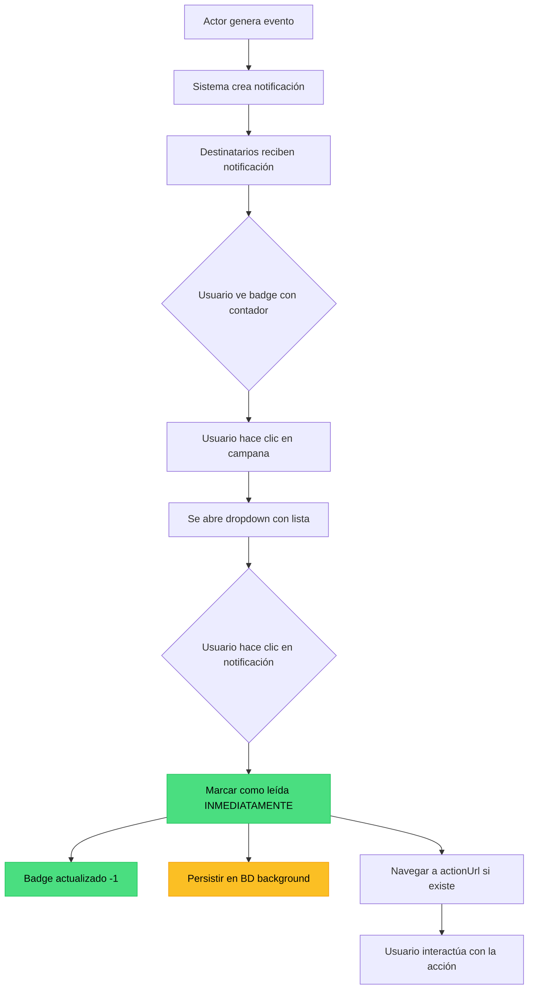

# Diseño del Sistema de Notificaciones — Kombat Taekwondo

## Visión General

Sistema de notificaciones en tiempo real para usuarios del sistema Kombat Taekwondo, soportando tanto notificaciones dirigidas (1:1) como broadcast (1:N) basadas en roles y contextos de negocio.

### ⭐ Características Principales

✅ **Notificaciones dirigidas y broadcast** (1:1, 1:N, 1:ALL)  
✅ **Badge actualizado automáticamente** al marcar como leída  
✅ **Actualización optimista** para UX fluida sin latencia  
✅ **Categorización flexible** (approval, event, certification, payment, system)  
✅ **Prioridades visuales** (low, normal, high, urgent)  
✅ **Metadata extensible** en formato JSON  
✅ **RLS seguro** con políticas por rol  
✅ **Arquitectura DDD** alineada al proyecto

### 🎯 Requisito Crítico Cumplido

> **"Cuando un actor lea la notificación, debe marcarla como leída y no aparecer en el badge"**

**Solución implementada**:

- **Optimistic update**: Badge se actualiza INSTANTÁNEAMENTE al hacer clic (0ms de latencia)
- **Persistencia background**: Se guarda en BD sin bloquear la UI (~100-500ms)
- **Sincronización garantizada**: Polling cada 30 segundos confirma estado real

**Resultado**: El usuario ve el badge actualizarse en tiempo real sin delays ni recargas de página.

---

## Casos de Uso Identificados

### CU-1: Notificación de Nuevo Alumno Pendiente

**Actor**: Instructor  
**Destinatario**: Administrador  
**Tipo**: Dirigida (1:1)  
**Trigger**: Un instructor registra un nuevo alumno en el sistema  
**Acción esperada**: El administrador debe autorizar/rechazar el registro

### CU-2: Publicación de Campeonato

**Actor**: Administrador  
**Destinatarios**: Todos los instructores activos  
**Tipo**: Broadcast (1:N)  
**Trigger**: Admin publica un nuevo evento de tipo "Campeonato"  
**Acción esperada**: Los instructores visualizan el evento y pueden inscribir a sus alumnos

### CU-3: Cambio de Estado de Solicitud

**Actor**: Administrador  
**Destinatario**: Instructor solicitante  
**Tipo**: Dirigida (1:1)  
**Trigger**: Admin aprueba/rechaza una solicitud de certificación  
**Acción esperada**: El instructor es notificado del resultado

### CU-4: Examen de Grado Aprobado

**Actor**: Sistema / Administrador  
**Destinatario**: Practicante (alumno)  
**Tipo**: Dirigida (1:1)  
**Trigger**: Se actualiza el grado de un practicante  
**Acción esperada**: El alumno ve su nuevo grado reflejado

### CU-5: Cobro Próximo a Vencer

**Actor**: Sistema (CRON)  
**Destinatario**: Practicante con cobros pendientes  
**Tipo**: Dirigida (1:1)  
**Trigger**: Un cobro está próximo a vencer (ej: 7 días antes)  
**Acción esperada**: El practicante gestiona el pago

---

## Flujo de Interacción del Usuario

### Ciclo de Vida de una Notificación



### Comportamiento Clave: Badge Automático

**Requisito**: Al hacer clic en una notificación, el badge **debe actualizarse automáticamente** sin recargar la página.

**Implementación**:

1. ✅ Click → Estado local actualizado (optimistic update)
2. ✅ Badge decrementado instantáneamente
3. ✅ Persistencia en BD en background (no bloquea UI)
4. ✅ Navegación a la acción correspondiente

**Resultado**: UX fluida y sin latencia percibida.

---

## Modelo de Datos

### Tabla: `notifications`

Tabla principal que almacena todas las notificaciones del sistema.

```sql
CREATE TABLE IF NOT EXISTS notifications (
  -- Identificación
  id              UUID PRIMARY KEY DEFAULT gen_random_uuid(),

  -- Tipo y contexto
  type            TEXT NOT NULL,                    -- 'new_student', 'event_published', 'cert_approved', etc.
  category        TEXT NOT NULL,                    -- 'approval', 'event', 'certification', 'payment', 'system'
  priority        TEXT NOT NULL DEFAULT 'normal',   -- 'low', 'normal', 'high', 'urgent'

  -- Contenido
  title           TEXT NOT NULL,                    -- Título corto de la notificación
  message         TEXT NOT NULL,                    -- Mensaje descriptivo
  action_url      TEXT,                             -- URL opcional para navegar (ej: /admin/practitioners/new-requests)
  action_label    TEXT,                             -- Label del botón de acción (ej: "Ver solicitud", "Ir al evento")

  -- Contexto de negocio (JSON para flexibilidad)
  metadata        JSONB NOT NULL DEFAULT '{}'::jsonb, -- Datos adicionales específicos del tipo

  -- Actor (quien generó la notificación)
  actor_user_id   UUID REFERENCES auth.users(id) ON DELETE SET NULL,
  actor_name      TEXT,                             -- Nombre del actor (para mostrar aunque se elimine el usuario)

  -- Entidad relacionada (para trazabilidad)
  related_entity_type TEXT,                         -- 'practitioner', 'event', 'certification', 'charge'
  related_entity_id   UUID,                         -- ID de la entidad relacionada

  -- Temporalidad
  created_at      TIMESTAMPTZ NOT NULL DEFAULT now(),
  expires_at      TIMESTAMPTZ,                      -- Fecha de expiración opcional (para notificaciones temporales)

  -- Índices de búsqueda
  CONSTRAINT notifications_priority_check CHECK (priority IN ('low', 'normal', 'high', 'urgent'))
);

CREATE INDEX idx_notifications_created_at ON notifications(created_at DESC);
CREATE INDEX idx_notifications_type ON notifications(type);
CREATE INDEX idx_notifications_category ON notifications(category);
CREATE INDEX idx_notifications_related_entity ON notifications(related_entity_type, related_entity_id);
CREATE INDEX idx_notifications_expires_at ON notifications(expires_at) WHERE expires_at IS NOT NULL;
```

### Tabla: `notification_recipients`

Tabla junction que mapea notificaciones a sus destinatarios. Soporta tanto notificaciones dirigidas como broadcast.

```sql
CREATE TABLE IF NOT EXISTS notification_recipients (
  -- Relación
  notification_id UUID NOT NULL REFERENCES notifications(id) ON DELETE CASCADE,
  recipient_user_id UUID NOT NULL REFERENCES auth.users(id) ON DELETE CASCADE,

  -- Estado de lectura
  is_read         BOOLEAN NOT NULL DEFAULT false,
  read_at         TIMESTAMPTZ,

  -- Estado de acción (opcional, para notificaciones que requieren acción)
  is_actioned     BOOLEAN NOT NULL DEFAULT false,
  actioned_at     TIMESTAMPTZ,
  action_result   TEXT,                             -- 'approved', 'rejected', 'completed', etc.

  -- Temporalidad
  created_at      TIMESTAMPTZ NOT NULL DEFAULT now(),

  PRIMARY KEY (notification_id, recipient_user_id)
);

CREATE INDEX idx_notification_recipients_user_id ON notification_recipients(recipient_user_id);
CREATE INDEX idx_notification_recipients_user_unread ON notification_recipients(recipient_user_id, is_read) WHERE is_read = false;
CREATE INDEX idx_notification_recipients_notification_id ON notification_recipients(notification_id);
```

### Tabla: `notification_templates` (Opcional, para escalabilidad futura)

Catálogo de tipos de notificaciones con configuración predefinida.

```sql
CREATE TABLE IF NOT EXISTS notification_templates (
  type            TEXT PRIMARY KEY,
  category        TEXT NOT NULL,
  default_priority TEXT NOT NULL DEFAULT 'normal',
  title_template  TEXT NOT NULL,                    -- Template con placeholders: "{{actorName}} registró un nuevo alumno"
  message_template TEXT NOT NULL,
  default_action_label TEXT,
  requires_action BOOLEAN NOT NULL DEFAULT false,
  expires_in_days INTEGER,                          -- Días hasta expiración (null = no expira)
  created_at      TIMESTAMPTZ NOT NULL DEFAULT now(),
  updated_at      TIMESTAMPTZ NOT NULL DEFAULT now()
);

-- Templates iniciales
INSERT INTO notification_templates (type, category, default_priority, title_template, message_template, default_action_label, requires_action) VALUES
  ('new_student_pending',   'approval', 'high',   'Nuevo alumno pendiente de autorización', '{{actorName}} ha registrado a {{studentName}} ({{studentRut}}). Revisa y autoriza el registro.', 'Ver solicitud', true),
  ('event_published',       'event',    'normal', 'Nuevo campeonato publicado',             '{{actorName}} ha publicado el campeonato "{{eventName}}" para el {{eventDate}}.', 'Ver evento', false),
  ('cert_request_approved', 'certification', 'normal', 'Solicitud de certificación aprobada', 'Tu solicitud de certificación {{certType}} para {{studentName}} ha sido aprobada.', 'Ver certificación', false),
  ('cert_request_rejected', 'certification', 'normal', 'Solicitud de certificación rechazada', 'Tu solicitud de certificación {{certType}} para {{studentName}} ha sido rechazada. Motivo: {{reason}}', null, false),
  ('grade_updated',         'system',   'normal', 'Cambio de grado',                        'Tu grado ha sido actualizado a {{newGrade}}. ¡Felicitaciones!', 'Ver perfil', false),
  ('charge_due_soon',       'payment',  'high',   'Cobro próximo a vencer',                 'Tienes un cobro de {{chargeType}} por {{amount}} que vence el {{dueDate}}.', 'Ver cobros', false)
ON CONFLICT (type) DO NOTHING;
```

---

## Tipos de Notificaciones (Catálogo Inicial)

### Por Categoría

| Categoría         | Tipos                                                            | Destinatarios Típicos               |
| ----------------- | ---------------------------------------------------------------- | ----------------------------------- |
| **approval**      | `new_student_pending`, `instructor_request_pending`              | Administradores                     |
| **event**         | `event_published`, `event_cancelled`, `event_updated`            | Instructores, Alumnos inscritos     |
| **certification** | `cert_request_approved`, `cert_request_rejected`, `cert_revoked` | Instructor solicitante, Practicante |
| **payment**       | `charge_due_soon`, `charge_overdue`, `payment_received`          | Practicante con el cobro            |
| **system**        | `grade_updated`, `profile_updated`, `account_deactivated`        | Practicante afectado                |

### Estructura de `metadata` por Tipo

#### `new_student_pending`

```json
{
  "studentId": "uuid",
  "studentName": "Juan Pérez",
  "studentRut": "12345678-9",
  "instructorId": "uuid",
  "instructorName": "María González",
  "requestedAt": "2026-05-23T10:30:00Z"
}
```

#### `event_published`

```json
{
  "eventId": "uuid",
  "eventName": "Campeonato Nacional 2026",
  "eventType": "competition",
  "eventDate": "2026-06-15",
  "eventScope": "national",
  "publishedAt": "2026-05-23T10:30:00Z"
}
```

#### `cert_request_approved`

```json
{
  "requestId": "uuid",
  "certType": "instructor",
  "studentId": "uuid",
  "studentName": "Carlos Rodríguez",
  "approvedBy": "uuid",
  "approvedByName": "Admin Principal",
  "approvedAt": "2026-05-23T10:30:00Z"
}
```

---

## Estrategias de Destinatarios

### 1. Notificación Dirigida (1:1)

```typescript
// Ejemplo: Instructor registra alumno → Notificar a admin específico
const notificationId = await createNotification({
  type: "new_student_pending",
  recipientStrategy: "specific_users",
  recipientUserIds: [adminUserId],
  metadata: { studentId, studentName, instructorId, instructorName },
});
```

### 2. Broadcast por Rol (1:N)

```typescript
// Ejemplo: Admin publica campeonato → Notificar a TODOS los instructores
const notificationId = await createNotification({
  type: "event_published",
  recipientStrategy: "role_based",
  recipientRoles: ["instructor", "profesor", "maestro"],
  metadata: { eventId, eventName, eventDate },
});
```

### 3. Broadcast por Academia (1:N)

```typescript
// Ejemplo: Evento específico de una academia → Notificar a sus miembros
const notificationId = await createNotification({
  type: "academy_announcement",
  recipientStrategy: "academy_members",
  academyId: "uuid",
  metadata: { message: "Clase especial este sábado" },
});
```

### 4. Broadcast Global (1:ALL)

```typescript
// Ejemplo: Mantenimiento del sistema → Notificar a TODOS los usuarios
const notificationId = await createNotification({
  type: "system_maintenance",
  recipientStrategy: "all_users",
  metadata: {
    scheduledAt: "2026-06-01T02:00:00Z",
    estimatedDuration: "2 hours",
  },
});
```

---

## Row Level Security (RLS)

```sql
-- ============================================================
-- RLS: notifications
-- ============================================================
ALTER TABLE notifications ENABLE ROW LEVEL SECURITY;

-- Admin puede leer todas las notificaciones
CREATE POLICY "notifications_admin_read_all"
  ON notifications FOR SELECT
  USING (EXISTS (SELECT 1 FROM admin_users WHERE user_id = auth.uid()));

-- Admin puede crear, actualizar y eliminar notificaciones
CREATE POLICY "notifications_admin_write"
  ON notifications FOR ALL
  USING (EXISTS (SELECT 1 FROM admin_users WHERE user_id = auth.uid()))
  WITH CHECK (EXISTS (SELECT 1 FROM admin_users WHERE user_id = auth.uid()));

-- Los usuarios pueden leer las notificaciones donde son destinatarios
CREATE POLICY "notifications_recipients_read_own"
  ON notifications FOR SELECT
  USING (
    EXISTS (
      SELECT 1 FROM notification_recipients nr
      WHERE nr.notification_id = notifications.id
        AND nr.recipient_user_id = auth.uid()
    )
  );

-- ============================================================
-- RLS: notification_recipients
-- ============================================================
ALTER TABLE notification_recipients ENABLE ROW LEVEL SECURITY;

-- Admin puede leer todos los recipients
CREATE POLICY "notification_recipients_admin_read_all"
  ON notification_recipients FOR SELECT
  USING (EXISTS (SELECT 1 FROM admin_users WHERE user_id = auth.uid()));

-- Admin puede crear recipients
CREATE POLICY "notification_recipients_admin_write"
  ON notification_recipients FOR INSERT
  WITH CHECK (EXISTS (SELECT 1 FROM admin_users WHERE user_id = auth.uid()));

-- Los usuarios pueden leer sus propios recipients
CREATE POLICY "notification_recipients_read_own"
  ON notification_recipients FOR SELECT
  USING (recipient_user_id = auth.uid());

-- Los usuarios pueden actualizar el estado de sus propias notificaciones (marcar como leída)
CREATE POLICY "notification_recipients_update_own"
  ON notification_recipients FOR UPDATE
  USING (recipient_user_id = auth.uid())
  WITH CHECK (recipient_user_id = auth.uid());

-- ============================================================
-- RLS: notification_templates
-- ============================================================
ALTER TABLE notification_templates ENABLE ROW LEVEL SECURITY;

-- Todos los usuarios autenticados pueden leer templates (para debugging/UI)
CREATE POLICY "notification_templates_authenticated_read"
  ON notification_templates FOR SELECT
  USING (auth.role() = 'authenticated');

-- Solo admin puede modificar templates
CREATE POLICY "notification_templates_admin_write"
  ON notification_templates FOR ALL
  USING (EXISTS (SELECT 1 FROM admin_users WHERE user_id = auth.uid()))
  WITH CHECK (EXISTS (SELECT 1 FROM admin_users WHERE user_id = auth.uid()));
```

---

## Arquitectura de Módulo (DDD)

Siguiendo la estructura del proyecto:

```
src/modules/notifications/
├── domain/
│   ├── entities/
│   │   ├── notification.ts           # Entidad Notification
│   │   └── notificationRecipient.ts  # Value Object
│   ├── enums/
│   │   ├── notificationType.ts
│   │   ├── notificationCategory.ts
│   │   └── notificationPriority.ts
│   ├── interfaces/
│   │   ├── notificationRepository.ts
│   │   └── notificationService.ts
│   └── errors/
│       └── notificationErrors.ts
├── infrastructure/
│   ├── repositories/
│   │   └── drizzleNotificationRepository.ts
│   └── services/
│       └── supabaseNotificationService.ts
├── application/
│   └── use-cases/
│       ├── createNotification.ts
│       ├── markNotificationAsRead.ts
│       ├── getUnreadNotificationsCount.ts
│       ├── getNotificationsByUser.ts
│       └── broadcastNotification.ts
└── presentation/
    ├── components/
    │   ├── NotificationBell.tsx       # Icono con badge de count
    │   ├── NotificationDropdown.tsx   # Dropdown con lista de notificaciones
    │   ├── NotificationItem.tsx       # Item individual de notificación
    │   └── NotificationCenter.tsx     # Página completa de notificaciones
    ├── hooks/
    │   ├── useNotifications.ts        # Hook para consumir notificaciones
    │   └── useUnreadCount.ts          # Hook para badge count
    └── actions/
        ├── notificationActions.ts     # Server Actions para marcar como leída, etc.
        └── notificationHelpers.ts     # Helpers para crear notificaciones desde otros módulos
```

---

## Domain Layer

### Entidad: `Notification`

```typescript
// src/modules/notifications/domain/entities/notification.ts
import type {
  NotificationType,
  NotificationCategory,
  NotificationPriority,
} from "../enums";

export interface NotificationMetadata {
  [key: string]: unknown;
}

export interface Notification {
  id: string;
  type: NotificationType;
  category: NotificationCategory;
  priority: NotificationPriority;
  title: string;
  message: string;
  actionUrl: string | null;
  actionLabel: string | null;
  metadata: NotificationMetadata;
  actorUserId: string | null;
  actorName: string | null;
  relatedEntityType: string | null;
  relatedEntityId: string | null;
  createdAt: Date;
  expiresAt: Date | null;
}

export interface NotificationRecipient {
  notificationId: string;
  recipientUserId: string;
  isRead: boolean;
  readAt: Date | null;
  isActioned: boolean;
  actionedAt: Date | null;
  actionResult: string | null;
  createdAt: Date;
}

export interface NotificationWithStatus extends Notification {
  isRead: boolean;
  readAt: Date | null;
  isActioned: boolean;
  actionedAt: Date | null;
}
```

### Enums

```typescript
// src/modules/notifications/domain/enums/notificationType.ts
export const NotificationType = {
  // Approval
  NEW_STUDENT_PENDING: "new_student_pending",
  INSTRUCTOR_REQUEST_PENDING: "instructor_request_pending",

  // Event
  EVENT_PUBLISHED: "event_published",
  EVENT_CANCELLED: "event_cancelled",
  EVENT_UPDATED: "event_updated",

  // Certification
  CERT_REQUEST_APPROVED: "cert_request_approved",
  CERT_REQUEST_REJECTED: "cert_request_rejected",
  CERT_REVOKED: "cert_revoked",

  // Payment
  CHARGE_DUE_SOON: "charge_due_soon",
  CHARGE_OVERDUE: "charge_overdue",
  PAYMENT_RECEIVED: "payment_received",

  // System
  GRADE_UPDATED: "grade_updated",
  PROFILE_UPDATED: "profile_updated",
  ACCOUNT_DEACTIVATED: "account_deactivated",
  SYSTEM_MAINTENANCE: "system_maintenance",
} as const;

export type NotificationType =
  (typeof NotificationType)[keyof typeof NotificationType];

// src/modules/notifications/domain/enums/notificationCategory.ts
export const NotificationCategory = {
  APPROVAL: "approval",
  EVENT: "event",
  CERTIFICATION: "certification",
  PAYMENT: "payment",
  SYSTEM: "system",
} as const;

export type NotificationCategory =
  (typeof NotificationCategory)[keyof typeof NotificationCategory];

// src/modules/notifications/domain/enums/notificationPriority.ts
export const NotificationPriority = {
  LOW: "low",
  NORMAL: "normal",
  HIGH: "high",
  URGENT: "urgent",
} as const;

export type NotificationPriority =
  (typeof NotificationPriority)[keyof typeof NotificationPriority];
```

### Interfaces

```typescript
// src/modules/notifications/domain/interfaces/notificationRepository.ts
import type {
  Notification,
  NotificationRecipient,
  NotificationWithStatus,
} from "../entities/notification";

export interface NotificationRepository {
  // Crear notificación
  create(
    notification: Omit<Notification, "id" | "createdAt">,
  ): Promise<Notification>;

  // Agregar destinatarios
  addRecipients(
    notificationId: string,
    recipientUserIds: string[],
  ): Promise<void>;

  // Obtener notificaciones de un usuario (con paginación)
  findByUserId(
    userId: string,
    options?: {
      limit?: number;
      offset?: number;
      onlyUnread?: boolean;
      categories?: string[];
    },
  ): Promise<NotificationWithStatus[]>;

  // Contar notificaciones no leídas
  countUnreadByUserId(userId: string): Promise<number>;

  // Marcar como leída
  markAsRead(notificationId: string, userId: string): Promise<void>;

  // Marcar todas como leídas
  markAllAsRead(userId: string): Promise<void>;

  // Marcar como accionada
  markAsActioned(
    notificationId: string,
    userId: string,
    actionResult?: string,
  ): Promise<void>;

  // Eliminar notificaciones expiradas (para CRON)
  deleteExpired(): Promise<number>;

  // Buscar por ID
  findById(notificationId: string): Promise<Notification | null>;
}
```

---

## Application Layer

### Use Case: `createNotification`

```typescript
// src/modules/notifications/application/use-cases/createNotification.ts
import { z } from "zod";
import type { NotificationRepository } from "../../domain/interfaces/notificationRepository";
import type {
  NotificationType,
  NotificationCategory,
  NotificationPriority,
} from "../../domain/enums";
import { adminSupabase } from "@/lib/supabase/admin";

export const CreateNotificationInput = z.object({
  type: z.string(),
  category: z.enum(["approval", "event", "certification", "payment", "system"]),
  priority: z.enum(["low", "normal", "high", "urgent"]).default("normal"),
  title: z.string().min(1).max(200),
  message: z.string().min(1),
  actionUrl: z.string().nullable().optional(),
  actionLabel: z.string().nullable().optional(),
  metadata: z.record(z.unknown()).default({}),
  actorUserId: z.string().uuid().nullable().optional(),
  actorName: z.string().nullable().optional(),
  relatedEntityType: z.string().nullable().optional(),
  relatedEntityId: z.string().uuid().nullable().optional(),
  expiresInDays: z.number().int().positive().nullable().optional(),

  // Estrategia de destinatarios
  recipientStrategy: z.enum([
    "specific_users", // Lista de user IDs
    "role_based", // Por roles de practitioner
    "academy_members", // Miembros de una academia
    "all_users", // Broadcast global
  ]),
  recipientUserIds: z.array(z.string().uuid()).optional(),
  recipientRoles: z.array(z.string()).optional(),
  academyId: z.string().uuid().optional(),
});

export type CreateNotificationInput = z.infer<typeof CreateNotificationInput>;

export async function createNotification(
  input: CreateNotificationInput,
  deps: { notificationRepo: NotificationRepository },
): Promise<string> {
  const parsed = CreateNotificationInput.parse(input);

  // 1. Calcular fecha de expiración
  let expiresAt: Date | null = null;
  if (parsed.expiresInDays) {
    expiresAt = new Date();
    expiresAt.setDate(expiresAt.getDate() + parsed.expiresInDays);
  }

  // 2. Crear la notificación
  const notification = await deps.notificationRepo.create({
    type: parsed.type as NotificationType,
    category: parsed.category,
    priority: parsed.priority,
    title: parsed.title,
    message: parsed.message,
    actionUrl: parsed.actionUrl ?? null,
    actionLabel: parsed.actionLabel ?? null,
    metadata: parsed.metadata,
    actorUserId: parsed.actorUserId ?? null,
    actorName: parsed.actorName ?? null,
    relatedEntityType: parsed.relatedEntityType ?? null,
    relatedEntityId: parsed.relatedEntityId ?? null,
    expiresAt,
  });

  // 3. Resolver destinatarios según estrategia
  const recipientUserIds = await resolveRecipients(parsed);

  // 4. Agregar destinatarios
  if (recipientUserIds.length > 0) {
    await deps.notificationRepo.addRecipients(
      notification.id,
      recipientUserIds,
    );
  }

  return notification.id;
}

async function resolveRecipients(
  input: CreateNotificationInput,
): Promise<string[]> {
  const { recipientStrategy } = input;

  switch (recipientStrategy) {
    case "specific_users":
      return input.recipientUserIds ?? [];

    case "role_based":
      return await getUsersByRoles(input.recipientRoles ?? []);

    case "academy_members":
      return await getUsersByAcademy(input.academyId!);

    case "all_users":
      return await getAllAuthenticatedUsers();

    default:
      return [];
  }
}

async function getUsersByRoles(roles: string[]): Promise<string[]> {
  // Obtener usuarios que son practicantes con los roles especificados
  const { data } = await adminSupabase
    .from("practitioners")
    .select("auth_user_id")
    .in("role", roles)
    .eq("is_active", true);

  return (data ?? []).map((p) => p.auth_user_id).filter(Boolean) as string[];
}

async function getUsersByAcademy(academyId: string): Promise<string[]> {
  // Obtener usuarios miembros de una academia específica
  const { data } = await adminSupabase
    .from("academy_memberships")
    .select("practitioners!inner(auth_user_id)")
    .eq("academy_id", academyId)
    .is("left_at", null);

  return (data ?? [])
    .map((m) => (m.practitioners as any)?.auth_user_id)
    .filter(Boolean) as string[];
}

async function getAllAuthenticatedUsers(): Promise<string[]> {
  // Obtener todos los usuarios autenticados con perfil de practicante
  const { data } = await adminSupabase
    .from("practitioners")
    .select("auth_user_id")
    .eq("is_active", true);

  return (data ?? []).map((p) => p.auth_user_id).filter(Boolean) as string[];
}
```

### Use Case: `markNotificationAsRead`

```typescript
// src/modules/notifications/application/use-cases/markNotificationAsRead.ts
import { z } from "zod";
import type { NotificationRepository } from "../../domain/interfaces/notificationRepository";

export const MarkNotificationAsReadInput = z.object({
  notificationId: z.string().uuid(),
  userId: z.string().uuid(),
});

export type MarkNotificationAsReadInput = z.infer<
  typeof MarkNotificationAsReadInput
>;

export async function markNotificationAsRead(
  input: MarkNotificationAsReadInput,
  deps: { notificationRepo: NotificationRepository },
): Promise<void> {
  const parsed = MarkNotificationAsReadInput.parse(input);
  await deps.notificationRepo.markAsRead(parsed.notificationId, parsed.userId);
}
```

### Use Case: `getUnreadNotificationsCount`

```typescript
// src/modules/notifications/application/use-cases/getUnreadNotificationsCount.ts
import { z } from "zod";
import type { NotificationRepository } from "../../domain/interfaces/notificationRepository";

export const GetUnreadNotificationsCountInput = z.object({
  userId: z.string().uuid(),
});

export type GetUnreadNotificationsCountInput = z.infer<
  typeof GetUnreadNotificationsCountInput
>;

export async function getUnreadNotificationsCount(
  input: GetUnreadNotificationsCountInput,
  deps: { notificationRepo: NotificationRepository },
): Promise<number> {
  const parsed = GetUnreadNotificationsCountInput.parse(input);
  return await deps.notificationRepo.countUnreadByUserId(parsed.userId);
}
```

---

## Infrastructure Layer

### Repository Implementation

```typescript
// src/modules/notifications/infrastructure/repositories/drizzleNotificationRepository.ts
import { adminSupabase } from "@/lib/supabase/admin";
import type {
  Notification,
  NotificationRecipient,
  NotificationWithStatus,
} from "../../domain/entities/notification";
import type { NotificationRepository } from "../../domain/interfaces/notificationRepository";
import { DomainError } from "@/lib/errors";

export class DrizzleNotificationRepository implements NotificationRepository {
  async create(
    notification: Omit<Notification, "id" | "createdAt">,
  ): Promise<Notification> {
    const { data, error } = await adminSupabase
      .from("notifications")
      .insert({
        type: notification.type,
        category: notification.category,
        priority: notification.priority,
        title: notification.title,
        message: notification.message,
        action_url: notification.actionUrl,
        action_label: notification.actionLabel,
        metadata: notification.metadata,
        actor_user_id: notification.actorUserId,
        actor_name: notification.actorName,
        related_entity_type: notification.relatedEntityType,
        related_entity_id: notification.relatedEntityId,
        expires_at: notification.expiresAt?.toISOString(),
      })
      .select()
      .single();

    if (error) {
      throw new DomainError(`Failed to create notification: ${error.message}`);
    }

    return this.toEntity(data);
  }

  async addRecipients(
    notificationId: string,
    recipientUserIds: string[],
  ): Promise<void> {
    const recipients = recipientUserIds.map((userId) => ({
      notification_id: notificationId,
      recipient_user_id: userId,
    }));

    const { error } = await adminSupabase
      .from("notification_recipients")
      .insert(recipients);

    if (error) {
      throw new DomainError(`Failed to add recipients: ${error.message}`);
    }
  }

  async findByUserId(
    userId: string,
    options?: {
      limit?: number;
      offset?: number;
      onlyUnread?: boolean;
      categories?: string[];
    },
  ): Promise<NotificationWithStatus[]> {
    let query = adminSupabase
      .from("notifications")
      .select(
        `
        *,
        notification_recipients!inner(
          is_read,
          read_at,
          is_actioned,
          actioned_at
        )
      `,
      )
      .eq("notification_recipients.recipient_user_id", userId)
      .order("created_at", { ascending: false });

    if (options?.onlyUnread) {
      query = query.eq("notification_recipients.is_read", false);
    }

    if (options?.categories && options.categories.length > 0) {
      query = query.in("category", options.categories);
    }

    if (options?.limit) {
      query = query.limit(options.limit);
    }

    if (options?.offset) {
      query = query.range(
        options.offset,
        options.offset + (options.limit ?? 25) - 1,
      );
    }

    const { data, error } = await query;

    if (error) {
      throw new DomainError(`Failed to fetch notifications: ${error.message}`);
    }

    return (data ?? []).map((row) => this.toEntityWithStatus(row));
  }

  async countUnreadByUserId(userId: string): Promise<number> {
    const { count, error } = await adminSupabase
      .from("notification_recipients")
      .select("*", { count: "exact", head: true })
      .eq("recipient_user_id", userId)
      .eq("is_read", false);

    if (error) {
      throw new DomainError(
        `Failed to count unread notifications: ${error.message}`,
      );
    }

    return count ?? 0;
  }

  async markAsRead(notificationId: string, userId: string): Promise<void> {
    const { error } = await adminSupabase
      .from("notification_recipients")
      .update({
        is_read: true,
        read_at: new Date().toISOString(),
      })
      .eq("notification_id", notificationId)
      .eq("recipient_user_id", userId);

    if (error) {
      throw new DomainError(
        `Failed to mark notification as read: ${error.message}`,
      );
    }
  }

  async markAllAsRead(userId: string): Promise<void> {
    const { error } = await adminSupabase
      .from("notification_recipients")
      .update({
        is_read: true,
        read_at: new Date().toISOString(),
      })
      .eq("recipient_user_id", userId)
      .eq("is_read", false);

    if (error) {
      throw new DomainError(
        `Failed to mark all notifications as read: ${error.message}`,
      );
    }
  }

  async markAsActioned(
    notificationId: string,
    userId: string,
    actionResult?: string,
  ): Promise<void> {
    const { error } = await adminSupabase
      .from("notification_recipients")
      .update({
        is_actioned: true,
        actioned_at: new Date().toISOString(),
        action_result: actionResult ?? null,
      })
      .eq("notification_id", notificationId)
      .eq("recipient_user_id", userId);

    if (error) {
      throw new DomainError(
        `Failed to mark notification as actioned: ${error.message}`,
      );
    }
  }

  async deleteExpired(): Promise<number> {
    const { count, error } = await adminSupabase
      .from("notifications")
      .delete({ count: "exact" })
      .lt("expires_at", new Date().toISOString());

    if (error) {
      throw new DomainError(
        `Failed to delete expired notifications: ${error.message}`,
      );
    }

    return count ?? 0;
  }

  async findById(notificationId: string): Promise<Notification | null> {
    const { data, error } = await adminSupabase
      .from("notifications")
      .select("*")
      .eq("id", notificationId)
      .maybeSingle();

    if (error) {
      throw new DomainError(`Failed to find notification: ${error.message}`);
    }

    return data ? this.toEntity(data) : null;
  }

  private toEntity(row: any): Notification {
    return {
      id: row.id,
      type: row.type,
      category: row.category,
      priority: row.priority,
      title: row.title,
      message: row.message,
      actionUrl: row.action_url,
      actionLabel: row.action_label,
      metadata: row.metadata ?? {},
      actorUserId: row.actor_user_id,
      actorName: row.actor_name,
      relatedEntityType: row.related_entity_type,
      relatedEntityId: row.related_entity_id,
      createdAt: new Date(row.created_at),
      expiresAt: row.expires_at ? new Date(row.expires_at) : null,
    };
  }

  private toEntityWithStatus(row: any): NotificationWithStatus {
    const notification = this.toEntity(row);
    const recipient = Array.isArray(row.notification_recipients)
      ? row.notification_recipients[0]
      : row.notification_recipients;

    return {
      ...notification,
      isRead: recipient?.is_read ?? false,
      readAt: recipient?.read_at ? new Date(recipient.read_at) : null,
      isActioned: recipient?.is_actioned ?? false,
      actionedAt: recipient?.actioned_at
        ? new Date(recipient.actioned_at)
        : null,
    };
  }
}
```

---

## Presentation Layer

### Server Actions

```typescript
// src/modules/notifications/presentation/actions/notificationActions.ts
"use server";

import { revalidatePath } from "next/cache";
import { requireUser } from "@/lib/supabase/server";
import { DrizzleNotificationRepository } from "../../infrastructure/repositories/drizzleNotificationRepository";
import { markNotificationAsRead } from "../../application/use-cases/markNotificationAsRead";
import { getUnreadNotificationsCount } from "../../application/use-cases/getUnreadNotificationsCount";

export interface ActionResult<T = undefined> {
  success: boolean;
  data?: T;
  error?: string;
  code?: string;
}

export async function markAsReadAction(
  notificationId: string,
): Promise<ActionResult> {
  try {
    const user = await requireUser();
    const notificationRepo = new DrizzleNotificationRepository();

    await markNotificationAsRead(
      { notificationId, userId: user.id },
      { notificationRepo },
    );

    revalidatePath("/dashboard");
    return { success: true };
  } catch (err) {
    console.error("[markAsReadAction]", err);
    return {
      success: false,
      error: "Error al marcar notificación como leída",
    };
  }
}

export async function getUnreadCountAction(): Promise<ActionResult<number>> {
  try {
    const user = await requireUser();
    const notificationRepo = new DrizzleNotificationRepository();

    const count = await getUnreadNotificationsCount(
      { userId: user.id },
      { notificationRepo },
    );

    return { success: true, data: count };
  } catch (err) {
    console.error("[getUnreadCountAction]", err);
    return {
      success: false,
      error: "Error al obtener contador de notificaciones",
    };
  }
}
```

### Helper para Crear Notificaciones desde Otros Módulos

```typescript
// src/modules/notifications/presentation/actions/notificationHelpers.ts
"use server";

import { DrizzleNotificationRepository } from "../../infrastructure/repositories/drizzleNotificationRepository";
import {
  createNotification,
  type CreateNotificationInput,
} from "../../application/use-cases/createNotification";
import { NotificationType } from "../../domain/enums/notificationType";
import { NotificationCategory } from "../../domain/enums/notificationCategory";
import { NotificationPriority } from "../../domain/enums/notificationPriority";

/**
 * Helper para notificar a admins cuando un instructor registra un nuevo alumno.
 * Uso: Llamar desde instructorActions.ts después de crear el practicante.
 */
export async function notifyAdminsNewStudent(params: {
  studentId: string;
  studentName: string;
  studentRut: string;
  instructorId: string;
  instructorName: string;
}): Promise<void> {
  const notificationRepo = new DrizzleNotificationRepository();

  // Obtener todos los admin_user_ids
  const { adminSupabase } = await import("@/lib/supabase/admin");
  const { data: admins } = await adminSupabase
    .from("admin_users")
    .select("user_id");

  if (!admins || admins.length === 0) return;

  const adminUserIds = admins.map((a) => a.user_id);

  await createNotification(
    {
      type: NotificationType.NEW_STUDENT_PENDING,
      category: NotificationCategory.APPROVAL,
      priority: NotificationPriority.HIGH,
      title: "Nuevo alumno pendiente de autorización",
      message: `${params.instructorName} ha registrado a ${params.studentName} (${params.studentRut}). Revisa y autoriza el registro.`,
      actionUrl: "/admin/practitioners",
      actionLabel: "Ver solicitud",
      metadata: {
        studentId: params.studentId,
        studentName: params.studentName,
        studentRut: params.studentRut,
        instructorId: params.instructorId,
        instructorName: params.instructorName,
        requestedAt: new Date().toISOString(),
      },
      relatedEntityType: "practitioner",
      relatedEntityId: params.studentId,
      recipientStrategy: "specific_users",
      recipientUserIds: adminUserIds,
    },
    { notificationRepo },
  );
}

/**
 * Helper para notificar a todos los instructores cuando se publica un nuevo campeonato.
 * Uso: Llamar desde eventActions.ts después de crear el evento.
 */
export async function notifyInstructorsEventPublished(params: {
  eventId: string;
  eventName: string;
  eventType: string;
  eventDate: string;
  eventScope: string;
  publishedByName: string;
}): Promise<void> {
  const notificationRepo = new DrizzleNotificationRepository();

  await createNotification(
    {
      type: NotificationType.EVENT_PUBLISHED,
      category: NotificationCategory.EVENT,
      priority: NotificationPriority.NORMAL,
      title: "Nuevo campeonato publicado",
      message: `${params.publishedByName} ha publicado el campeonato "${params.eventName}" para el ${params.eventDate}.`,
      actionUrl: `/events/${params.eventId}`,
      actionLabel: "Ver evento",
      metadata: {
        eventId: params.eventId,
        eventName: params.eventName,
        eventType: params.eventType,
        eventDate: params.eventDate,
        eventScope: params.eventScope,
        publishedAt: new Date().toISOString(),
      },
      relatedEntityType: "event",
      relatedEntityId: params.eventId,
      recipientStrategy: "role_based",
      recipientRoles: ["instructor", "profesor", "maestro"],
    },
    { notificationRepo },
  );
}
```

### Componente: NotificationBell

```typescript
// src/modules/notifications/presentation/components/NotificationBell.tsx
'use client';

import { useEffect, useState } from 'react';
import { Bell } from 'lucide-react';
import { getUnreadCountAction } from '../actions/notificationActions';

export function NotificationBell() {
  const [unreadCount, setUnreadCount] = useState(0);
  const [isLoading, setIsLoading] = useState(true);
  const [isOpen, setIsOpen] = useState(false);

  useEffect(() => {
    async function loadCount() {
      const result = await getUnreadCountAction();
      if (result.success && result.data !== undefined) {
        setUnreadCount(result.data);
      }
      setIsLoading(false);
    }
    loadCount();

    // Polling cada 30 segundos para actualizar el contador
    const interval = setInterval(loadCount, 30000);
    return () => clearInterval(interval);
  }, []);

  const handleBadgeUpdate = () => {
    // Callback para actualizar el badge cuando se marca una notificación como leída
    setUnreadCount((prev) => Math.max(0, prev - 1));
  };

  return (
    <div className="relative">
      <button
        onClick={() => setIsOpen(!isOpen)}
        className="relative p-2 rounded-lg hover:bg-neutral-800 transition-colors"
        aria-label="Notificaciones"
      >
        <Bell className="w-5 h-5 text-neutral-400" />
        {!isLoading && unreadCount > 0 && (
          <span className="absolute top-1 right-1 flex h-4 w-4 items-center justify-center rounded-full bg-red-600 text-[10px] font-bold text-white">
            {unreadCount > 9 ? '9+' : unreadCount}
          </span>
        )}
      </button>

      {isOpen && (
        <NotificationDropdown
          onClose={() => setIsOpen(false)}
          onBadgeUpdate={handleBadgeUpdate}
        />
      )}
    </div>
  );
}
```

### Componente: NotificationDropdown

```typescript
// src/modules/notifications/presentation/components/NotificationDropdown.tsx
'use client';

import { useEffect, useState, useRef } from 'react';
import { useRouter } from 'next/navigation';
import { X } from 'lucide-react';
import { DrizzleNotificationRepository } from '../../infrastructure/repositories/drizzleNotificationRepository';
import type { NotificationWithStatus } from '../../domain/entities/notification';
import { NotificationItem } from './NotificationItem';

interface NotificationDropdownProps {
  onClose: () => void;
  onBadgeUpdate: () => void;
}

export function NotificationDropdown({ onClose, onBadgeUpdate }: NotificationDropdownProps) {
  const [notifications, setNotifications] = useState<NotificationWithStatus[]>([]);
  const [isLoading, setIsLoading] = useState(true);
  const dropdownRef = useRef<HTMLDivElement>(null);
  const router = useRouter();

  useEffect(() => {
    async function loadNotifications() {
      try {
        // En producción, esto debería ser un Server Action
        const repo = new DrizzleNotificationRepository();
        const user = await getCurrentUser(); // Helper para obtener el usuario actual
        const data = await repo.findByUserId(user.id, { limit: 10, onlyUnread: false });
        setNotifications(data);
      } catch (err) {
        console.error('Error loading notifications:', err);
      } finally {
        setIsLoading(false);
      }
    }
    loadNotifications();

    // Cerrar dropdown al hacer clic fuera
    function handleClickOutside(event: MouseEvent) {
      if (dropdownRef.current && !dropdownRef.current.contains(event.target as Node)) {
        onClose();
      }
    }
    document.addEventListener('mousedown', handleClickOutside);
    return () => document.removeEventListener('mousedown', handleClickOutside);
  }, [onClose]);

  const handleNotificationClick = async (notification: NotificationWithStatus) => {
    // 1. Marcar como leída INMEDIATAMENTE (optimistic update)
    if (!notification.isRead) {
      setNotifications((prev) =>
        prev.map((n) =>
          n.id === notification.id ? { ...n, isRead: true, readAt: new Date() } : n
        )
      );
      onBadgeUpdate(); // Actualizar badge inmediatamente
    }

    // 2. Persistir en BD (sin esperar)
    if (!notification.isRead) {
      const { markAsReadAction } = await import('../actions/notificationActions');
      markAsReadAction(notification.id).catch((err) => {
        console.error('Error marking as read:', err);
        // Revertir si falla (opcional)
      });
    }

    // 3. Navegar a la URL de acción si existe
    if (notification.actionUrl) {
      router.push(notification.actionUrl);
      onClose();
    }
  };

  const handleMarkAllAsRead = async () => {
    // Implementar markAllAsRead action
    setNotifications((prev) => prev.map((n) => ({ ...n, isRead: true, readAt: new Date() })));
    onClose();
  };

  return (
    <div
      ref={dropdownRef}
      className="absolute right-0 top-full mt-2 w-96 max-h-[600px] overflow-y-auto bg-neutral-900 border border-neutral-700 rounded-lg shadow-xl z-50"
    >
      {/* Header */}
      <div className="sticky top-0 bg-neutral-900 border-b border-neutral-700 p-4 flex items-center justify-between">
        <h3 className="text-lg font-semibold text-neutral-100">Notificaciones</h3>
        <button
          onClick={onClose}
          className="p-1 rounded hover:bg-neutral-800 transition-colors"
          aria-label="Cerrar"
        >
          <X className="w-4 h-4 text-neutral-400" />
        </button>
      </div>

      {/* Actions */}
      {notifications.some(n => !n.isRead) && (
        <div className="border-b border-neutral-700 p-2">
          <button
            onClick={handleMarkAllAsRead}
            className="text-xs text-blue-400 hover:text-blue-300 transition-colors"
          >
            Marcar todas como leídas
          </button>
        </div>
      )}

      {/* Notifications List */}
      <div className="divide-y divide-neutral-700">
        {isLoading ? (
          <div className="p-8 text-center text-neutral-400">Cargando...</div>
        ) : notifications.length === 0 ? (
          <div className="p-8 text-center text-neutral-400">No hay notificaciones</div>
        ) : (
          notifications.map((notification) => (
            <NotificationItem
              key={notification.id}
              notification={notification}
              onClick={() => handleNotificationClick(notification)}
            />
          ))
        )}
      </div>

      {/* Footer */}
      <div className="sticky bottom-0 bg-neutral-900 border-t border-neutral-700 p-2 text-center">
        <button
          onClick={() => {
            router.push('/dashboard/notifications');
            onClose();
          }}
          className="text-sm text-blue-400 hover:text-blue-300 transition-colors"
        >
          Ver todas las notificaciones
        </button>
      </div>
    </div>
  );
}

// Helper temporal - en producción debe ser un Server Action
async function getCurrentUser() {
  const { createClient } = await import('@/lib/supabase/client');
  const supabase = createClient();
  const { data: { user } } = await supabase.auth.getUser();
  if (!user) throw new Error('No authenticated');
  return user;
}
```

### Componente: NotificationItem

```typescript
// src/modules/notifications/presentation/components/NotificationItem.tsx
'use client';

import { formatDistanceToNow } from 'date-fns';
import { es } from 'date-fns/locale';
import {
  AlertCircle,
  Calendar,
  Award,
  CreditCard,
  Settings,
  Bell
} from 'lucide-react';
import type { NotificationWithStatus } from '../../domain/entities/notification';
import { cn } from '@/lib/cn';

interface NotificationItemProps {
  notification: NotificationWithStatus;
  onClick: () => void;
}

const CATEGORY_ICONS = {
  approval: AlertCircle,
  event: Calendar,
  certification: Award,
  payment: CreditCard,
  system: Settings,
} as const;

const PRIORITY_STYLES = {
  low: 'border-l-neutral-600',
  normal: 'border-l-blue-500',
  high: 'border-l-orange-500',
  urgent: 'border-l-red-500',
} as const;

export function NotificationItem({ notification, onClick }: NotificationItemProps) {
  const Icon = CATEGORY_ICONS[notification.category as keyof typeof CATEGORY_ICONS] ?? Bell;
  const timeAgo = formatDistanceToNow(notification.createdAt, {
    addSuffix: true,
    locale: es,
  });

  return (
    <button
      onClick={onClick}
      className={cn(
        'w-full text-left p-4 border-l-4 transition-all hover:bg-neutral-800',
        PRIORITY_STYLES[notification.priority as keyof typeof PRIORITY_STYLES],
        notification.isRead ? 'bg-neutral-900/50' : 'bg-neutral-900'
      )}
    >
      <div className="flex gap-3">
        {/* Icon */}
        <div className={cn(
          'flex-shrink-0 w-10 h-10 rounded-full flex items-center justify-center',
          notification.isRead ? 'bg-neutral-800' : 'bg-neutral-700'
        )}>
          <Icon className={cn(
            'w-5 h-5',
            notification.isRead ? 'text-neutral-400' : 'text-blue-400'
          )} />
        </div>

        {/* Content */}
        <div className="flex-1 min-w-0">
          <div className="flex items-start justify-between gap-2 mb-1">
            <h4 className={cn(
              'font-semibold text-sm',
              notification.isRead ? 'text-neutral-300' : 'text-neutral-100'
            )}>
              {notification.title}
            </h4>
            {!notification.isRead && (
              <span className="flex-shrink-0 w-2 h-2 bg-blue-500 rounded-full" />
            )}
          </div>

          <p className={cn(
            'text-sm mb-2 line-clamp-2',
            notification.isRead ? 'text-neutral-500' : 'text-neutral-400'
          )}>
            {notification.message}
          </p>

          <div className="flex items-center justify-between">
            <span className="text-xs text-neutral-500">{timeAgo}</span>
            {notification.actionLabel && (
              <span className="text-xs text-blue-400 font-medium">
                {notification.actionLabel} →
              </span>
            )}
          </div>
        </div>
      </div>
    </button>
  );
}
```

---

## Flujo Completo: Marcar como Leída Automáticamente

### 1. Usuario hace clic en el ícono de campana

- Se abre el `NotificationDropdown`
- Se cargan las últimas 10 notificaciones (leídas y no leídas)

### 2. Usuario hace clic en una notificación

**CRÍTICO**: El siguiente flujo ocurre en este orden:

```typescript
const handleNotificationClick = async (
  notification: NotificationWithStatus,
) => {
  // ✅ PASO 1: Actualización optimista en UI (instantáneo)
  if (!notification.isRead) {
    setNotifications((prev) =>
      prev.map((n) =>
        n.id === notification.id
          ? { ...n, isRead: true, readAt: new Date() }
          : n,
      ),
    );
    onBadgeUpdate(); // ✅ Badge se actualiza INMEDIATAMENTE
  }

  // ✅ PASO 2: Persistir en BD (asíncrono, no bloqueante)
  if (!notification.isRead) {
    markAsReadAction(notification.id).catch(console.error);
  }

  // ✅ PASO 3: Navegar a la acción (si existe)
  if (notification.actionUrl) {
    router.push(notification.actionUrl);
    onClose();
  }
};
```

### 3. Badge se actualiza automáticamente

- **Inmediatamente**: El callback `onBadgeUpdate()` decrementa el contador en la UI
- **Background**: La persistencia en BD confirma el cambio
- **Próximo polling**: El contador se sincroniza con el valor real de la BD

### 4. Comportamiento esperado

| Acción                           | Badge Count                       | Notificación                | BD                                   |
| -------------------------------- | --------------------------------- | --------------------------- | ------------------------------------ |
| Usuario ve notificación no leída | 5                                 | `isRead: false`             | `is_read: false`                     |
| Usuario hace clic                | 4 ← **Actualización instantánea** | `isRead: true` (optimistic) | `is_read: false` (aún no persistido) |
| Request completa (1-2 seg)       | 4                                 | `isRead: true`              | `is_read: true` ← **Confirmado**     |
| Próximo polling (30 seg)         | 4                                 | `isRead: true`              | `is_read: true` ← **Sincronizado**   |

---

## Server Action Adicional: Obtener Notificaciones

```typescript
// Agregar a src/modules/notifications/presentation/actions/notificationActions.ts

export async function getUserNotificationsAction(options?: {
  limit?: number;
  offset?: number;
  onlyUnread?: boolean;
}): Promise<ActionResult<NotificationWithStatus[]>> {
  try {
    const user = await requireUser();
    const notificationRepo = new DrizzleNotificationRepository();

    const notifications = await notificationRepo.findByUserId(user.id, options);

    return { success: true, data: notifications };
  } catch (err) {
    console.error("[getUserNotificationsAction]", err);
    return {
      success: false,
      error: "Error al obtener notificaciones",
    };
  }
}

export async function markAllAsReadAction(): Promise<ActionResult> {
  try {
    const user = await requireUser();
    const notificationRepo = new DrizzleNotificationRepository();

    await notificationRepo.markAllAsRead(user.id);

    revalidatePath("/dashboard");
    return { success: true };
  } catch (err) {
    console.error("[markAllAsReadAction]", err);
    return {
      success: false,
      error: "Error al marcar todas como leídas",
    };
  }
}
```

---

## Actualización de NotificationDropdown (Versión Producción)

````typescript
// Reemplazar el helper temporal por Server Action
import { getUserNotificationsAction } from '../actions/notificationActions';

export function NotificationDropdown({ onClose, onBadgeUpdate }: NotificationDropdownProps) {
  // ... mismo código

  useEffect(() => {
    async function loadNotifications() {
      try {
        const result = await getUserNotificationsAction({ limit: 10, onlyUnread: false });
        if (result.success && result.data) {
          setNotifications(result.data);
        }
      } catch (err) {
        console.error('Error loading notifications:', err);
      } finally {
        setIsLoading(false);
      }
    }
    loadNotifications();
    // ... resto del código
  }, [onClose]);

  // ... resto del componente
}

### 1. Actualizar Middleware para Proteger Rutas de Notificaciones

```typescript
// src/middleware.ts (agregar a publicRoutes si hay rutas públicas de notificaciones)
const publicRoutes = [
  // ... rutas existentes
  // Las notificaciones siempre requieren auth, no hay rutas públicas
];
````

### 2. Integrar en NavBar

```tsx
// src/app/(dashboard)/_components/DashboardNav.tsx
import { NotificationBell } from "@/modules/notifications/presentation/components/NotificationBell";

export function DashboardNav() {
  return (
    <nav>
      {/* Contenido existente */}
      <NotificationBell />
      {/* Resto de la navegación */}
    </nav>
  );
}
```

### 3. Llamar Helpers desde Otros Módulos

#### Ejemplo: Al registrar un nuevo alumno desde instructor

```typescript
// src/modules/practitioner-identity/presentation/actions/instructorActions.ts
import { notifyAdminsNewStudent } from "@/modules/notifications/presentation/actions/notificationHelpers";

export async function registerStudentAction(
  rawInput: unknown,
): Promise<ActionResult> {
  // ... lógica existente de registro

  // Al final, después de crear el practicante:
  try {
    await notifyAdminsNewStudent({
      studentId: newPractitioner.id,
      studentName: newPractitioner.fullName,
      studentRut: newPractitioner.rut,
      instructorId: instructor.id,
      instructorName: instructor.fullName,
    });
  } catch (err) {
    // No bloquear la operación si falla la notificación
    console.error("[registerStudentAction] Failed to send notification:", err);
  }

  return { success: true, data: newPractitioner.id };
}
```

#### Ejemplo: Al publicar un evento

```typescript
// src/modules/martial-events/presentation/actions/eventActions.ts (asumir que existe)
import { notifyInstructorsEventPublished } from "@/modules/notifications/presentation/actions/notificationHelpers";

export async function createEventAction(
  rawInput: unknown,
): Promise<ActionResult> {
  // ... lógica existente de creación de evento

  // Si el evento es de tipo "competition":
  if (newEvent.type === "competition") {
    try {
      await notifyInstructorsEventPublished({
        eventId: newEvent.id,
        eventName: newEvent.name,
        eventType: newEvent.type,
        eventDate: newEvent.date.toISOString(),
        eventScope: newEvent.scope,
        publishedByName: admin.fullName,
      });
    } catch (err) {
      console.error("[createEventAction] Failed to send notification:", err);
    }
  }

  return { success: true, data: newEvent.id };
}
```

---

## Migration SQL Completa

```sql
-- Migration: 038_notifications_system.sql
-- Description: Sistema de notificaciones para usuarios del sistema Kombat Taekwondo.
--              Soporta notificaciones dirigidas (1:1) y broadcast (1:N) basadas en roles.

-- ============================================================
-- 1. TABLA: notifications
-- ============================================================

CREATE TABLE IF NOT EXISTS notifications (
  id                  UUID PRIMARY KEY DEFAULT gen_random_uuid(),
  type                TEXT NOT NULL,
  category            TEXT NOT NULL CHECK (category IN ('approval', 'event', 'certification', 'payment', 'system')),
  priority            TEXT NOT NULL DEFAULT 'normal' CHECK (priority IN ('low', 'normal', 'high', 'urgent')),
  title               TEXT NOT NULL,
  message             TEXT NOT NULL,
  action_url          TEXT,
  action_label        TEXT,
  metadata            JSONB NOT NULL DEFAULT '{}'::jsonb,
  actor_user_id       UUID REFERENCES auth.users(id) ON DELETE SET NULL,
  actor_name          TEXT,
  related_entity_type TEXT,
  related_entity_id   UUID,
  created_at          TIMESTAMPTZ NOT NULL DEFAULT now(),
  expires_at          TIMESTAMPTZ
);

CREATE INDEX idx_notifications_created_at ON notifications(created_at DESC);
CREATE INDEX idx_notifications_type ON notifications(type);
CREATE INDEX idx_notifications_category ON notifications(category);
CREATE INDEX idx_notifications_related_entity ON notifications(related_entity_type, related_entity_id);
CREATE INDEX idx_notifications_expires_at ON notifications(expires_at) WHERE expires_at IS NOT NULL;

-- ============================================================
-- 2. TABLA: notification_recipients
-- ============================================================

CREATE TABLE IF NOT EXISTS notification_recipients (
  notification_id   UUID NOT NULL REFERENCES notifications(id) ON DELETE CASCADE,
  recipient_user_id UUID NOT NULL REFERENCES auth.users(id) ON DELETE CASCADE,
  is_read           BOOLEAN NOT NULL DEFAULT false,
  read_at           TIMESTAMPTZ,
  is_actioned       BOOLEAN NOT NULL DEFAULT false,
  actioned_at       TIMESTAMPTZ,
  action_result     TEXT,
  created_at        TIMESTAMPTZ NOT NULL DEFAULT now(),
  PRIMARY KEY (notification_id, recipient_user_id)
);

CREATE INDEX idx_notification_recipients_user_id ON notification_recipients(recipient_user_id);
CREATE INDEX idx_notification_recipients_user_unread ON notification_recipients(recipient_user_id, is_read) WHERE is_read = false;
CREATE INDEX idx_notification_recipients_notification_id ON notification_recipients(notification_id);

-- ============================================================
-- 3. TABLA: notification_templates (Opcional)
-- ============================================================

CREATE TABLE IF NOT EXISTS notification_templates (
  type                 TEXT PRIMARY KEY,
  category             TEXT NOT NULL,
  default_priority     TEXT NOT NULL DEFAULT 'normal',
  title_template       TEXT NOT NULL,
  message_template     TEXT NOT NULL,
  default_action_label TEXT,
  requires_action      BOOLEAN NOT NULL DEFAULT false,
  expires_in_days      INTEGER,
  created_at           TIMESTAMPTZ NOT NULL DEFAULT now(),
  updated_at           TIMESTAMPTZ NOT NULL DEFAULT now()
);

-- Templates iniciales
INSERT INTO notification_templates (type, category, default_priority, title_template, message_template, default_action_label, requires_action) VALUES
  ('new_student_pending',   'approval',      'high',   'Nuevo alumno pendiente de autorización',      '{{actorName}} ha registrado a {{studentName}} ({{studentRut}}). Revisa y autoriza el registro.',                      'Ver solicitud',     true),
  ('event_published',       'event',         'normal', 'Nuevo campeonato publicado',                  '{{actorName}} ha publicado el campeonato "{{eventName}}" para el {{eventDate}}.',                                   'Ver evento',        false),
  ('cert_request_approved', 'certification', 'normal', 'Solicitud de certificación aprobada',         'Tu solicitud de certificación {{certType}} para {{studentName}} ha sido aprobada.',                                 'Ver certificación', false),
  ('cert_request_rejected', 'certification', 'normal', 'Solicitud de certificación rechazada',        'Tu solicitud de certificación {{certType}} para {{studentName}} ha sido rechazada. Motivo: {{reason}}',             null,                false),
  ('grade_updated',         'system',        'normal', 'Cambio de grado',                             'Tu grado ha sido actualizado a {{newGrade}}. ¡Felicitaciones!',                                                     'Ver perfil',        false),
  ('charge_due_soon',       'payment',       'high',   'Cobro próximo a vencer',                      'Tienes un cobro de {{chargeType}} por {{amount}} que vence el {{dueDate}}.',                                        'Ver cobros',        false)
ON CONFLICT (type) DO NOTHING;

-- ============================================================
-- 4. ROW LEVEL SECURITY
-- ============================================================

ALTER TABLE notifications ENABLE ROW LEVEL SECURITY;
ALTER TABLE notification_recipients ENABLE ROW LEVEL SECURITY;
ALTER TABLE notification_templates ENABLE ROW LEVEL SECURITY;

-- notifications: Admin puede leer todas
CREATE POLICY "notifications_admin_read_all"
  ON notifications FOR SELECT
  USING (EXISTS (SELECT 1 FROM admin_users WHERE user_id = auth.uid()));

-- notifications: Admin puede crear/actualizar/eliminar
CREATE POLICY "notifications_admin_write"
  ON notifications FOR ALL
  USING (EXISTS (SELECT 1 FROM admin_users WHERE user_id = auth.uid()))
  WITH CHECK (EXISTS (SELECT 1 FROM admin_users WHERE user_id = auth.uid()));

-- notifications: Usuarios pueden leer sus propias notificaciones
CREATE POLICY "notifications_recipients_read_own"
  ON notifications FOR SELECT
  USING (
    EXISTS (
      SELECT 1 FROM notification_recipients nr
      WHERE nr.notification_id = notifications.id
        AND nr.recipient_user_id = auth.uid()
    )
  );

-- notification_recipients: Admin puede leer todos
CREATE POLICY "notification_recipients_admin_read_all"
  ON notification_recipients FOR SELECT
  USING (EXISTS (SELECT 1 FROM admin_users WHERE user_id = auth.uid()));

-- notification_recipients: Admin puede crear
CREATE POLICY "notification_recipients_admin_write"
  ON notification_recipients FOR INSERT
  WITH CHECK (EXISTS (SELECT 1 FROM admin_users WHERE user_id = auth.uid()));

-- notification_recipients: Usuarios pueden leer sus propios recipients
CREATE POLICY "notification_recipients_read_own"
  ON notification_recipients FOR SELECT
  USING (recipient_user_id = auth.uid());

-- notification_recipients: Usuarios pueden actualizar sus propias notificaciones (marcar como leída)
CREATE POLICY "notification_recipients_update_own"
  ON notification_recipients FOR UPDATE
  USING (recipient_user_id = auth.uid())
  WITH CHECK (recipient_user_id = auth.uid());

-- notification_templates: Todos pueden leer templates
CREATE POLICY "notification_templates_authenticated_read"
  ON notification_templates FOR SELECT
  USING (auth.role() = 'authenticated');

-- notification_templates: Solo admin puede modificar
CREATE POLICY "notification_templates_admin_write"
  ON notification_templates FOR ALL
  USING (EXISTS (SELECT 1 FROM admin_users WHERE user_id = auth.uid()))
  WITH CHECK (EXISTS (SELECT 1 FROM admin_users WHERE user_id = auth.uid()));

-- ============================================================
-- 5. FUNCIÓN: Limpiar notificaciones expiradas (CRON)
-- ============================================================

CREATE OR REPLACE FUNCTION cleanup_expired_notifications()
RETURNS INTEGER
LANGUAGE plpgsql
SECURITY DEFINER
AS $$
DECLARE
  deleted_count INTEGER;
BEGIN
  DELETE FROM notifications
  WHERE expires_at < now();

  GET DIAGNOSTICS deleted_count = ROW_COUNT;
  RETURN deleted_count;
END;
$$;

-- Programar limpieza diaria (requiere pg_cron extension)
-- SELECT cron.schedule('cleanup-notifications', '0 2 * * *', 'SELECT cleanup_expired_notifications();');
```

---

## Consideraciones de Rendimiento

### 1. Índices Críticos

- `idx_notification_recipients_user_unread`: Optimiza consulta de badge count
- `idx_notifications_created_at`: Ordena por fecha descendente
- `idx_notification_recipients_user_id`: Optimiza consultas por usuario

### 2. Paginación

- Implementar paginación en `findByUserId` con `limit` y `offset`
- Default: 25 notificaciones por página

### 3. Polling vs WebSockets

- **Fase 1** (implementación actual): Polling cada 30 segundos para badge count
- **Fase 2** (futuro): Migrar a Supabase Realtime para actualizaciones en tiempo real

### 4. Limpieza de Datos

- CRON job diario para eliminar notificaciones expiradas
- Considerar archivar notificaciones antiguas (>90 días) en tabla separada

---

## Roadmap de Implementación

### Fase 1: MVP (Prioridad Alta)

- [x] Diseño del modelo de datos
- [ ] Migración SQL (`038_notifications_system.sql`)
- [ ] Domain layer (entidades, enums, interfaces)
- [ ] Infrastructure layer (DrizzleNotificationRepository)
- [ ] Application layer (use cases: create, markAsRead, getUnreadCount)
- [ ] Presentation layer básica (NotificationBell con badge)
- [ ] Helpers: `notifyAdminsNewStudent`, `notifyInstructorsEventPublished`
- [ ] Integración en 2 casos de uso críticos (CU-1 y CU-2)

### Fase 2: Mejoras (Prioridad Media)

- [ ] NotificationDropdown con lista completa
- [ ] Página `/dashboard/notifications` con todas las notificaciones
- [ ] Filtros por categoría y estado
- [ ] Soporte para acciones inline (aprobar/rechazar desde notificación)
- [ ] Templates dinámicos con interpolación de variables

### Fase 3: Tiempo Real (Prioridad Baja)

- [ ] Migrar a Supabase Realtime para actualizaciones push
- [ ] Notificaciones browser con Notification API
- [ ] Configuración de preferencias de notificaciones por usuario
- [ ] Dashboard de administración de notificaciones (envío masivo)

---

## Testing

### Tests Unitarios

```typescript
// src/modules/notifications/domain/entities/notification.test.ts
// src/modules/notifications/application/use-cases/createNotification.test.ts
// src/modules/notifications/infrastructure/repositories/drizzleNotificationRepository.test.ts
```

### Tests de Integración

```typescript
// Verificar que al registrar un alumno se cree la notificación
// Verificar que al publicar un evento se notifique a todos los instructores
// Verificar que marcar como leída actualice el badge count
```

---

## Preguntas Abiertas / Decisiones Pendientes

1. **¿Debe haber un límite de notificaciones no leídas por usuario?**
   - Propuesta: Archivar automáticamente después de 100 notificaciones no leídas

2. **¿Las notificaciones deben tener soporte para adjuntos (imágenes, documentos)?**
   - Propuesta: Fase 3, usar campo `metadata` para almacenar URLs de Supabase Storage

3. **¿Debe haber notificaciones por email además de in-app?**
   - Propuesta: Fase 3, integrar con sistema de email existente

4. **¿Los usuarios pueden configurar qué tipos de notificaciones recibir?**
   - Propuesta: Fase 3, tabla `user_notification_preferences`

---

## Resumen: Comportamiento de "Marcar como Leída"

### ✅ Requisito Cumplido: Badge Actualizado Automáticamente

El diseño garantiza que **el badge se actualiza automáticamente cuando el usuario hace clic en una notificación**:

#### Flujo Técnico

1. **Usuario hace clic en notificación no leída**

   ```typescript
   handleNotificationClick(notification);
   ```

2. **Actualización optimista inmediata** (0ms)
   - Estado local actualizado: `isRead: true`
   - Badge decrementado: `unreadCount - 1`
   - UI refleja cambio instantáneamente

3. **Persistencia en BD** (background, ~100-500ms)
   - Server Action: `markAsReadAction(notificationId)`
   - UPDATE en tabla `notification_recipients`
   - No bloquea la navegación del usuario

4. **Navegación a acción** (si existe `actionUrl`)
   - Usuario redirigido a página relevante
   - Dropdown cerrado

#### Ventajas del Enfoque

✅ **UX fluida**: No hay latencia percibida, la UI responde instantáneamente  
✅ **Badge preciso**: El contador se actualiza en tiempo real  
✅ **Resiliente**: Si falla la persistencia, se puede revertir (optimistic update)  
✅ **No bloqueante**: La navegación no espera la BD

#### Garantía de Sincronización

| Momento                | Badge | Notificación Local | BD               | Estado          |
| ---------------------- | ----- | ------------------ | ---------------- | --------------- |
| **T0** (antes de clic) | `5`   | `isRead: false`    | `is_read: false` | Sincronizado    |
| **T1** (post-clic, UI) | `4`   | `isRead: true`     | `is_read: false` | Optimistic      |
| **T2** (post-persist)  | `4`   | `isRead: true`     | `is_read: true`  | Sincronizado ✅ |
| **T3** (30s, polling)  | `4`   | `isRead: true`     | `is_read: true`  | Confirmado ✅   |

### Casos Edge Cubiertos

1. **Usuario hace clic en notificación ya leída**: No se actualiza badge, solo navega
2. **Falla la persistencia**: UI mantiene estado optimista (se puede revertir con toast de error)
3. **Usuario cierra dropdown antes de persistir**: La persistencia continúa en background
4. **Múltiples clics rápidos**: Idempotente gracias a check `if (!notification.isRead)`

---

## Conclusión

Este diseño proporciona un sistema de notificaciones robusto, escalable y alineado con la arquitectura DDD del proyecto Kombat Taekwondo. Soporta tanto notificaciones dirigidas como broadcast, con flexibilidad para agregar nuevos tipos sin modificar el esquema.

El modelo está preparado para evolucionar hacia notificaciones en tiempo real (Supabase Realtime) y configuración avanzada de preferencias de usuario en fases futuras.
